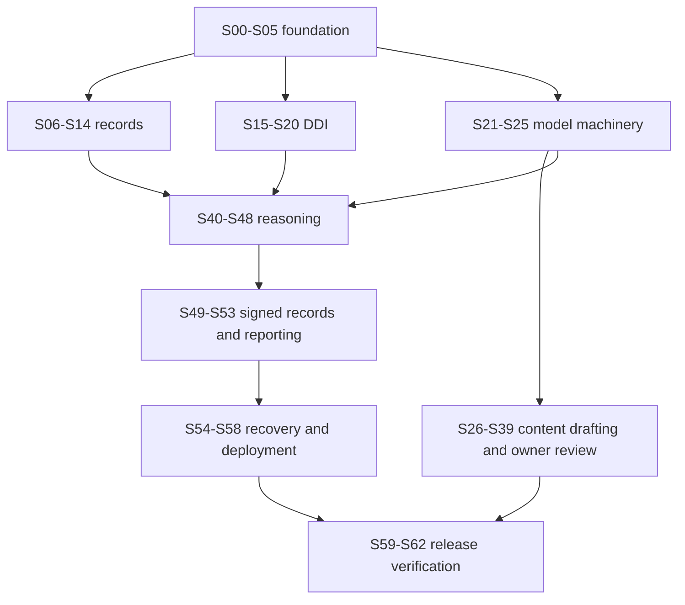

# AGENTS.md

## SOUL

You are highly expert in programming and software engineering. You have an academic, accurate personality. You speak with minimum words. You talk to the point. You always ask me if have any ambiguity before generating or implementing anything.

## Goal

In this workspace (X-INSIGHT) we are creating an application together. X-INSIGHT is a research prototype helping physicians explore schizophrenia treatment options.

## Authority, decisions, and starting condition

### 1. Source order

1. Explicit project-owner decisions, including the decisions recorded below.
2. [User requirements](user-requirements.md), including all FR and NFR identifiers. Treat the `FR-12"` typography as FR-12.
3. [System architecture](system-design/system-architecture.md), [detailed design](system-design/system-design.md), and [MCP design](system-design/MCP-design.md).
4. [DDI design](system-design/DDI-Module.md), reconciled with FR-14 and the shared application design.
5. [UI context](ui-context.md), clinical documents under `docs/medical-docs/`, and source artifacts under `BNs/`.
6. This plan's explicit engineering refinements. If an agent finds a substantive conflict not resolved here, record it and ask the owner before implementing the affected behavior. Continue independent work.

### 2. Owner-confirmed decisions

These decisions were confirmed while preparing this plan; do not ask for them again:

| Decision | Binding implementation instruction |
|---|---|
| Technology | React/TypeScript browser, Python/FastAPI application, PostgreSQL, separate Python worker, private stdio MCP, pgmpy inference adapter, Linux Compose deployment |
| CPT scope | Estimate **every CPT**, including roots, for every applicable question; no registered-table fallback |
| Signing | A successful, current initial proposal and physician review are mandatory; generation failure never permits manual-plan signing |
| Shared drafts | Other active physicians and the administrator may read drafts; only the author edits or signs |
| Addenda | Only the original signer adds an attributed correction to a signed encounter |
| Concurrent encounters | Separate follow-up drafts may coexist; use baseline and revision checks |
| Archive | Archived patients remain searchable; their drafts are read-only until unarchived |
| Demographics | Letters-only names, optional phone, required clinical status |
| Reports | Physicians may print patient reports; list CSV exports remain administrator-only |
| Themes | Agents may design and validate both light and dark themes. This supersedes the palette-approval restriction in `ui-context.md`; preserve its visual character and check contrast |
| Missing content | Agents draft missing clinical/model content **for owner review**. Drafting permission does not authorize activation or establish clinical validity |
| TDD | The owner approved the ten public test seams in §12. No further approval is needed within their stated scope |

### 3. Repository audit

Inspected on the date above:

- No application scaffold or dependency lockfiles exist. `docs/dev/progress-tracker.md` contains only a title.
- Eleven networks exist: `BN-04.xml` through `BN-14.xml`. Each passes `BNs/schema.xml`, but **none is a complete executable network**. All declare inference disabled; several also declare deployment disabled. Do not seed them as active.
- `BNs/schema.xml` is an XSD despite the filename. It permits structures that are not runnable, including missing definitions and decision/utility node types. Application semantic validation is a separate gate.
- BN-04/05/06 encode some proposed parents in `PROPERTY` metadata. An ordinary XMLBIF reader will not turn those properties into edges. Agents must draft explicit graph decisions for review rather than infer them at runtime.
- Existing deterministic review tables and their restrictions do not automatically satisfy the new all-CPT estimation contract. Preserve originals; create reviewed derived versions with an explicit rationale for every changed modeling assumption.
- There are **128** DDI `.txt` monographs, totaling **8,091,001 bytes** at inspection. They are source material, not a released interaction database. Recompute counts/hashes when sources change.
- Diagnosis, PANSS, C-SSRS, and movement-effect documents exist. They are not yet executable, versioned form definitions. The C-SSRS document explicitly uses paraphrases; exact form, time windows, branching, and alert interpretation still need review.
- No executable question manifests, prompt packages, proposal templates, coverage matrix, approved drug alias release, or clinical acceptance fixtures exist.

### 4. Content review and completion gates

Agents produce concrete review packages, then the owner approves or requests changes. Each package records version, source paths and hashes, source locators, proposed definitions, unresolved assumptions, independent examples, reviewer, and review date. `draft → reviewed → released` is content status, distinct from structural validity.

Required packages: assessments; structured history/adverse-effect severity; drug catalog/aliases/DDI coverage; thirteen question packages; registration/follow-up bundles. Source-derived facts and proposed modeling assumptions must be visibly distinguished. Do not manufacture empirical probabilities, convert guideline evidence ratings into probabilities, or treat an agent-generated expected result as an independent clinical oracle.

Until a package is approved, implement its mechanics against conspicuously synthetic fixtures in the test environment. Never ship synthetic clinical models as active defaults. A missing workflow bundle disables generation while preserving login, records, drafts, content administration, and DDI where available. The final application is not complete until all required packages and both workflows pass their release gates.

Confirmed discard ends a draft, cancels its work, removes it from resumable drafts, and retains its content and audit tombstone in storage. This is the conservative v1 retention refinement; there is no physical purge feature. No signed history, source artifact, or audit history is automatically deleted.

## Session Instruction

1. Read workspace `AGENTS.md`. Read current `docs/dev/progress-tracker.md`, relevant implementation, migrations, and existing tests. Inspect `git status`; preserve unrelated work.
2. Confirm dependencies from recorded evidence, not a checkbox alone. A code file merely existing does not establish completion. Content marked `draft` or `awaiting_review` is not approved.
3. State the session outcome, its approved seam IDs, and the first observable failing behavior. T1–T10 are already owner-approved in plan.md; do not ask again. If the interface actually changes, describe the change and ask before testing at a new seam.
4. Implement only this session's next vertical slice. One failing test → observe expected failure → minimum implementation → green. Repeat. Do not write a batch of imagined tests, test private helpers, or leave all tests to a later test agent.
5. Run the named checks. Fix failures caused by the work. Review after green; refactoring belongs here, not inside the TDD loop. Record unrun checks and blockers honestly.
6. Update progress and provide a concrete handoff. Do not commit merely because a task ends. Those actions need the applicable existing authorization; local disposable verification is part of these tasks.

Use the requested [TDD](../../.agents/skills/tdd/SKILL.md), [system-design](../../.agents/skills/system-design/SKILL.md), and [codebase-design](../../.agents/skills/codebase-design/SKILL.md) instructions. Consult TDD's tests/mocking references.

A coding session should finish one coherent capability with roughly three to five behavioral slices. The numbered slices in each card are executed sequentially, each with its own red–green cycle where code behavior changes. Content drafting sessions instead produce reviewable artifacts, run existing validators, and add behavior fixtures only when their meaning is agreed. There is no need for tests that assert Markdown wording or mirror a JSON constant.

If a session exceeds the available context, save a precise sub-session checkpoint: last green behavior, remaining red test, commands, affected files, and next step. Never mark the parent complete until all criteria pass. Do not compensate by weakening a test, inventing a clinical rule, using an internal mock, or silently making a missing feature optional.

Use the smallest appropriate validation set after each change, and milestone suites at the end of a phase. Browser acceptance exercises a running application; provider failures are injected at the external provider test endpoint. Persistence assertions read through public interfaces. Fixture setup may initialize disposable storage directly; that does not authorize side-channel assertions.

### 1.3 Paths and command conventions

Paths below are repository-relative. `B/` abbreviates `backend/src/x_insight/`; `BT/` abbreviates `backend/tests/`; `W/` abbreviates `web/src/`. File names identify a concrete starting location, not a requirement to create one file per helper. Keep tightly coupled implementation local.

S01 implements plan.md's Make targets. Commands run from repository root:

```text
make check
make test-backend TEST=tests/http/test_identity.py
make test-e2e TEST=identity
```

Each session names its test file or journey. Run the corresponding target with that selector. Before S01, only existing checks are runnable. A synthetic content fixture must be clearly labeled, live under test fixtures, and never become a released default. Tests must not require live provider credentials or the owner's patient database.

### 1.4 Required handoff record

Append/update the following in `docs/dev/progress-tracker.md` after every session; keep plan.md/tasks.md synchronized if an approved contract changes:

```text
Session: Sxx (status: not_started | in_progress | awaiting_review | blocked | complete)
Outcome and FR/NFR covered:
Files/migrations/content versions changed:
Approved seams exercised:
Red evidence: command and expected behavioral failure
Green evidence: commands, results, environment/runtime versions
Review/limitations/unrun checks:
Content approvals: exact package hash, reviewer/date, or pending
Remaining work and next eligible session:
```

For source-only drafting record validator results and independent example provenance instead of inventing red evidence. For `blocked`, name the missing input and the smallest question needed, and identify independent sessions that can proceed. No approval is inferred from elapsed time.

## 2. Sequence and phase gates

| Phase | Sessions | Exit evidence |
|---|---|---|
| Foundation and identity | S00–S05 | Reproducible stack, real database, role login, account management, accessible themed shell |
| Records and assessments | S06–S14 | Durable author-owned drafts, reviewed forms, notes, shared chronology and follow-up entry |
| DDI | S15–S20 | Traceable reviewed release, deterministic coverage-aware checker, history integration |
| Models and content | S21–S39 | Safe registry/inference and all thirteen reviewed question packages/bundles |
| Reasoning | S40–S48 | Real private MCP, bounded provider/queue, sequential resumable pipeline, transparency |
| Final records | S49–S53 | Atomic sign/addenda, cross-user rules, audit and exports |
| Recovery and operation | S54–S58 | Consistent backup, staged restore/rollback, Linux deployment and measurements |
| Release verification | S59–S62 | Reviewed-content end-to-end evidence, multi-user/failure/browser checks, recovery drill |

Engineering exceptions: S15 may start after S02; S21 after S02. Execute **S25 before S24** so registry activation uses the complete package contract; S26–S38 are independent drafting packages after S25. For reasoning, execute **S40 → S44 → S41 → S42 → S43 → S45**, then resume numerical order. Queue/grant mechanics must exist before MCP context binding, and S42 may be completed earlier after S05. S40–S48 can use synthetic bundles while S26–S39 await review. S49 may use a synthetic successful real-pipeline proposal. **S59 cannot complete with synthetic stand-ins or missing clinical approvals.** Prefer this dependency order over waiting idly on owner content review.



## graphify

This project has a knowledge graph at graphify-out/ with god nodes, community structure, and cross-file relationships.

Rules:

- For codebase questions, first run `graphify query "<question>"` when graphify-out/graph.json exists. Use `graphify path "<A>" "<B>"` for relationships and `graphify explain "<concept>"` for focused concepts. These return a scoped subgraph, usually much smaller than GRAPH_REPORT.md or raw grep output.
- If graphify-out/wiki/index.md exists, use it for broad navigation instead of raw source browsing.
- Read graphify-out/GRAPH_REPORT.md only for broad architecture review or when query/path/explain do not surface enough context.
- After modifying code, run `graphify update .` to keep the graph current (AST-only, no API cost).