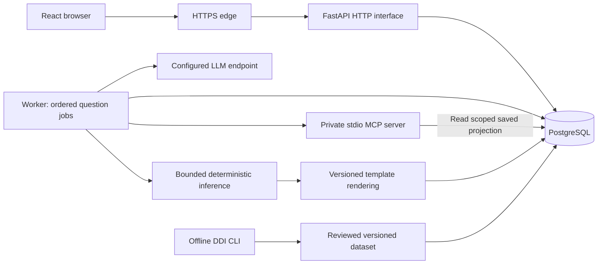

# X-INSIGHT implementation plan

Prepared: 2026-09-20–21. Status: implementation specification; application not yet built.

Read this document for the product and engineering contracts. Execute [tasks.md](tasks.md) one session at a time. Together these documents specify the build; the linked repository sources supply clinical wording and source evidence. A task is complete only when its observable acceptance criteria pass. Engineering fixtures are not clinical validation.

## 1. Authority, decisions, and starting condition

### 1.1 Source order

1. Explicit project-owner decisions, including the decisions recorded below.
2. [User requirements](user-requirements.md), including all FR and NFR identifiers. Treat the `FR-12"` typography as FR-12.
3. [System architecture](system-design/system-architecture.md), [detailed design](system-design/system-design.md), and [MCP design](system-design/MCP-design.md).
4. [DDI design](system-design/DDI-Module.md), reconciled with FR-14 and the shared application design.
5. [UI context](ui-context.md), clinical documents under `docs/medical-docs/`, and source artifacts under `BNs/`.
6. This plan's explicit engineering refinements. If an agent finds a substantive conflict not resolved here, record it and ask the owner before implementing the affected behavior. Continue independent work.

The DDI design's `:chatgpt-content-reference` markers are unresolved legacy citations, not evidence. Use the actual local monograph and source location. UI references to an existing gateway or implemented modules describe inherited design context: there is no existing application to reuse.

### 1.2 Owner-confirmed decisions

These decisions were confirmed while preparing this plan; do not ask for them again:

| Decision | Binding implementation instruction |
|---|---|
| Technology | React/TypeScript browser, Python/FastAPI application, PostgreSQL, separate Python worker, private stdio MCP, pgmpy inference adapter, Linux Compose deployment |
| CPT scope | Estimate **every CPT**, including roots, for every applicable question; no registered-table fallback |
| Signing | A successful, current initial proposal and physician review are mandatory; generation failure never permits manual-plan signing |
| Shared drafts | Other active physicians and the administrator may read drafts; only the author edits or signs |
| Addenda | Only the original signer adds an attributed correction to a signed encounter |
| Concurrent encounters | Separate follow-up drafts may coexist; use baseline and revision checks |
| Archive | Archived patients remain searchable; their drafts are read-only until unarchived |
| Demographics | Letters-only names, optional phone, required clinical status |
| Reports | Physicians may print patient reports; list CSV exports remain administrator-only |
| Themes | Agents may design and validate both light and dark themes. This supersedes the palette-approval restriction in `ui-context.md`; preserve its visual character and check contrast |
| Missing content | Agents draft missing clinical/model content **for owner review**. Drafting permission does not authorize activation or establish clinical validity |
| TDD | The owner approved the ten public test seams in §12. No further approval is needed within their stated scope |

### 1.3 Repository audit

Inspected on the date above:

- No application scaffold or dependency lockfiles exist. `docs/dev/progress-tracker.md` contains only a title.
- Eleven networks exist: `BN-04.xml` through `BN-14.xml`. Each passes `BNs/schema.xml`, but **none is a complete executable network**. All declare inference disabled; several also declare deployment disabled. Do not seed them as active.
- `BNs/schema.xml` is an XSD despite the filename. It permits structures that are not runnable, including missing definitions and decision/utility node types. Application semantic validation is a separate gate.
- BN-04/05/06 encode some proposed parents in `PROPERTY` metadata. An ordinary XMLBIF reader will not turn those properties into edges. Agents must draft explicit graph decisions for review rather than infer them at runtime.
- Existing deterministic review tables and their restrictions do not automatically satisfy the new all-CPT estimation contract. Preserve originals; create reviewed derived versions with an explicit rationale for every changed modeling assumption.
- There are **128** DDI `.txt` monographs, totaling **8,091,001 bytes** at inspection. They are source material, not a released interaction database. Recompute counts/hashes when sources change.
- Diagnosis, PANSS, C-SSRS, and movement-effect documents exist. They are not yet executable, versioned form definitions. The C-SSRS document explicitly uses paraphrases; exact form, time windows, branching, and alert interpretation still need review.
- No executable question manifests, prompt packages, proposal templates, coverage matrix, approved drug alias release, or clinical acceptance fixtures exist.

### 1.4 Content review and completion gates

Agents produce concrete review packages, then the owner approves or requests changes. Each package records version, source paths and hashes, source locators, proposed definitions, unresolved assumptions, independent examples, reviewer, and review date. `draft → reviewed → released` is content status, distinct from structural validity.

Required packages: assessments; structured history/adverse-effect severity; drug catalog/aliases/DDI coverage; thirteen question packages; registration/follow-up bundles. Source-derived facts and proposed modeling assumptions must be visibly distinguished. Do not manufacture empirical probabilities, convert guideline evidence ratings into probabilities, or treat an agent-generated expected result as an independent clinical oracle.

Until a package is approved, implement its mechanics against conspicuously synthetic fixtures in the test environment. Never ship synthetic clinical models as active defaults. A missing workflow bundle disables generation while preserving login, records, drafts, content administration, and DDI where available. The final application is not complete until all required packages and both workflows pass their release gates.

Confirmed discard ends a draft, cancels its work, removes it from resumable drafts, and retains its content and audit tombstone in storage. This is the conservative v1 retention refinement; there is no physical purge feature. No signed history, source artifact, or audit history is automatically deleted.

## 2. Product contract

### 2.1 Users, roles, and scope

One administrator and fewer than ten physicians share a patient pool. English, desktop, latest Chrome and Firefox. Self-hosted Linux or cloud VPS. No self-registration, external record integration, prescribing action, autonomous treatment, PDF generation, graphical network editing, or permanent patient deletion.

Seed exactly one `admin` account with password `admin` once. Store only a password hash; the username cannot change. No password complexity requirement, mandatory initial change, or application session timeout. Logout, credential change, deactivation, and restore revoke sessions. Changing credentials must not recreate the default password at the next startup.

After **every** successful physician login show: “This is a research app and is not intended to be used as the sole basis for treating patients.” Register displays “Contact administrator”. The server derives privileges from the account, not the selected login role.

| Action | Administrator | Physician |
|---|---|---|
| Own password/theme | Yes | Yes |
| Accounts, provider settings, models, audit, backup/restore | Yes | No |
| Read patient directory, charts, shared drafts | Yes | Yes |
| Register patient, update demographics, start follow-up | No | Yes |
| Edit/discard/sign draft | No | Author only |
| Addendum | No | Original signer only |
| Archive/unarchive | Yes | No |
| Patient/physician list CSV | Yes | No |
| Printable patient report | Yes | Yes |

Deactivation offers retain-read-only or explicitly confirmed discard for the reviewed draft set. A changing draft set invalidates that confirmation. Reactivation restores author access to retained drafts, never resurrects discarded drafts, and never changes historical attribution.

### 2.2 Registration and follow-up

Registration pages: demographics → diagnosis → severity → suicide → history/medications/DDI → proposal review → secondary plan/sign. Every page supports attributed notes and autosave once a draft exists. The demographic form before initial creation remains local until valid; do not claim its unsent values are saved.

- Names: Unicode letters after NFC normalization, nonempty, no whitespace/digits/punctuation; preserve casing. Sex `M|F`; integer age 18–99. Patient ID is exactly ten **ASCII digits stored as text**, globally unique even among archived patients. Clinical status `first_time|established` is required. Phone is optional text, not a number; do not invent country validation.
- Valid demographics atomically create patient plus registration draft. A duplicate race yields one creation and a clear conflict for the other; never automatically merge records.
- Diagnosis is distinct from a calculated diagnostic claim: unanswered, partial, complete, or bypassed. Live threshold display follows reviewed criteria. Complete below-threshold answers can proceed after an attributed warning acknowledgment. Bypass is allowed without a reason. Partial answers cannot masquerade as below-threshold completion.
- PANSS and C-SSRS begin unanswered. Skip records `not_assessed`, not zero/minimum. Scores/results exist only when the definition's required items are complete.
- History is structured, with only expressly defined analysis-visible text. Medications contain a catalog reference or explicit unknown label; no dose, unit, route, frequency, or active/stopped fields.
- Entry into proposal review flushes saves and automatically requests generation once prerequisites are met. Re-entry must not duplicate a run. Show configuration or required-input errors rather than inventing defaults.
- The initial proposal is immutable system output. The secondary plan is a separately revisioned physician edit, with changes and sign-off recorded.

Follow-up starts from a chosen current signed baseline, copies relevant history/medications with provenance, requires reconciliation, updates phone, captures new PANSS/C-SSRS, and records all four adverse effects. Prior scores are shown as historical, never as newly completed answers. Each effect has `present|absent|not_assessed`; severity is required only when present, under the reviewed severity definition. Do not add a standardized scale merely because a reference discusses one.

### 2.3 Records, notes, and concurrency

The chart includes demographics, signed chronology, shared read-only drafts, assessment completeness, medication/DDI history, both plans, signature provenance, and addenda. Search by name/Patient ID and filter clinical status; archive is an additional explicit filter.

Autosave: approximately one-second debounce and save on page transition. Show saving/saved/failed; only acknowledged writes are durable. Preserve in-memory edits on error and warn on navigation with pending edits. Offline editing is out of scope. Use revisions for patient, draft, plan, and administrative pointers; a stale update returns `412` and requires reconciliation, never silent overwrite.

Page notes carry page, author ID/display snapshot, server timestamp, and text. They never influence applicability, patient projections, inference evidence, prompts, CPTs, DDI, or proposal selection. Enforce this by serialization allowlists. Signed notes are frozen; corrections use addenda. Notes can change the encounter revision without changing the analysis fingerprint.

Separate follow-up drafts show the baseline encounter and other open drafts. If another encounter signs first, the older draft must explicitly review/reconcile against the new baseline before signing. If clinical inputs change, create a new run; preserve old artifacts. Even if inputs remain identical, record the baseline acknowledgment before signing.

## 3. Architecture and repository structure

### 3.1 Deployment

One modular application release, one PostgreSQL database, one worker process initially with two provider slots, and one HTTPS edge. The worker owns private MCP subprocesses; the provider has no inbound connection to them. PostgreSQL holds authoritative records, immutable content/XML, and durable jobs. Do not add Redis, a broker, vector storage, a graph database, or separate DDI web deployment.



The browser uses relative `/api/v1` routes at the same origin. Only the edge is externally reachable; database and MCP have no public ports. LLM downtime must not disable ordinary chart work.

### 3.2 Deep modules and interfaces

Use **module**, **interface**, **implementation**, **seam**, and **adapter** in their codebase-design meanings. The four source subsystems remain logical ownership groups; they do not require four applications. Each row below presents one cohesive interface, which may contain several operations. Avoid wrappers that merely forward calls and generic repositories with one implementation.

| Module / ownership | Interface and invariants | Hidden implementation |
|---|---|---|
| Identity / S4 | Authenticate, authorize, manage own credentials/admin accounts; active role and revocation checks | Hashing, sessions, credential revisions, throttling |
| Cases / S1 | Register/read/update patients; save/read/discard drafts; notes, final plans, sign/addenda | Transactions, revisions, ownership, snapshots, baseline checks |
| Assessments / S2 definitions, S1 answers | `evaluate(definition, answers) → AssessmentResult`; no I/O or invented defaults | Completeness, conditional items, approved scoring |
| DDI ingestion / S2 | `build(source_dir, terminology, review_manifest) → CandidateDataset + Report`; CLI equivalent | Preprocessing, parsing, source offsets, count checks, conflicts |
| DDI checker / S1 consumes S2 | `check(medications, dataset_version) → DDIReport` | Resolution, unique pairs, indexed lookup, coverage, evidence aggregation |
| Models / S2 | Import/validate/version/activate/export; `infer(effective_artifact, evidence, query, engine_config)` and replay | Safe XML, semantic checks, pgmpy conversion, resource isolation |
| Reasoning / S3 | Start/read/retry current run; worker `run_once()` executes eligible durable work | Snapshots, gates, ordered steps, attempt budgets, leases, templates |
| Scoped record access / S3 | Real MCP `get_question_patient_inputs({})` | Authorization binding, immutable projection lookup, output limits |
| Provider / S4 config, S3 use | `estimate_cpts(request, permitted_tool_bridge) → candidate response`; explicit error taxonomy | Endpoint protocol, tool messages, limits, capability verification |
| Operations / S4 | Read audit; export; create/validate/commit recovery artifacts | Consistent snapshots, staging, maintenance, checksums, process restart |

Accept real external dependencies (provider, clock, process runner) at composition time. Use a deterministic provider test adapter and controlled clock alongside their production adapters. PostgreSQL tests use real PostgreSQL; do not add an in-memory database abstraction solely for tests. HTTP and workers call the owning module, not each other's routes or foreign mutable tables. Read views may join immutable references.

### 3.3 Target layout

Create directories only when a task needs them; this is a location contract, not an instruction to fill empty layers.

```text
backend/
  pyproject.toml, uv.lock
  src/x_insight/
    app.py, config.py, db.py, contracts.py
    identity/       # domain commands, HTTP routes, schemas
    cases/          # patients, drafts, notes, signing, reports
    assessments/    # definitions and pure evaluation
    ddi/            # ingestion CLI and deterministic runtime
    models/         # registry, validation, inference, replay
    reasoning/      # snapshots, provider, queue, coordination, rendering
    mcp_server/     # private process entry point and tool
    operations/    # audit, backups, staged restore
  migrations/      # incremental Alembic migrations
  tests/{http,assessments,ddi,models,mcp,provider,worker,recovery}/
web/
  package.json, package-lock.json
  src/{app,features,shared}/
  tests/           # browser journeys and necessary browser-only behavior
content/
  assessments/     # reviewed definitions and reference examples
  history/         # structured fields and adverse-effect definitions
  questions/<question_key>/
    manifest.json, network.xml, prompt.txt, template.json, examples.json, review.json
  bundles/         # ordered immutable workflow selections
  ddi/             # controlled aliases, review decisions, released manifests
tests/fixtures/    # synthetic records/models; clearly separated from released content
e2e/              # Playwright Chrome/Firefox scenarios
deploy/           # Dockerfiles, edge config, operations scripts
compose.yaml
Makefile
docs/dev/{plan,tasks,progress-tracker}.md
```

`BNs/` and original medical sources remain unchanged unless the owner explicitly requests a source correction. Derived content references source hashes and carries its own version. Runtime imports released content into PostgreSQL; running encounters do not read mutable repository files.

Use Python with FastAPI, Pydantic, SQLAlchemy/Alembic, psycopg, lxml, pgmpy, an MCP SDK, and a tested password-hashing implementation. React uses Vite, TypeScript, routing, and ordinary accessible form controls. Use pytest and Playwright; add a browser unit runner only for behavior that cannot be sensibly covered at existing seams. Pin actual compatible versions and container digests in the bootstrap session; this document does not invent future dependency versions. Use Python `uv` and npm lockfiles consistently.

## 4. Persistence, transactions, and HTTP contracts

### 4.1 Storage model

Use relational columns for identifiers, ownership, state, uniqueness, revisions, foreign keys, and scheduling. Use schema-validated JSONB for versioned answers, definitions, snapshots, and variable response shapes. Times are UTC with explicit display timezone; age is reported age, not an inferred birth date. Immutable artifacts have SHA-256 hashes and schema versions.

| Records | Required fields and constraints |
|---|---|
| Users/sessions | UUID, normalized unique username, immutable admin identity, role, active, hash, credential revision, theme; hashed opaque session token, created/revoked time, no timeout |
| Patients/revisions | Unique ten-digit text ID, names, sex, age, clinical status, phone, archive flag, revision; changed fields/actor/time history |
| Encounters | Patient, kind, author, visit time, baseline, baseline acknowledgment, state (`draft`, `review_ready`, `signed`, `discarded`), revision |
| Assessments/history/medications/effects | Encounter and definition version; explicit completeness/status, typed answers and nullable results; drug-only entries; effect status plus nullable severity |
| Notes | Encounter/page, immutable note ID, author snapshot, time/text; separate from analysis-visible history |
| Plans/signed snapshots/addenda | Immutable initial proposal reference; revisioned secondary text/change history; full signed snapshot/hash, signer/time; append-only attributed correction |
| Content/network versions/bundles | Immutable payload/XML/manifest, source hash, status and review record; versions retained; activation pointer revision per workflow |
| DDI data | Dataset release, concepts/aliases, source documents/bytes or immutable raw source artifacts, directional evidence, coverage declarations, review decisions/import report |
| Runs/question steps | Owner, immutable snapshot/hash, pinned bundle/config/content/engine, current ordinal, state/revision; per-question applicability, projection/hash, stage and attempts |
| CPT/evidence/results/sections | Exact returned percentages, complete ordered probability tables, effective XML/hash, observations and source refs, queries/posteriors, template/version/rendered text |
| Jobs/attempts | Run/question/stage, batch and attempt indices, availability, lease token/hash/deadline, last heartbeat, fencing generation, bounded failure details, unique artifact keys |
| Configuration/audit/idempotency | Encrypted provider credentials and version; append-only event metadata; actor/operation/key/request hash/result reference for retried commands |
| Recovery jobs | Backup/staging identity, manifest/checksums, status, uploader, expiration, confirmation digest, deployment generation |

Add migrations with the feature using them. Use foreign keys and uniqueness to enforce invariants even under simultaneous requests. The normal application role cannot update/delete signed snapshots, accepted artifacts, or audit events. Migration/recovery privileges are separate; this is not protection against the database owner.

### 4.2 Hash and freshness rules

Hash canonical UTF-8 JSON with sorted object keys, preserved semantically ordered arrays, explicit null/missing status, schema version, and finite numeric values. Never hash a presentation string. For XML keep both exact source bytes/hash and a parsed ordered contract/hash; do not assume arbitrary XML serialization preserves metadata or CPT ordering. A content approval references the hash of the immutable content files; keep the approval record outside that hash to avoid a self-referential digest. Changing content invalidates its prior approval.

The analysis fingerprint includes analysis-visible patient/draft facts, reconciled medications, baseline clinical facts, and pinned content. It excludes notes, names/identifier/phone unless an explicitly permitted analytical field is needed (identifiers and names are never model inputs), UI state, and secondary-plan edits. A run additionally pins network/bundle, DDI, prompt/template/mapping, provider configuration, and engine versions. Signed snapshots preserve the full displayed record, including notes and demographics, even when those fields are not analytical.

A new active bundle/configuration does not invalidate a run already pinned to valid versions. Changed analytical patient facts do. A changed baseline requires reconciliation as in §2.3. Activation revocation for a known invalid artifact must be explicit and invalidate its signing eligibility; do not silently mutate the artifact.

### 4.3 HTTP conventions

All routes below are under `/api/v1`. Internal IDs are UUIDs. JSON has explicit schema versions; list queries use bounded cursor pagination (default 25, maximum 100), stable ordering, and validated filters. Mutations require session/role checks and CSRF protection. Use `If-Match`/ETag for mutable revisions and `Idempotency-Key` for create/run/sign/note/addendum/recovery commands. Same key and body returns the original result; changed body with the same key is `409`.

```json
{"code":"STALE_REVISION","message":"The draft changed. Reload and reconcile your edits.","field_errors":{},"request_id":"uuid","retryable":false}
```

Use `401` missing/revoked session, `403` denied role/ownership, `404` inaccessible/missing entity where appropriate, `409` duplicate/state conflict, `412` stale revision, `422` invalid content, `429` queue/admission limit, and `503` unavailable dependency. Never return secret values or tracebacks.

| Routes | Behavior |
|---|---|
| `POST /auth/login`, `/auth/logout`; `GET /me`; `PATCH /me/preferences`; `POST /me/password` | Identity, research-warning requirement, preference, revocation |
| `GET/POST /physicians`; `PATCH /physicians/{id}`; `POST .../deactivate`, `.../reactivate` | Admin-only credentials/state; reviewed draft-set confirmation on discard |
| `GET/POST /patients`; `GET/PATCH /patients/{id}`; `POST .../archive`, `.../unarchive` | Shared reads, physician writes, admin archive; create returns patient and registration draft |
| `POST /patients/{id}/encounters`; `GET/PATCH /encounters/{id}`; `POST .../notes`, `.../discard` | Follow-up, author-owned versioned draft, notes and explicit discard |
| `GET /content/assessments/{type}`; `GET /content/history`; `GET /drugs?query=...` | Authenticated released definitions and catalog for forms; expose version IDs |
| `POST /ddi/check` | Local drug-only check, explicit dataset version; report is not an LLM response |
| `POST /encounters/{id}/runs`; `GET /runs/{id}`; `POST /runs/{id}/retry` | Automatic run creation, durable progress/transparency, failed-stage resume |
| `PATCH /encounters/{id}/secondary-plan`; `POST .../sign`, `.../addenda` | Separate plan revision; current-run attestation; append-only correction |
| `GET/POST /networks`; `GET /networks/{id}/versions`; `POST /networks/{id}/versions` | Admin import and immutable editing |
| `POST /network-versions/{id}/validate`; `GET .../graph`, `.../xml` | Validation report, read-only graph, exact export |
| `POST /model-bundles/activate`, `/model-bundles/rollback` | Atomic workflow pointer, compatibility/review validation |
| `GET/PUT /api-settings`; `POST /api-settings/test` | Masked reads, explicit unchanged/replace/clear secret semantics, capability result |
| `GET /exports/patients.csv`, `/exports/physicians.csv`; `GET /patients/{id}/report` | Authorized exports and escaped printable HTML |
| `GET /audit-events`; `POST /backups`; `GET /backups/{id}` | Admin inspection and asynchronous consistent download |
| `POST /restores/validate`; `GET /restores/{id}`; `POST /restores/commit` | Staging, progress/impact report, confirmed replacement |

Run creation body: `{encounter_revision, warning_acknowledgments}`; returns `202 {run_id, revision, status, questions}`. Retry body: `{question_key, failed_stage, expected_run_revision}`; it cannot select another snapshot or swap pinned settings. Sign body: `{encounter_revision, run_id, secondary_plan_revision, review_acknowledgments, baseline_acknowledgment}`. Server recomputes eligibility; client flags never grant authority.

## 5. Assessment and clinical-content contracts

An assessment definition contains stable item IDs, source locators, version, permitted answers, required/conditional rules, period fields, completion rules, result rules, and independent examples. Do not evaluate arbitrary Python/JavaScript from JSON. Use a small allowlisted declarative rule set or explicit typed implementations per reviewed instrument; do not build a general rules platform.

`evaluate(definition, answers)` returns `{status, missing_item_ids, item_errors, scores, findings, definition_version}`. Partial/skipped answers have null unavailable scores. Keep observed negatives distinct from unanswered. The server is authoritative; the browser may preview the same approved rules, with contract fixtures preventing drift.

Source-specific drafting instructions:

- Diagnosis: represent the six criteria and their subconditions in `schizophrenia-criteria.md`; a symptom count alone cannot satisfy the full document. Include unknown and bypass behavior. Obtain reviewed threshold examples.
- PANSS: source contains 30 items and subscale arithmetic. Fully answered all-1 fixture has positive 7, negative 7, general 16, total 30; all-7 has 49, 49, 112, 210. Do not initialize answers to 1. One missing required item suppresses the total. Any follow-up change formula must specify its denominator and zero case; no treatment threshold is inferred from score bands.
- C-SSRS: select exact administration form and time windows for review. Ideation severity, intensity dimensions, behavior, and lethality remain separate; do not produce a composite risk score. Do not infer lower-level recorded answers from a higher-level answer. Draft branching and alerts for review rather than making unanswered items negative.
- History: derive the minimum typed field inventory from approved question mappings, with explicit source provenance, dates/windows, tri-state values, and reconciliation. Drug regimen details excluded by FR-14 remain excluded even when source network drafts mention them; resolve that mismatch in model design.
- Adverse effects: present/absent/not-assessed plus reviewed severity definitions. Existing BARS/SAS discussion is supporting source material, not permission to invent common severity bands or add mandatory full scales to FR-21.

When a form is skipped, optional analysis inputs remain explicitly missing. A required input can stop generation for clarification; the UI must explain the specific question/field instead of silently undoing the skip or generating a score.

## 6. DDI: offline ingestion and deterministic checking

### 6.1 Dataset contract

Use the application's PostgreSQL database at runtime. A separate command-line build converts sources into an immutable, reviewable dataset. No LLM, RAG, external terminology request, or raw text parsing occurs during patient interaction checking.

Minimum records:

- `DrugConcept`: stable ID, canonical/normalized name, concept type (`ingredient|combination_drug|herbal|food|substance|other`), catalog availability. Catalog availability is not a medication active/stopped field.
- `DrugAlias`: controlled normalized alias, concept ID, source/review record. Ambiguous aliases never resolve silently.
- `SourceDocument`: relative source path, source URL/date when present, checksum, parser version, original text and location mapping.
- `InteractionEvidence`: canonical unordered pair; directional subject/object when explicit, otherwise null/unknown; severity; separate management/action; source document/span; raw text; optional source-derived mechanism/effect; review status.
- `DatasetRelease`: hashes, source inventory, parser/terminology versions, category-count report, unresolved/conflict counts, reviewed coverage declarations, reviewer/time.
- `PairCoverage`: explicit reviewed basis for whether a pair is adequately covered by this dataset. Having two recognized drugs or one monograph is not sufficient.

Retain multiple assertions per pair and both monograph directions. Deduplicate exact repeated extraction within the same source/span/hash; do not erase independent evidence from another source. Sort by severity `contraindicated > serious > monitor_closely > minor > unknown`; these are display priorities, not clinical scores. Unknown severity remains visible, not a low-severity reassurance. Do not infer a management action or mechanism that the source does not support; retain raw text.

### 6.2 Ingestion sequence

1. Discover all `.txt` files recursively; stable relative path order and byte hashes. Preserve originals, including Unicode/BOM handling.
2. Preprocess page headers, timestamps, repeated URLs, and line wraps while preserving an original line-span map. Do not globally remove similar clinical prose.
3. Identify the actual interaction section, severity headings with declared counts, entry headers, continuation paragraphs, and section end. Summary navigation headings are not entries.
4. Parse a state machine. For every category, declared and parsed counts must agree. A mismatch fails that document's release eligibility. It is never repaired by truncation or padding.
5. Resolve concepts using exact normalized canonical names and controlled aliases. Unknown terms enter a review queue. No silent fuzzy matching, suffix stripping, or combination-drug splitting.
6. Preserve directional evidence, conflicts, duplicates, and uncertain extraction. Generate machine-readable and readable reports.
7. Agent drafts explicit alias/parse corrections with source spans; owner reviews all contraindicated/serious evidence, unresolved names, parser anomalies, and conflicting severities/management as required by the DDI design.
8. Publish an atomic immutable dataset only after its declared review gate passes. A deliberately partial release requires explicit owner acceptance and unavailable coverage for excluded material. Never label a partial corpus complete.

The Sitagliptin monograph supplies an initial independent parser fixture: declared counts are 0 contraindicated, 4 serious, 92 monitor closely, 70 minor. Ofloxacin appears in more than one severity category; keep both assertions. These are source parsing expectations, not new treatment guidance.

CLI target: `uv run python -m x_insight.ddi build --sources ../docs/medical-docs/DDI-text --terminology ../content/ddi/aliases.json --output <staging-dir>` from `backend/`. Exit nonzero for structural/count failures; still write an anomaly report. A separate `publish --manifest <reviewed-manifest>` validates approvals and imports a release. No patient data enters this command.

### 6.3 Runtime interface

Input: `{medications:[{catalog_drug_id}|{unknown_label}], dataset_version}`. Exactly one discriminator per entry. Normalization deduplicates equivalent recognized concepts while preserving display provenance; ambiguous labels stay unresolved. Combination products remain distinct concepts unless a reviewed rule authorizes a specific decomposition.

Generate each unique unordered pair once and batch-fetch evidence. Return:

```text
DDIReport
  dataset_version, catalog_version, medication_fingerprint
  resolved_medications[], unresolved_medications[]
  pairs[]
    drug_a, drug_b
    status: interaction_found | covered_no_listed_interaction | coverage_unavailable
    highest_known_severity, has_unknown_severity, conflicts[]
    evidence[]: source_severity, direction, raw_text, management, source_path/span/hash
    coverage_basis
  limitations[], generated_at
```

An unresolved medication is always displayed as “coverage unavailable”; every pair involving it is uncovered. A recognized pair with no row is uncovered unless explicit coverage permits “no listed interaction in this dataset”. Never say “safe” or “no interaction”. Zero or one unique medication has no pairs, with unresolved-drug warnings still visible.

Recompute for changed reconciled medications, pin the dataset for each run, and retain the report in the proposal/signed snapshot. DDI is informational; the source requirements do not authorize a new hard stop on signing based solely on interaction severity. A missing/broken dataset is distinct from valid limited coverage and must not appear as a successful empty report.

## 7. Bayesian models and question packages

### 7.1 Required inventory and ordering

Each row is a distinct clinical question with one network and prompt. Candidate sources below are **drafting leads**, not approved assignments. Preserve exactly seven registration questions and six follow-up questions. Do not add independent LAI indication and choice runs.

| Order/key | Applicability to draft for review | Source starting point / known gap |
|---|---|---|
| R1 `hospitalization` | All registration encounters | No matching executable network; draft a new question package |
| R2 `pharmacotherapy` | All registration encounters | BN-04 reviews established treatment; initial selection needs explicit redesigned scope |
| R3 `involuntary_care` | All registration encounters | No matching network; jurisdiction and criteria must be supplied/reviewed; do not invent legal rules |
| R4 `high_suicide_clozapine` | Reviewed high-risk/persistence gate | BN-08; align assessment period and treatment-history meanings |
| R5 `lai_indication_choice` | Evaluate indication; choice only when permitted | BN-10 has discussion/review outputs; it does not establish a complete product-choice contract |
| R6 `aggression_clozapine` | Reviewed aggression gate | BN-09; do not substitute PANSS hostility for an unreviewed aggression threshold |
| R7 `established_case_clozapine` | Established clinical status and reviewed criteria | BN-07 is a lead; define trial adequacy and inputs without excluded regimen fields |
| F1 `tardive_dyskinesia` | Effect present | BN-14 and tardive-dyskinesia criteria |
| F2 `akathisia` | Effect present | BN-13 and akathisia criteria |
| F3 `parkinsonism` | Effect present | BN-12 and parkinsonism criteria |
| F4 `acute_dystonia` | Effect present | BN-11 and acute-dystonia criteria |
| F5 `no_improvement_clozapine` | Reviewed no-improvement gate | BN-07 may inform a **separate** package; define baseline/window/adequate trial |
| F6 `continue_or_adjust` | All follow-up encounters | BN-04/05/06 overlap; draft one network. BN-06 records an electronic decision-support restriction that must be resolved during review |

True gate executes; false gate records `not_applicable` with reason. Unknown is not false. Required unknown/missing/conflict yields `needs_clarification`, stopping later questions. Optional unknown behavior must be explicit in the manifest and visible in the final proposal. No implicit chaining of one question's posterior into the next question's inputs.

### 7.2 Package shape

Each package includes:

```text
manifest
  schema_version, question_key, title, workflow, version, review_status
  network_file, network_hash, source_refs[], declared_node_order[]
  variables[]: node_id, XMLBIF kind, patient_value_type, states[], ordered_parents[]
  patient_mappings[]: node_id, allowed_source_paths[], typed transform, time_window
                      usage: cpt_context | observation | both; missing_policy
  applicability: allowlisted expression, required_fields, unknown_policy
  cpt_contract: ordered node/parent/state rows; all nodes mandatory
  query_nodes[], evidence_mappings[], impossible_evidence_policy
  prompt_version, template_version, reviewed_result_mapping
  numerical_tolerances, context/output/resource limits, engine configuration
  review: assumptions, reviewer, decision, date, source hashes
```

Prompts instruct estimation only: fixed definitions, current-question inputs, every CPT in percentage units, strict response schema. Prompt versions must not add unrepresented patient facts, ask for full-record extraction, ask the LLM to choose applicability, or ask it to write a plan. Templates contain approved wording and deterministic result mappings, with explicit missing/uncertainty/coverage disclosures. Never infer “recommend” from whichever posterior state happens to be largest unless that mapping was reviewed.

A mapping using a fact both for CPT estimation and hard observation requires an explicit reviewed rationale against double counting. Hard evidence is optional per node; unknown/conflicting evidence is not a negative state. Likelihood evidence is disabled unless separately reviewed and supported by numerical fixtures.

### 7.3 Registry validation and activation

Store source XML exactly and validate in layers:

1. Parse safely: reject DTD/external entities, network resolution, oversized XML, unexpected references, and resource abuse.
2. XSD structure using the versioned `BNs/schema.xml`; keep the distinction between structural validity and executability.
3. Semantic shape: one question network per admitted version; unique nodes/states, valid parents, acyclic graph, nonempty outcomes, complete definitions, finite normalized reference tables with correct dimensions/order. Initial execution profile supports discrete `nature` nodes only; decision/utility artifacts can be inspected as unsupported drafts but cannot activate. Supporting influence diagrams is a future design decision, not an implicit conversion.
4. Contract completeness: reviewed patient mappings, fixed types/relevance, prompts, all-CPT schema, gates, missingness, queries, templates, and examples. Unknown executable expressions and note mappings are rejected.
5. Admission: inference fixtures, full-CPT payload size, configured context budget, execution time/memory limits, and review status.

Reference tables in a released source artifact must be explicitly reviewed; missing values cannot be silently filled with uniform probabilities to pass. Drafts may remain incomplete and viewable. Because all runtime CPTs are replaced, document the purpose and provenance of reference tables without presenting them as patient estimates. Owner review must resolve draft restrictions and fixed-rule versus estimated-table assumptions in a new version, not merely flip an `inference_enabled` property.

Admin XML editing creates a new immutable version. Validation returns separate structural/semantic/content/admission reports. Read-only graph displays nodes, states, edges and validation state; no drag-to-edit semantics. Activation atomically changes a complete workflow bundle, with expected revision and audit event. Rollback is a new activation event selecting old valid versions. Existing runs retain pinned versions.

### 7.4 CPT contract and deterministic inference

For each applicable question require:

```json
{
  "question_key":"synthetic_example",
  "network_version":"v1",
  "network_hash":"sha256",
  "tables":[
    {"node_id":"A","parent_ids":[],"states":["no","yes"],
     "rows":[{"parent_states":[],"percentages":[80,20]}]},
    {"node_id":"B","parent_ids":["A"],"states":["no","yes"],
     "rows":[{"parent_states":["no"],"percentages":[90,10]},
             {"parent_states":["yes"],"percentages":[30,70]}]}
  ]
}
```

This is a mathematical test network, not clinical content. Require exact identity/hash, node/parent/state order, one table per node, one row per ordered Cartesian parent configuration, and no extra fields. Roots have one empty-parent row. Reject missing/duplicate/extra rows, strings/booleans/null numbers, nonfinite numbers, and values outside `[0,100]`. Percentage sums must be within absolute `0.000001` of 100; do not normalize, clip, round, or repair. Configure probability-validation tolerance consistently (`0.00000001` for sums after division by 100).

Persist the exact accepted percentages and request/response provenance. Divide by 100 without presentation rounding; populate **every** table in a run-local XML artifact, preserve fixed structure and ordering, and freeze its hash before inference. Registered XML never changes.

The XMLBIF ordering contract is child state fastest, last declared parent next, first parent slowest. Explicitly map this to the pinned engine's array order; do not trust an incidental iteration order or a reader/writer round trip. Preserve metadata outside any engine conversion that drops properties.

Use deterministic exact inference with pinned engine/runtime, query, numeric dtype, and deterministic elimination order/tie-breaking. Fail impossible evidence or resource exhaustion; never silently approximate or soften probabilities. Replay reads stored effective CPTs/evidence/query and does not call the provider. Numerical replay acceptance: absolute posterior difference at most `1e-9` under the pinned supported runtime; record any stricter or changed tolerance as a versioned configuration decision.

Independent mathematical fixtures: in the example above, `P(B=yes)=0.22`, `P(B=yes|A=yes)=0.70`, and `P(A=yes|B=yes)=7/11`. A second fixture must have at least two parents with asymmetric probabilities to detect transpose/order bugs. Expected literals/worked calculations are checked independently, never produced by the implementation under test.

## 8. MCP, provider, and sequential reasoning

### 8.1 Snapshot and projection

Creating a run is one transaction: authenticate active author, validate draft/revision/archive/prerequisites, freeze analytical snapshot and bundle/content/provider/engine versions, add ordered steps, enqueue the first step, and append audit. Repeated automatic triggers with the same fingerprint reuse an eligible existing run; a failed run is resumed through explicit retry. Changed analytical inputs create a new run and mark old work stale.

For each question, persist its typed allowlisted projection before provider access. Values include node ID, patient type, observed/not-assessed/missing/conflict status, source path/revision, and explicit null when unavailable. Only represented variables appear. Applicability may use additional saved fields internally, but those fields are not automatically sent to the model. Exclude notes, names, Patient ID, unrelated history, other questions' fields/results, and secrets.

### 8.2 Private MCP server

There is **one MCP server implementation**, exposing one tool:

```text
get_question_patient_inputs
  inputSchema: {type: object, properties: {}, additionalProperties: false}
  output: {question_key, network_version, projection_hash, variables[]}
```

The worker is the MCP host/client. It obtains the initial projection through a real stdio `tools/call` and passes that result to the provider. Optional provider-requested reads traverse the same transport and return the same persisted projection. Do not maintain a second direct-call implementation that bypasses MCP in production.

Concrete context isolation: launch a worker-owned MCP subprocess for an active question with a short-lived opaque authorization grant supplied through its protected process environment, never a model argument or command-line secret. Bind it once to actor/encounter/run/question/snapshot/manifest/job lease/deployment generation. The grant refers to database authorization state created by the worker; MCP uses a read-only database role. On question completion/retry-context replacement, stop the process and revoke the grant. Concurrent provider slots have separate processes/grants. This lifecycle avoids a mutable global “current patient”; a later optimization may reuse processes only with equivalent isolation tests.

Validate active account, eligible encounter/run, live lease/grant, projection hash, tool name/empty arguments, and output size on each read. Reject forged, expired, mismatched, stale, archived, or terminal contexts. Secrets and unrelated record existence never appear in errors. Log protocol output only to stdout and diagnostic metadata only to stderr. MCP cannot search patients, read notes, submit CPTs, alter data, execute inference, or expose shell/SQL/files/URLs. No extra MCP servers for DDI or network administration are needed.

Pin and test the actual SDK/protocol combination. Authorization binding is application state, not a dependency on a particular MCP session protocol. Use the SDK's supported discovery/lifecycle behavior rather than copying outdated handshake examples. See the [official MCP architecture](https://modelcontextprotocol.io/docs/learn/architecture) for host/client/server and transport roles.

### 8.3 Provider configuration and adapter

Admin settings store key, base URL, model and a configuration revision. Encrypt the key using a standard authenticated-encryption implementation and a deployment-held key outside the database; do not design a custom cipher. Masked reads distinguish configured/absent. Saving/testing never echoes the secret. Explicit replace/clear semantics avoid turning a redacted placeholder into a real key. Old credentials remain available while referenced runs require them; removing one cancels/restarts affected work explicitly.

Use an OpenAI-compatible chat/tool exchange through a provider adapter; do not assume every compatible endpoint supports structured outputs or tools. A capability check uses synthetic input and proves tool exchange plus usable JSON responses. Prefer schema-constrained responses if supported; strict JSON parsing/validation remains mandatory either way. Credentials/model/capability failure is a configuration error, not a blind retry.

The request contains only the pinned question prompt, ordered fixed network contract, scoped patient projection, strict CPT response contract, and the one permitted tool declaration. A tool bridge validates model-requested name/arguments, calls MCP, returns its bounded result, and preserves required tool correlation IDs. The model cannot supply its own authorization metadata. Reject disallowed calls, excessive tool loops, oversized requests/responses and ambiguous multiple final outputs.

Keep all tool exchanges within one estimation attempt; do not grant a new retry budget for each tool call. Maximum ten tool calls per attempt, 60 seconds per provider HTTP request, and ten minutes per active question batch excluding queue wait/manual pause. Set explicit prompt/output byte/token limits after measuring admitted models and endpoint capabilities. If complete CPT output cannot fit, reject admission or fail clearly; no silent truncation.

Never trust model explanations as patient facts, template text, SQL, executable code, or new instructions. Retain restricted request/response artifacts for provenance, but ordinary logs/audit contain only safe metadata and references.

### 8.4 Durable queue and execution

Run states: `queued → preparing_question → estimating_cpts → validating_cpts → inferring → rendering → succeeded`, with `needs_clarification|failed|stale|cancelled` exits. Each question has the same stage states plus `pending` and `not_applicable`; run success requires all questions succeeded or validly not applicable and a valid assembled proposal/DDI artifact.

Only one question is eligible per run. Complete and persist its result **and rendered section** before atomically enabling its successor. No later question runs while the current one fails, retries, or waits for clarification. Two provider calls may run across different encounters; one active generation per encounter. Database-backed admission and global concurrency must remain correct if a second worker is started.

Queue implementation uses short claim transactions, row locks with `SKIP LOCKED`, lease expiration/heartbeat, random fencing token, and a deployment-generation check on commit. Do not hold database locks or transactions while awaiting the provider. Select eligible physicians round-robin and oldest eligible job within physician; persist enough scheduling state to avoid starvation. Keep the scheduler small at this user count. PostgreSQL documents `SKIP LOCKED` as appropriate for queue-like contention; it does not replace the application's lease and fencing rules. [PostgreSQL SELECT documentation](https://www.postgresql.org/docs/current/sql-select.html)

Initial operational defaults: heartbeat every 15 seconds, lease 120 seconds, two global provider slots, at most 100 queued runs. Treat these as tunable engineering settings; the admission benchmark verifies them. Check run/account/archive state both before expensive work and in the committing transaction. On lost lease, the old worker must not commit even if its provider call finishes. Provider billing can repeat after ambiguous failures; only committed application artifacts are idempotent.

### 8.5 Retries and resume

| Condition | Required behavior |
|---|---|
| Timeout, transient 5xx/429, transient MCP failure, invalid CPT JSON/content | One shared budget: initial attempt plus **two retries**, three total; persist attempt start before outbound work |
| Retry delay | Exponential delay with bounded jitter/Retry-After, maximum 60 seconds; persist next eligibility, do not sleep holding a lease transaction |
| Bad credential/model/capability | Fail configuration immediately; settings repair creates a new pinned run |
| Required missing/conflicting input or unknown gate | Needs clarification, no guessed evidence or blind retry; saving corrected input creates a new run |
| Inference failure | Retain accepted CPT artifact; resume inference without re-estimating |
| Rendering failure | Retain inference result; resume template rendering without provider/inference |
| Exhausted budget | Clear failed-question message, later questions pending, drafts and completed sections retained |
| Explicit manual retry | Author-only, matching run revision and unchanged inputs; new bounded batch at failed stage, prior history retained |
| Crash/restart | Resume from persisted artifacts/attempt counter after lease recovery; an uncertain in-flight request consumes its recorded attempt |
| Archive/discard/deactivation/stale input | Cancel or mark ineligible, preserve history, reject late commits and signing |

## 9. Proposal review, signing, and UI

After all eligible questions finish, assemble the stored template sections and pinned DDI report into one immutable initial proposal. Preserve skipped/unknown explanations and coverage limitations. Never ask the LLM to draft or rewrite prose. A partial run can be inspected but is labeled incomplete and cannot make an encounter review-ready.

For every question display together: question, network version, **exact saved patient inputs supplied**, returned CPT percentages, and deterministic network result. Include source paths, missingness, prompt/template versions, status and retry action. Label CPT percentages separately from posterior probabilities. Paginate/expand large tables without hiding whether they are complete. Read persisted artifacts, not recomputed current chart values. Poll active runs roughly every two seconds, back off in hidden tabs, stop at terminal states.

Signing is a single transaction: lock encounter/patient as needed; check active original author, unarchived patient, draft state, expected encounter/plan revisions, reconciled baseline, acknowledgments, successful current run/fingerprint, and completed saves; freeze both plan references and full signed snapshot; mark signed; append audit. Repeated identical sign commands return the same signed result. Concurrent save/sign/deactivation/archive cannot bypass checks. An unrelated note change does not require a new run but does require the latest draft revision at sign time.

After signing, no clinical/plan/note mutation is allowed through any route. Addendum captures original signer, server timestamp, reason and correction text, referencing the signed encounter without overwriting it. Changed structured facts belong in a new follow-up.

Required browser surfaces:

| Surface | Required states and behavior |
|---|---|
| Login/research notice | Role/username/password, generic failure, Register message, every-login physician notice |
| Role dashboards | Shared searchable directory, own resumable drafts; admin navigation to all governance tools |
| Registration/follow-up wizard | Validated progression, autosave state, notes, explicit skip/bypass, source dates, conflict/retry/readonly states |
| History/DDI | Drug-only catalog input, explicit unknown entry, reconciliation, severity/conflict/evidence and coverage |
| Proposal/final plan | Sequential progress, all transparency fields, retained partial results, retry, separate secondary edits/change comparison, sign eligibility |
| Patient chart | Signed snapshots versus current demographics, drafts, chronology, addenda, print |
| Model administration | XML import/edit/version history, validation report, read-only graph, workflow activation/rollback |
| Administration | Physicians/deactivation confirmation, masked provider settings/test, theme, archive, audit filters, CSV, backup and staged restore |

Use X-INSIGHT wordmark, restrained teal, dense clinical layout, semantic state labels, and the UI context's typography/spacing. Design dark tokens deliberately; do not invert colors. Both themes must support keyboard navigation, labels/error association, focus visibility, zoom, reduced motion, and text/non-text contrast. Existing teal/white contrast is insufficient for ordinary small button labels; choose a darker compliant action fill or compliant label treatment. Do not claim boldness alone fixes small text contrast. Urgent findings persist visibly; status never relies on color alone.

## 10. Exports, audit, and recovery

### 10.1 Exports and audit

CSV: stable English headers, UTF-8, proper quoting, spreadsheet-formula neutralization for text fields, no credentials. Preserve Patient ID as ten digit bytes; document importing the column as text because CSV has no type information. Do not use spreadsheet formulas to preserve zeros.

Printable HTML: current demographics, historical signed snapshots, assessment completeness, history, meds/DDI coverage, initial and secondary plans, signature, notes/addenda, and conspicuous draft/research labels. Escape user/model text; print CSS with legible page breaks. No PDF generation dependency.

Append audit for login successes/failures, credential/account changes, record mutations, content/model import/validation/activation, run/question transitions and retries/tool access, sign/addenda, exports and recovery. Successful mutations and audit commit together. Failure events must not claim success. Actor IDs plus display snapshots survive renaming/deactivation. Admin can filter/page audit; nobody can edit it through the application. Record references/hashes, not unrestricted clinical text or keys.

### 10.2 Backup creation

Full backup includes a consistent PostgreSQL snapshot, all referenced source and effective XML, manifests, content, DDI versions/evidence/source provenance, accepted CPTs, prompts/templates, active selections, schema/app/engine versions, timestamp, inventory and checksums. Export XML from **that snapshot**, not from changing live filesystem content. One practical implementation is a transactionally consistent database dump restored into temporary isolated storage for artifact export/verification.

Exclude usable sessions from portable recovery; revoke sessions on restore regardless. Encrypted provider credentials can be included, but the deployment encryption key is never included in the downloadable archive. Manifest explains that migration without the old key requires key re-entry. Secure key escrow is an operator responsibility, not a plaintext backup feature. Authorized downloads are private/no-store and bounded; clean temporary artifacts after a documented retention window without deleting clinical history.

### 10.3 Restore workflow

1. Admin uploads to staging. Enforce compressed/uncompressed limits, reject traversal/absolute paths/symlinks, verify checksums/schema/application compatibility before any live mutation.
2. Restore only a supported app-generated format into isolated database/storage with a restricted role and resource limits. Uploaded SQL/archive content is untrusted; do not run it as database superuser or allow host-file/program access.
3. Validate singleton admin, references, content/network hashes, effective CPT artifacts, and report health. Present timestamp, backup identity, current replacement impact, missing-key consequence and staging digest.
4. Admin explicitly confirms that exact staged artifact. Enter maintenance mode; reject new writes, stop workers, fence old deployment generation, and take a pre-restore backup.
5. Swap the validated database selection under the maintenance lock, restart application/worker processes against it, revoke sessions/grants, clear caches, cancel restored nonterminal work for explicit restart, add restore audit and operator recovery record outside the replaced database.
6. Health-check login/read/replay. Reopen only on success; otherwise switch back to the pre-restore database/configuration and verify it. Keep external maintenance control independent of either database.

This is replacement, never a merge. Application-level atomicity means no mixed live traffic across old/new databases; PostgreSQL cannot transactionally combine a database switch and process restart. Implement explicit phases, durable operator status, and rollback. Old provider results must fail generation fencing after restore. A successful restore is demonstrated by a disposable restore drill, not merely producing an archive.

## 11. Security, operations, capacity, and trade-offs

Prototype-basic controls: server-side role/ownership validation, standard password hashing, opaque hashed sessions, HttpOnly/SameSite cookies (Secure under HTTPS), CSRF defense, login throttling, parameterized SQL, escaped output, secret redaction and request/file limits. No session timeout. HTTPS required outside localhost. This scope does not establish PHI hardening or clinical validation, and it does not impose a synthetic-only patient policy.

Provider destinations use operator allowlists, permitted schemes, DNS/resolved-address checks, and redirect restrictions. Local model endpoints require explicit host configuration; browser traffic outside localhost still requires HTTPS. Never allow arbitrary metadata or internal-network targets through a setting. Test the selected HTTP client's actual redirect/DNS behavior.

Configuration inventory: database URLs/roles, encryption key, public origin/TLS, allowed provider hosts, worker/provider limits, lease/heartbeat/retry budgets, XML/request/context limits, inference CPU/memory/time budget, backup staging path/limits, application/deployment generation, environment mode. `.env.example` contains placeholders only. Readiness requires database/schema; missing LLM/content disables generation, not basic record access. Separate live/readiness endpoints must not disclose configuration.

Planning load: up to nine physicians plus admin, 10,000 synthetic patients, roughly 20 ordinary HTTP requests/second, two simultaneous provider requests, seven sequential registration or six follow-up questions. Start benchmarking on 2 vCPU/4 GB RAM/20 GB persistent disk; these are assumptions, not proven capacity. Ordinary reads/acknowledged saves and patient search target p95 below one second at this load. Measure provider latency separately. Model admission must benchmark CPT size and inference complexity; user count alone is insufficient.

Record request latency/errors, save failure, database/disk health, queue age, heartbeat, provider attempt/validation failures, inference duration/resource failures, and last successful backup. Safe structured logs use request/run/question IDs. Initial alerts: missing heartbeat over two minutes, eligible queue age over five minutes, repeated provider auth failure, disk over 80%. Manual backups satisfy requirements; no automatic schedule, numerical RPO, or high-availability promise is implied. Proposed restore drill target is under 30 minutes on the reference dataset, subject to measurement.

Cache immutable parsed definitions/catalogs by hash with bounded memory. Keep patient CPTs/projections scoped by run/question; never cache them under a base-model key. Authenticated records/exports use private/no-store. No cross-patient LLM response caching.

| Choice | Benefit | Cost and revisit trigger |
|---|---|---|
| Modular monolith + worker | Local transactions and one coherent release | Shared deployment coupling; split only with measured independent scaling/ownership |
| PostgreSQL queue | Atomic snapshot/job creation, no broker | Implement leases/fairness; add broker only if queue contention is measured |
| All-CPT estimation + exact inference | Matches requirements and permits stored-artifact replay | Full-table size/latency; admit bounded networks, do not silently narrow scope |
| Sequential questions | Durable section-level progress and explicit resume | Per-run latency is additive; scale across encounters |
| One private MCP tool | Small readable access contract | Subprocess lifecycle overhead; reuse only after isolation verification |
| Offline DDI release | Fast traceable runtime | Source parsing/review effort; expand sources only with coverage policy |
| Versioned content + signed snapshots | Historical interpretation remains inspectable | Storage growth; measure before designing archival tiers |
| Single host | Practical self-hosting | Single point of failure; increase resources first, replicas/failover when availability warrants |

## 12. TDD, verification, and release

### 12.1 Approved test seams

The owner approved these seams during this planning session. DDI ingestion and checking are listed separately below. Tests and callers use the same interface. Adding a new public seam requires discussion; tests of private helpers or database side channels are not substitutes.

| ID | Approved seam | Observable behavior and real dependencies |
|---|---|---|
| T1 | Authenticated HTTP | Permissions, record lifecycle, revisions, signing, audit, exports, admin operations; real PostgreSQL |
| T2 | Assessment evaluation | Definition/answers to completeness and results; reviewed independent examples |
| T3 | DDI build/publish | CLI/library input to report/dataset; real source files and reviewed manifests |
| T4 | DDI checking | Medication list/dataset version to coverage and evidence; real PostgreSQL |
| T5 | Model validation/inference/replay | XML/contract/effective artifacts to validation and posterior; real pinned engine |
| T6 | Scoped MCP transport | Real subprocess discovery/tool calls, context denial, scoped result and lifecycle |
| T7 | Provider adapter | Protocol-shaped requests/tool exchanges/response/error behavior through controlled external endpoint; no internal collaborator mocks |
| T8 | Durable worker | Public start/read/retry plus worker entry point; real queue/database/MCP/inference and controlled provider/clock |
| T9 | Browser workflows | Visible user actions, accessibility, autosave, review/sign, admin and themes; real app for integration journeys |
| T10 | Backup/restore commands | Actual archives, staging/switch lifecycle and read/replay after restore in disposable environment |

Deployment verification exercises HTTP health, browser workflows, worker/recovery entry points, and their process restart behavior. It does not introduce tests of hidden internals. Do not create an extra per-file seam just because a function exists.

For each behavioral slice: write one failing test, run it and verify the expected failure, implement the minimum behavior, rerun it, then move to the next slice. Never write all session tests before implementation. Prefer real owned dependencies; fake only external provider, controlled time/randomness, or necessary OS failures. Keep expected values independent. Refactoring belongs to the separate review stage after the red–green work, as required by the TDD skill.

Do not mock internal module calls or assert call order instead of outcomes. For strict question order, observe public run status and requests captured by the external provider test endpoint. For persistence, read through HTTP/module interfaces rather than querying rows behind the interface. Fixture setup may use migrations/setup helpers; behavior assertions must use the approved seam.

### 12.2 Command contract

Session S01 creates these commands. They are target commands, not claims they run today. Narrow checks accept a selector; full checks run only at milestones or when affected behavior warrants them.

```text
make setup                 # locked dependencies and development prerequisites
make dev                   # documented local stack
make migrate               # explicit migration command; never destructive reseeding
make check                 # formatting/lint/types/build, excluding network access
make test-backend TEST=tests/<seam>/test_file.py
make test-web TEST=<selector>
make test-e2e TEST=<journey>
make test-recovery         # disposable database/volumes only
make test-load             # synthetic representative data, records environment/results
make verify               # defined offline CI gate; no live provider credentials
```

Normal CI uses a deterministic provider test endpoint; live-provider smoke is explicit, separately reported, and uses synthetic inputs. A mock-only pipeline is insufficient: the acceptance run must cross real MCP transport, PostgreSQL, XML validation, exact inference, templates, and HTTP/UI. Test migrations on both fresh and previous schema state. Do not make auto-commit, external publication, or paid provider execution implicit in `make verify`.

### 12.3 Mandatory release evidence

- Both end-to-end workflows through successful signing, with every required question covered by true/false/unknown gate fixtures and reviewed packages.
- Duplicate registration race, author/role violations, stale autosave, baseline conflicts, note noninterference, save/sign/archive/deactivation races, immutable signed record, attributed addendum.
- Every CPT required; exact parent/state ordering; invalid percentages/structural edits rejected; original XML unchanged; deterministic replay from stored artifacts without provider access.
- Real MCP access isolation across simultaneous patients and successive questions, forged context denial, no notes/unrepresented fields in any request/tool result.
- Three total mixed failure attempts; failed step retains prior results; later steps wait; manual retry resumes the failed stage; crash/lease fencing preserves attempt counters and unique commits.
- DDI count/traceability review, conflicts retained, source-backed alias resolution, all three coverage states, no runtime LLM/network dependency, released data reproducibility.
- All five transparency fields beside each recommendation; partial/stale/failed runs cannot sign even through direct HTTP.
- Both themes, Chrome/Firefox, keyboard/zoom/contrast, clear unsaved state, safe CSV/HTML, no secret disclosure.
- Fresh Linux install, locked versions, migrations, restart recovery, representative load/inference admission, full backup and destructive restore drill with rollback and session revocation.

No release while content approval is missing, any FR is uncovered, or required validation is merely planned. Failed checks are recorded; agents must not report unrun checks as passed.

### 12.4 Requirement coverage

The session-level mapping is in tasks.md. This matrix prevents scope loss.

| Requirement | Specification |
|---|---|
| FR-01 | §2.1 login, role dashboard, every-login notice, Register message |
| FR-02 | §2.1 singleton admin/admin, immutable username, no complexity |
| FR-03 | §2.1, §4.3, §7.3, §8.3, §9–11 all admin capabilities and themes |
| FR-04 | §2.1 physician administration, revocation, confirmed discard |
| FR-10 | §2.2 demographics/uniqueness, §4 constraints and concurrent creation |
| FR-11 | §2.2 and §5 diagnosis/threshold/warning/reason-free bypass |
| FR-12 | §5 unanswered PANSS, completeness, skip |
| FR-13 | §5 unanswered C-SSRS, completeness, skip |
| FR-14 | §2.2, §5–6 structured history, drug-only catalog, DDI coverage |
| FR-15 | §7–9 initial proposal, separate secondary plan and signature |
| FR-16 | §2.3 notes/autosave/confirmed discard; §8.1 note exclusion |
| FR-20 | §2.2 follow-up, §7.1 follow-up questions, §9 sign/chronology |
| FR-21 | §2.2, §5 four tri-state effects and severity |
| FR-22 | §2.1–2.3, §4, §9 ownership, immutable signatures, addenda |
| FR-23 | §2.3 shared directory, clinical-status/search/archive |
| FR-30 | §7.1 thirteen questions, one combined LAI network |
| FR-31 | §7.2–7.3 question prompt/XMLBIF/XSD |
| FR-32 | §7–8 fixed definitions, sequential processing, scoped input |
| FR-33 | §7.4, §8 MCP-mediated all-CPT estimation |
| FR-34 | §7.4, §8.4–9 application inference and templates |
| FR-35 | §8.1–8.2 automatic run/internal MCP, §9 persisted transparency |
| FR-36 | §8.5 bounded retries, preserved results, failed-step resume |
| FR-37 | §7.3 registry graph/XML/version/activation/rollback |
| FR-40 | §10.1 CSV and print HTML |
| FR-41 | §10.2–10.3 full backup/restore |
| FR-42 | §4, §10.1 append-only audit |
| FR-43 | §8.3–8.5 settings, concurrent queued provider calls |
| NFR-01 | §3, §11 Linux/VPS concurrent deployment |
| NFR-02 | §2.1, §11 authentication/no timeout/HTTPS |
| NFR-03 | §9 browser/theme/accessibility/validation/confirmations |
| NFR-04 | §2.3, §7.4, §8.4–8.5 durable drafts and replay |
| NFR-05 | §4, §7, §10 versioned artifacts/XSD/audit |

Technical references: pgmpy's [reading/writing index](https://pgmpy.org/api/readwrite.html) documents XMLBIF reader/writer support; [VariableElimination](https://pgmpy.org/api/generated/inference/pgmpy.inference.VariableElimination.html) documents exact inference and ordering controls. These references support adapter selection, not compatibility or clinical validation of the supplied networks. The bootstrap/admission tasks must verify the pinned releases.
