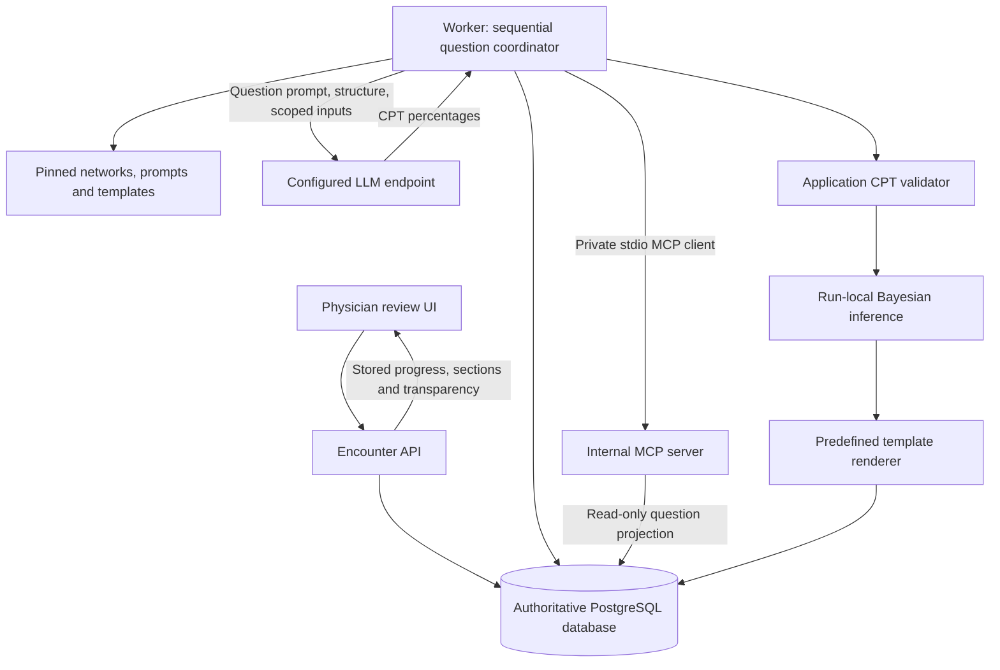

# X-INSIGHT — MCP Server Design

## 1. Scope and requirements

This component design implements the [reasoning pipeline](../user-requirements.md#reasoning-pipeline) within the [system design](system-design.md) and [system architecture](system-architecture.md). The internal database remains the single source of truth. The MCP server exposes read-only, question-scoped patient-record access; the application owns scheduling, response validation, network execution and proposal rendering.

| Requirement | Design responsibility |
|---|---|
| FR-30 | One network for each of seven registration and six follow-up questions; use the inventory in system-design.md Section 7.1 |
| FR-31 | Each question has a predefined prompt and a corresponding XMLBIF network; XSD validates structure only |
| FR-32 | Process questions sequentially; supply the question prompt, fixed network structure and only represented patient variables |
| FR-33 | LLM estimates CPT percentages in the MCP environment; it neither executes the network nor modifies its structure |
| FR-34 | App inserts validated CPTs, executes deterministically and renders the relevant predefined proposal template before continuing |
| FR-35 | Automatic runs; internal MCP tools; persisted question, network version, supplied inputs, returned CPT percentages and network result shown alongside the recommendation |
| FR-36 | Two to three retries, then a clear failed-question error; retain patient data and completed results; permit later retry |
| FR-37 | Registry supplies validated, versioned XMLBIF artifacts; administration remains outside MCP tools |
| FR-16, FR-42–43, NFR-04 | Exclude page notes; audit runs; queue concurrent provider calls; preserve deterministic inference replay |

**Confirmed CPT scope:** Estimate every CPT, including root distributions, for each applicable question. No registered table serves as a fallback for an omitted or invalid estimate. The registered network remains immutable; accepted values populate a run-local copy.

**Operating choices:** PostgreSQL-backed jobs, a separate worker and an internal stdio MCP server match the detailed system design. Choose two retries after the initial attempt, three attempts total, within FR-36's range. Use concurrency across separate runs; never process two clinical questions concurrently within one run. These are proposed implementation choices, not measured capacity claims.

## 2. Component boundaries and deployment



The worker acts as MCP host/client and bridges permitted model tool calls to the private server. The configured provider need not connect to MCP directly. Use the actual MCP transport on the application path, with a managed server process per worker and isolated per-question authorization contexts. Do not expose a public MCP port or add a second in-process invocation path.

The provider adapter must pass capability tests for the selected endpoint's required tool-call and response formats. Prefer schema-constrained output when supported; otherwise parse JSON and apply identical validation. The design does not assume every OpenAI-compatible endpoint supports all required capabilities.

| Component | Owns | Boundary |
|---|---|---|
| Encounter service | Saved records, draft ownership, automatic generation trigger | No model-originated writes to records |
| Registry | Immutable question networks, prompts, mappings, templates and bundle order | Administrative edits create new versions |
| Worker | Authorization context, sequential jobs, LLM requests, accepted artifacts | Cannot bypass draft ownership or current-run checks |
| MCP server | Read-only access to the current question's patient inputs | Cannot broaden the projection, run inference or submit CPTs |
| LLM | Candidate percentages for every CPT in the supplied network | No variable, type, state, relevance or structural changes; no proposal wording |
| Inference and renderer | Network result and template-based recommendation | Consume validated, pinned artifacts; no provider request |

## 3. Snapshot and question scope

At automatic run creation, freeze the encounter's analysis snapshot, ordered workflow bundle, network versions, predefined prompt/template versions, variable mappings, engine configuration and API configuration version. Exclude page notes from the analysis snapshot. Names, Patient ID and unrelated record fields are not included in model-facing projections.

Before each question, the app projects only patient variables represented in that question's network. The manifest binds each variable to permitted snapshot source paths and fixes its type, states and relevance. Applicability is evaluated by application rules against the saved snapshot; record not-applicable or unknown outcomes explicitly. Do not send unrelated applicability fields to the LLM.

```text
QuestionContext
  run_id, question_step_id, question_key, ordinal
  actor_id, encounter_id, snapshot_id, snapshot_hash
  network_id, network_version, network_hash
  prompt_version, template_version, mapping_version
  patient_projection_id, patient_projection_hash
  allowed_tool_names, lease_token
```

Bind this context server-side to the worker's authorized application session over the private MCP connection; this is application authorization state, not a protocol-level session requirement. It is not a model-editable tool argument. A reused connection must discard the previous question context before binding the next; reject a missing, expired, mismatched or terminal context. Validate actor and encounter eligibility at binding and before committing outputs. Session isolation must be tested; absence of patient identifiers in tool schemas alone does not prove isolation.

The same complete projection is persisted, supplied in the question request and returned by tools. Missing, not-assessed and conflicting values remain explicit. Required missing inputs pause the question for clarification. Optional missing inputs use the declared network policy; the LLM cannot invent a patient value. A projection that exceeds the context budget fails visibly rather than silently dropping variables.

## 4. Patient-record tool contract

One tool is sufficient for v1; additional reads must obey the same question projection.

| Tool | Arguments | Result |
|---|---|---|
| `get_question_patient_inputs` | Empty object; reject additional properties | Current question's represented patient-variable values, fixed types, source references and missing/conflict status from the immutable database snapshot |

Example result shape (illustrative variable names, not a supplied clinical network):

```json
{
  "question_key": "hospitalization",
  "network_version": 4,
  "projection_hash": "<stored-content-hash>",
  "variables": [
    {
      "node_id": "Age",
      "type": "integer",
      "value": 42,
      "status": "observed",
      "source_ref": "snapshot.demographics.age"
    },
    {
      "node_id": "UnderlyingCondition",
      "type": "categorical",
      "value": null,
      "status": "not_assessed",
      "source_ref": "snapshot.history.underlying_condition"
    }
  ]
}
```

These fields may appear only if those variables exist in the pinned network. A history mapping must select the represented variable's value, not return an entire history section containing unrelated facts. Medication projections follow FR-14's drug-only schema; no dose, unit, route, frequency or active/stopped fields are introduced. Historical signed facts may be returned only when explicitly mapped to a represented variable. Page notes are always excluded.

The worker obtains the initial patient projection through this MCP tool before sending the request; optional model-requested reads return the same projection. The worker supplies the network contract and predefined prompt from the registry directly. There are no full-record, patient-search, arbitrary query, evidence-submission, CPT-write, network-execution or proposal-drafting tools. CPT estimates return as the model's structured response; application code validates and persists them. No separate MCP prompt or resource mirror is required for v1.

Proposed limits are ten tool calls per attempt and a 60-second provider-request timeout, with bounded response and total context sizes selected during model admission tests. Tool errors distinguish invalid context, forbidden access, unavailable storage and oversized projection without exposing another patient's existence or contents.

## 5. Sequential run protocol

```mermaid
sequenceDiagram
    participant UI as Review UI
    participant W as Worker / MCP host
    participant DB as Database
    participant M as MCP server
    participant L as LLM
    participant B as Inference + templates
    UI->>W: Automatic trigger for saved encounter revision
    W->>DB: Freeze snapshot, versions and ordered question steps
    loop Each applicable question in pinned order
        W->>DB: Persist question-specific patient projection
        W->>M: Bind context and read get_question_patient_inputs
        M->>DB: Read bound projection
        M-->>W: Scoped patient inputs
        W->>L: Predefined prompt + network structure + patient projection
        opt Model requests the scoped patient-record tool
            L->>W: get_question_patient_inputs({})
            W->>M: Authorized tool call
            M->>DB: Read the bound projection
            M-->>W: Represented patient variables only
            W-->>L: Scoped tool result
        end
        L-->>W: CPT percentages for every node and parent configuration
        W->>W: Validate complete response
        alt Valid response
            W->>DB: Freeze returned percentages and effective CPT artifact
            W->>B: Insert values into run-local network; infer
            B->>B: Render question recommendation using predefined template
            B-->>W: Result and proposal section
            W->>DB: Commit result/section and enable next question
        else Failed request or invalid response
            W->>W: Retry within shared three-attempt budget
            W->>DB: On exhaustion, stop at failed question; retain earlier results
            Note over W,DB: Later questions remain pending until this step succeeds
        end
    end
    W->>DB: After all applicable questions complete, assemble sections + local DDI
    DB-->>UI: Stored proposal, progress and transparency
```

A `ReasoningRun` contains ordered `QuestionStep` records. Only the current step is eligible. An applicable question moves through `queued → preparing_question → estimating_cpts → validating_cpts → inferring → rendering → succeeded`. Not-applicable questions terminate with a recorded reason; missing required inputs enter `needs_clarification`; exhausted failures enter `failed`. `stale` and `cancelled` preserve historical artifacts without allowing signing.

The diagram's loop advances only after a question succeeds or is explicitly not applicable. No later question starts while the current one is retrying, awaiting clarification or failed. No implicit cross-question result chaining is introduced: subsequent LLM requests still contain only their own represented patient variables.

Render and persist each completed question's proposal section before advancing. Once all applicable questions succeed, assemble them with the locally generated DDI report and mark the proposal complete. Partial results remain reviewable but are labeled incomplete. Preserve the existing confirmed signing rule: a current successful proposal and physician review are required; generation failure does not permit manual-plan signing.

## 6. CPT response and validation

The fixed network contract declares all nodes, types, states and ordering, parent relationships, parent-state configurations and output queries. It carries no permission to modify structure or relevance. Each question's predefined prompt requests the complete CPT set in percentage units.

```text
CPTResponse
  question_key, network_version, network_hash
  tables[]
    node_id
    parent_ids[]                   # exact declared order
    states[]                       # exact declared order
    rows[]
      parent_states[]              # aligned with parent_ids
      percentages[]                # aligned with states
```

A root node has no parents and exactly one row with an empty `parent_states` array. Every other node includes exactly one row for each declared parent-state combination. A response may not omit a table or supply a replacement structure.

| Check | Application behavior |
|---|---|
| Identity and schema | Require matching question/network version/hash; reject extra structural fields and malformed responses |
| Complete coverage | Require every node's complete CPT; reject missing, duplicate or unexpected tables/rows/cells |
| Ordering and dimensions | Require exact declared parent/state identities and ordering and Cartesian-product coverage |
| Numeric validity | Require finite numeric percentages in `[0,100]`; reject strings, booleans, nulls, NaN and infinities |
| Row sums | Require 100 within a documented absolute tolerance; proposed tolerance is `0.000001` percentage points |
| No silent correction | Reject invalid output; do not clamp, renormalize, fill defaults or round values for inference |
| Conversion and insertion | Preserve returned percentages; divide by 100 for engine probabilities and populate every table in a run-local XMLBIF copy |
| Effective artifact | Freeze the complete accepted set and XML/hash before inference; never mutate registered XML |

Exact zeros and hundreds are valid percentages. If they produce impossible evidence, inference reports that failure; the application does not silently soften them. Structural XSD validation, runtime mathematical checks and clinical validity are separate concerns. Clinical thresholds, mappings and validation fixtures must come from supplied versioned content.

Structured patient facts may map deterministically to observed inference evidence under the manifest. The LLM does not return evidence classifications. The manifest must specify how supplied facts affect estimation and observation to avoid unintentionally counting them twice. This interpretation remains content to validate, not a new model decision.

## 7. Retry, recovery and queue contracts

| Failure | Handling |
|---|---|
| Timeout, transient endpoint error or rate limit | Retry with bounded backoff/Retry-After; consume the same question-attempt budget |
| Invalid or incomplete CPT response | Return bounded validation errors and retry the full question response against the same prompt, structure and patient projection |
| Invalid credentials, unavailable model or unsupported capability | Fail clearly as configuration error; resume only after correction, without repeatedly sending unchanged requests |
| Required patient input missing/conflicting | Pause for clarification; never substitute a guessed value |
| MCP storage/transport error | Retry within the same bounded budget where transient; retain recorded attempts |
| Inference error or resource limit | Stop the question, retaining accepted CPTs for diagnosis and retry; no silent approximation |
| Template rendering error | Stop the question and retain its inference result; retry rendering without an LLM call |
| Worker crash | Recover after lease expiry using durable artifacts and the recorded attempt count |
| Changed analysis input, archive, discard or account deactivation | Mark stale/cancel eligibility as appropriate; prevent stale commits and signing |

Choose two retries after the initial LLM attempt: three attempts total across transport and validation failures. Do not multiply separate repair and request retry budgets. Rate limits, tool loops and worker recovery cannot create unlimited retries. A manual retry creates a new bounded attempt batch for the failed stage, retaining previous history.

The failed-step message identifies the question and cause, for example: “Hospitalization question failed: CPT values were invalid after three attempts. Saved data and completed results are retained. Retry this question.” Subsequent questions remain pending.

Retry on an unchanged snapshot resumes the failed stage with pinned versions. Reuse completed CPT validation, inference or rendering artifacts as applicable; do not rerun successful earlier questions. If patient inputs change, create a new run. If configuration repair requires replacing pinned credentials or model settings, create a new run rather than silently changing the existing run's provenance. Activating a new network version does not abort a run using its pinned version.

Use the system design's PostgreSQL jobs, leases, heartbeat, fencing and idempotent commits. Commit successful question completion and eligibility of its successor atomically. Enforce one active generation per encounter and at most one eligible question per run. Proposed global provider concurrency is two, with fairness across physicians' eligible runs. Persistent completion survives a worker restart, although an ambiguous provider timeout can still result in a repeated billable request.

## 8. Persistence and deterministic replay

Use the shared entities in system-design.md Section 5, not a separate MCP database or competing run-group model.

| Entity | Pipeline-specific stored content |
|---|---|
| `ReasoningRun` | Immutable analysis snapshot/hash, encounter revision, owner, ordered bundle, pinned configuration and engine versions, current question, aggregate status |
| `QuestionStep` | Question key/order, network/prompt/template versions, applicability/reason, exact supplied patient projection/hash, status and attempts |
| `JobAttempt` | Question/stage, attempt batch/index, request/response status, validation errors, timing, provider/model, tool-call metadata and projection references |
| `RunCPTSet` | Returned percentages, complete validated probabilities, effective XML/hash, accepted response and validation report |
| `EvidenceItem` | Deterministically mapped observations with source and mapping version |
| `NetworkResult` | Question query, posterior/result, warnings, engine/runtime version, inference input hash |
| `Proposal` | Stored per-question rendered sections, source result IDs and template versions; final assembled proposal and DDI reference |
| `AuditEvent` | Append-only run/question transitions, retries, accepted-artifact hashes and completion/failure references |

Retain the exact effective request inputs and accepted response in restricted run storage. A versioned prompt plus recorded dynamic request fields must reconstruct what was sent. Operational logs and audit events store references and safe metadata, not keys or unrestricted record bodies. The transparency payload reads these persisted artifacts rather than rebuilding inputs from the current patient chart.

The replay key includes network structure/version, complete effective CPT set, mapped evidence, query and engine/runtime configuration. Deterministic replay uses these stored artifacts without calling the LLM and verifies results within the declared numerical tolerance. Do not claim bit-identical output across unpinned engines or platforms. Fresh estimation may produce different CPT values even for identical records.

Immutable network structures can be cached by hash. Patient projections and effective CPTs remain scoped by run and question; never cache them under a network-version key alone. Backup and restore must preserve run artifacts, question prompts/templates and network versions together with the authoritative database.

## 9. Application API and physician transparency

Use the existing REST API under `/api/v1`; these routes are application endpoints, not model tools.

| Endpoint | Contract |
|---|---|
| `POST /encounters/{id}/runs` | Automatic review-entry trigger with snapshot revision and idempotency key; returns run ID and ordered question steps |
| `GET /runs/{id}` | Aggregate/current-question status, per-question results and proposal sections, errors, and stored transparency artifacts |
| `POST /runs/{id}/retry` | Author-only; identify failed question/stage and expected run revision; create new bounded attempt batch and resume sequence |

The review panel shows, alongside each question's recommendation:

1. Clinical question and pinned network version.
2. Exact patient-variable values supplied to the LLM, source references and missing/not-assessed states.
3. Returned CPT percentages, with node and parent-state configuration, separate from posterior result percentages.
4. Deterministic network result and predefined template version used for the recommendation.
5. Completion/failure status, retained prior results, pending questions and a retry action when eligible.

The initial run starts automatically on reaching proposal review once required data and acknowledgments are saved; it does not require a separate physician click. Repeated triggers reuse the active run for the same snapshot. Manual retry is explicit and auditable. A partial pipeline must never appear as a complete proposal or satisfy the signing prerequisite.

## 10. Security and audit boundaries

Use private stdio transport, a read-only database role for MCP access and server-bound contexts. The worker uses separate authorized persistence for artifacts. Patient field projection is enforced in application serializers and MCP reads, independent of prompt instructions. Records and responses are treated as data; no shell, SQL, URL-fetch or filesystem capability is exposed to the LLM.

API credentials remain server-side, encrypted at rest and absent from tool schemas, responses and audit logs. Endpoint destination controls, authentication, account status checks and HTTPS follow the system design. Prototype-basic security does not imply clinical validation or production PHI hardening.

Audit automatic run creation, question start/skip/failure, bounded retries, tool access, accepted CPT snapshots, inference completion, template-section completion and final proposal completion. Each event records the initiating physician and system actor where applicable, question/run references, timestamp and outcome. Preserve failed attempts; never overwrite history during retry.

## 11. Capacity, trade-offs and growth

A registration has up to seven sequential LLM estimation steps; follow-up has up to six. Each has one initial estimation attempt plus at most two retries, excluding optional tool exchanges and later explicit manual retry batches. There is no separate LLM extraction or proposal-writing phase. Measure latency, payload sizes, retry counts and inference cost against representative networks; user count alone does not predict full-CPT output size.

| Decision | Benefit | Cost / revisit trigger |
|---|---|---|
| Sequential questions | Matches FR-32–34 and makes resume position explicit | Sum of question latencies; scale separate runs without parallelizing questions |
| Estimate every CPT | Matches confirmed scope and makes the response contract complete | Large parent-state products increase output size and validation failures; revisit model admission limits and prompt quality |
| One scoped patient-record tool | Small access surface and consistent question inputs | Mapping definitions must be complete; add tools only for demonstrated needs under the same scope |
| Private stdio MCP | One real protocol path with no public listener | Worker/server lifecycle management; revisit transport if deployment spans hosts |
| Predefined local templates | Predictable output grounded in stored network results | Content owners must supply adequate result mappings and wording |
| Strict validation without silent repair | Displayed estimates match accepted inference values | More corrective retries; measure response quality rather than distorting values |
| Persistent snapshots and artifacts | Retained partial work, transparency and replay | Storage growth; measure before setting retention rules |
| PostgreSQL job queue | Atomic record/job changes and one recovery store | Revisit a broker only when measured queue contention warrants it |

Before integration, obtain each network's complete contract, prompt, patient mappings, missing-data/applicability rules, proposal template and mathematical fixtures. Revisit calibration through research evaluation; syntactic and numerical validation alone cannot establish recommendation quality. Infrastructure sizing and latency targets remain unverified until benchmarked.

## 12. Verification criteria

- Cover all FR-30 questions, including one LAI indication-and-choice network.
- Assert question B cannot start before question A completes or is marked not applicable; a failed question pauses later ones.
- Inspect requests and MCP results to prove exclusion of nonrepresented variables and page notes, including mixed-content history and connection reuse across questions/patients.
- Verify every node's CPT is required, including root distributions; reject missing/duplicate cells, structural changes, invalid numbers and invalid sums without default substitution or normalization.
- Verify percentage conversion, fixed structure/state ordering and immutability of registered XML after insertion into the run-local network.
- Verify proposal sections use predefined templates and that no LLM drafting request occurs.
- Exhaust mixed timeout/invalid-response attempts; preserve drafts and completed sections; resume the failed stage without repeating successful earlier questions.
- Recover after a worker crash without duplicate committed sections or a reset retry counter; activating a new model does not change pinned runs.
- Replay stored artifacts without an LLM request and compare inference results within the declared tolerance.
- Display the five required FR-35 transparency fields alongside each recommendation; block signing for partial, failed or stale proposals.

These are implementation acceptance criteria, not claims of completed software tests.
