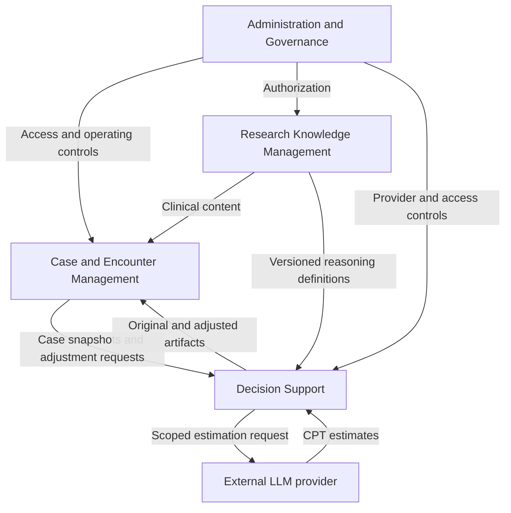

# X-INSIGHT — System Architecture

Revision: 2026-09-28. Basis: the supplied `user_requirements.md` and the project owner's subsequent clarifications. This document describes the highest-level software structure. Technical data models, algorithms, API contracts and deployment proposals belong in `system-design.md`.

## 1. Purpose and vocabulary

X-INSIGHT is an English-only research prototype helping physicians/psychiatrists explore treatment options for schizophrenia. It serves one administrator and fewer than ten physicians with a shared patient pool. The research warning appears after physician login; the application must not be the sole basis for treatment.

| Level | Definition | Application |
|---|---|---|
| System | The complete software serving the overall purpose | X-INSIGHT |
| Subsystem | An independent system holding independent value | A coherent capability with a useful outcome and owned information |
| Module | A component of a subsystem that cannot function as a standalone system | A capability whose value depends on its parent subsystem's context |

Independence means a subsystem can deliver its defined value without completing the whole clinical workflow. It does not require separate deployment, database or application. Maintaining a patient record remains useful during a provider outage; a CPT slider alone has no standalone value outside a question run and physician review.

## 2. System boundary and governing decisions

| Participant | Relationship to the system |
|---|---|
| Physician | Maintains cases, privately authors a draft, reviews/adjusts probabilities, signs a plan and adds attributed corrections to signed records |
| Administrator | Manages accounts, models, provider settings, archiving, exports, audit and recovery; cannot sign for a physician |
| Configured LLM provider | Estimates all CPT values from scoped patient inputs and fixed network structure; does not execute networks or sign records |
| Hosting environment | Supplies execution and durable storage; outside the functional subsystem decomposition |

The internal database is the authoritative record. MCP provides controlled access to question-specific patient inputs. The LLM estimates probabilities; the application validates them, executes the Bayesian network and renders recommendations from predefined templates.

The following decisions govern every subsystem:

- Patient variables inform LLM CPT estimation only; they are not also submitted as observed, soft or virtual evidence to Bayesian inference. Record workflows, applicability and DDI checks still use their relevant clinical inputs.
- All CPT values, including root distributions, are available for physician review and adjustment, subject to normalized distributions and the single-state 100% constraint.
- Each patient has at most one open encounter draft. Only its author may view its clinical content, edit it, adjust/reset probabilities, accept results or sign it.
- Any active physician may append an attributed addendum to any signed encounter. The signed record itself is immutable.
- Signing requires a successful current original proposal, accepted current probability results and physician review. Failed generation cannot be bypassed with a manual plan.

Excluded from v1: autonomous treatment, external EHR integration, self-registration, permanent patient deletion, PDF generation and graphical network editing. The catalog is explicitly a demo catalog; the requirements do not otherwise impose a synthetic-only patient restriction. Prototype security does not imply PHI hardening or clinical validation.

## 3. Subsystem decomposition

Retain four logical subsystems. Interactive probability review extends existing case and reasoning responsibilities; it does not warrant a separate independent subsystem.

| ID | Subsystem | Independent value | Primary owned information |
|---|---|---|---|
| S1 | Case and Encounter Management | Maintains a useful longitudinal case record, even when reasoning is unavailable | Patients, private drafts, assessments, history, medications, notes, accepted-result references, secondary plans, signed snapshots and addenda |
| S2 | Research Knowledge Management | Maintains reusable, inspectable and exportable research definitions without an encounter or LLM call | Network versions, fixed variable/state definitions, prompts, templates, content, validation and activation |
| S3 | Decision Support | Produces inspectable original and adjusted analysis artifacts without finalizing a clinical encounter | Scoped input snapshots, original baselines, CPT revisions, calculation results, generated recommendations/proposals and provenance |
| S4 | Administration and Governance | Provides access control, accountability and recoverable operation independently of a current encounter | Accounts, operating configuration, audit history and recovery operations |

All subsystems supply audit events to S4. Those additional arrows are omitted for readability. The external-provider relationship applies to original estimation and regeneration; local probability recalculation does not traverse it.

## 4. Subsystems and modules

### 4.1 S1 — Case and Encounter Management

**Outcome:** An accessible signed case history and a private, resumable encounter workflow. Draft recording remains useful without completed decision support, although plan signing remains blocked.

| Module | Responsibility |
|---|---|
| Patient Registry | Unique identifiers, demographics, phone, clinical status, search and archive lifecycle |
| Encounter Workflow | Registration/follow-up, one open draft per patient, author-only access, autosave, resumption and confirmed discard |
| Assessment and History | Versioned DSM-5-TR/PANSS/C-SSRS assessments, explicit missing states, structured history and adverse effects |
| Medication Review | Catalog-selected medications and local DDI reporting with explicit coverage limitations |
| Page Notes | Attributed timestamped notes kept outside algorithm inputs |
| Probability and Plan Review | Presents all CPTs, original/adjusted comparison and calculation state; captures author adjustment intent and final acceptance |
| Sign-off and Corrections | Enforces current-result prerequisites, freezes final plan/snapshots and permits any physician to append an attributed addendum |
| Record Presentation and Reporting | Shared signed chart and printable probability/plan history while preserving draft privacy |

Each module depends on a case or encounter and therefore does not constitute a standalone subsystem.

**Boundary:** S1 owns physician intent, probability acceptance and the final secondary plan. It asks S3 to calculate and references the resulting artifacts; it does not independently implement a competing probability algorithm. S1 cannot rewrite S3's original baseline or a prior signed record. Another physician's demographic update can make a draft's relevant analysis stale without granting access to that draft.

### 4.2 S2 — Research Knowledge Management

**Outcome:** A versioned research knowledge collection that can be maintained independently of patient encounters.

| Module | Responsibility |
|---|---|
| Bayesian Model Library | XMLBIF import, XML edit/export and read-only graph inspection |
| Model Validation | Structural validation and separate probability/model consistency checks |
| Version and Activation Control | Immutable versions, validated activation and rollback |
| Assessment and Drug Content | Assessment forms/rules, structured content definitions, demo catalog and local interaction coverage |
| Reasoning Definitions | Fixed variable/state meanings, represented patient mappings, complete CPT contracts, applicability/order, output queries, prompts and recommendation templates |

These modules derive their value from the managed knowledge collection and its interpretability.

**Boundary:** S2 owns shared definitions, not patient-specific probabilities. The LLM estimates every table in a run-local copy; registered defaults do not replace missing estimates. Physician adjustments do not edit XML definitions, activate models or create shared network versions. Historical definitions remain available for original and adjusted result replay. Content ownership does not imply an unrequested graphical content editor.

### 4.3 S3 — Decision Support

**Outcome:** A reproducible analysis artifact with original and optionally adjusted probabilities, outputs, recommendations and their provenance. S3 produces this value without signing a physician plan.

| Module | Responsibility |
|---|---|
| Analysis Coordination | Automatic initial generation, sequential clinical questions, applicability, bounded retries and resumable failures |
| Authorized Input Access | Internal MCP access restricted to the current question's saved patient projection |
| Patient Input Projection | Selects represented patient variables, tracks source versions/missingness and detects relevant input changes |
| CPT Estimation and Validation | Obtains all LLM-estimated CPTs and validates complete normalized distributions before original execution |
| Baseline Preservation | Retains the successful original CPTs, output, recommendation and pinned definitions immutably |
| Probability Adjustment | Applies physician commands with proportional redistribution and reset, preserving every committed revision |
| Bayesian Execution | Deterministic original/local execution of saved CPTs with fixed structure and no additional patient evidence |
| Recommendation Generation | Applies pinned templates; assembles original proposals with DDI findings and separately renders adjusted recommendations |
| Calculation Integrity and Provenance | Associates results with exact revisions, prevents stale response replacement and preserves replay/history |

Each module requires an authorized analysis context and versioned definitions. Neither the CPT controls nor the execution adapter independently delivers the subsystem's complete result.

**Boundary:** S3 owns original/adjusted calculation artifacts, not the physician's final plan. Original generation uses the LLM and MCP; local recalculation uses saved artifacts and neither external mechanism. A failed recalculation preserves both the new unsolved values and prior successful result as distinct states. S3 never labels an old result as belonging to current unsolved values.

Registration covers hospitalization, pharmacotherapy, involuntary care, high-suicide Clozapine, LAI indication/choice, aggression Clozapine and established-case Clozapine. Follow-up covers tardive dyskinesia, akathisia, parkinsonism, acute dystonia, no-improvement Clozapine and continue-versus-adjust. These are configured clinical questions, each with one network, rather than separate subsystems.

### 4.4 S4 — Administration and Governance

**Outcome:** An administered, accountable and recoverable operating environment that remains useful without an active encounter or successful provider request.

| Module | Responsibility |
|---|---|
| Identity and Access | Roles, credentials, sessions, account deactivation and enforcement of author-only draft access |
| Operating Configuration | Provider key/base URL/model and user preferences |
| Audit | Append-only actions, original runs, probability edits/redistribution, resets, calculation outcomes, acceptance and signing |
| Backup and Restore | Coherent recovery of clinical records, baselines, revisions, calculations, signed snapshots and all referenced definitions |
| Administrative Reporting | Physician-list exports and authorized operational views |

These modules depend on X-INSIGHT's actors, domain events and consistency rules.

**Boundary:** Administrator privileges do not include physician signing or ordinary draft clinical access. Required audit and full-backup access are separate administrative capabilities. Model editing remains owned by S2 and patient archiving by S1; S4 supplies their administrator authorization. An admin dashboard is not a fifth subsystem.

## 5. Information ownership and collaboration

| Information or request | Owner | Consumer | Required boundary |
|---|---|---|---|
| Case and question inputs | S1 supplies facts; S3 preserves analysis projection | S3 | Only represented variables go to the LLM; page notes excluded |
| Versioned knowledge | S2 | S1 and S3 | Definitions remain identifiable and historical versions available |
| Original CPT baseline and output | S3 | S1 review/signing | Immutable after successful original execution |
| Physician adjustment intent | S1 | S3 | Author-only, limited to one current question run |
| Adjusted CPT revisions/results | S3 | S1 | Complete distributions, exact revision association and truthful calculation state |
| Acceptance and signed secondary plan | S1 | Reporting and recovery | References exact current results; freezes original/final artifacts together |
| Attributed addendum | S1 | Shared signed chart | Any physician can append; no signed content replacement |
| Permissions/configuration | S4 | All subsystems | Active role and ownership checked at operation boundaries |
| Domain audit events | Domain owner supplies; S4 preserves | Administrator | Includes actor/time and relevant before/after probability values |
| Recovery state | Each information owner, coordinated by S4 | Restored application | Preserves cross-subsystem references and immutable history |

One logical owner remains authoritative for each mutable category. Signed snapshots deliberately copy historical state for permanence; they do not become competing editable master records. Acceptance belongs to S1, while validity of the referenced calculated artifact is supplied by S3 and must be checked coherently at signing.

## 6. End-to-end behavior

### 6.1 Original proposal

S1 records a private registration or follow-up draft using S2's versioned content. On reaching proposal review, S3 obtains a fixed authorized snapshot and processes applicable questions sequentially. For each question it sends only represented patient variables, the predefined prompt and fixed network structure to the LLM in the MCP-enabled workflow. It validates every returned CPT, executes the network without adding patient evidence and renders a template recommendation. Successful originals become immutable baselines. The complete initial proposal combines original question recommendations with DDI findings.

Failed provider requests or invalid estimates receive bounded retries; exhaustion stops the affected step. Data and completed results remain saved. Questions without successful original execution expose no adjustable result. Manual retry resumes eligible failed work rather than erasing successful questions.

### 6.2 Physician probability review

S1 presents all root and conditional CPT rows with original/current values and outputs. An author-completed slider change is sent to S3, which keeps the selected probability and redistributes the remainder proportionally within that row, using equal distribution when all other prior values are zero. Single-state rows remain 100%; deterministic rounding preserves valid totals.

S3 saves the adjustment and locally recalculates only that question using the same baseline input snapshot, network and template versions. Other questions, shared models and signed plans are unaffected. S1 shows original and adjusted recommendations side by side, including unchanged recommendation text when that is the correct result.

If a newer adjustment exists, an older calculation cannot become the current result. Failed work keeps its values and displays any prior successful result as belonging to an earlier revision. Reset restores that question's original baseline without an LLM call and without deleting history.

### 6.3 Acceptance and signing

S1 records the author's acceptance of the exact current probabilities and matching results for every applicable question, including unchanged ones. Signing requires all originals to be successful/current and all final accepted results to be solved/current. Pending, failed or obsolete results cannot justify signature.

The signed record preserves the original proposal, original CPTs/results, accepted CPTs/results, physician-adjusted recommendations, separate plan edits, patient snapshots, versions and attribution. Follow-up creates a new encounter; any physician may append a dated correction to an existing signed encounter without modifying it.

### 6.4 Relevant patient-data changes

A change to a represented patient variable or applicability dependency marks affected results and adjustments out of date. S3 regenerates affected applicable questions, preserving earlier runs/history and creating new original baselines. Old physician adjustments are not silently transferred. Unaffected current questions can retain their artifacts. S1 requires renewed acceptance for changed results before signing. Notes do not trigger regeneration.

## 7. Failure and availability boundaries

| Situation | Still useful | Completion restriction |
|---|---|---|
| LLM unavailable | Record work, knowledge maintenance and local adjustment of existing current successful baselines | Failed/incomplete originals block new signing; provider availability alone does not invalidate a completed baseline |
| Local recalculation pending or failed | Saved draft, adjusted values, original baseline and visibly identified earlier successful result | Current result cannot be accepted until solved or reset |
| Patient data relevant to a question changes | Draft editing and retained historical analysis | Affected question needs a new original baseline |
| Another physician owns the open draft | Shared demographics and signed records | No draft viewing or second draft creation |
| Draft author deactivated | Signed records and administration | Retained draft remains reserved until reactivation or explicitly confirmed discard |
| Shared hosting/storage outage | Depends on infrastructure recovery | Logical subsystem boundaries do not promise independent process availability |

These rules separate failure domains without introducing unrequested services or high-availability guarantees.

## 8. System-wide constraints

1. Original runs and signed snapshots are immutable; adjusted CPTs form a retained revision history.
2. Shared patient access coexists with private drafts and one open draft per patient.
3. Authorization applies to derived artifacts, reports and background results, not merely visible controls.
4. All CPT values remain inspectable; outputs remain calculated results rather than editable inputs.
5. Probability changes preserve row normalization, fixed structure and encounter/question isolation.
6. Reproduction uses saved complete CPTs and pinned execution configuration; recommendation reproduction also pins templates. Fresh LLM estimation is not replay.
7. Page notes never influence algorithms. Missing/unknown/not-assessed data remain distinct from absent findings.
8. Backups and reports preserve original/final probability distinctions, versions and physician attribution.
9. No application session timeout or password-complexity policy is added; HTTPS is required outside localhost.
10. Local recalculation consumes no provider or MCP calls and cannot restart unrelated questions.

Archive handling remains an unconfirmed policy proposal in the detailed design: retained drafts would become read-only while archived and resumable after unarchive. Clinical content, discard retention and physician export permission also remain explicitly identified inputs. They do not reopen the confirmed draft/evidence/addendum decisions or alter these subsystem boundaries.

## 9. Requirements responsibility map

| Requirements | Accountable subsystem | Supporting subsystems |
|---|---|---|
| FR-01–04: access and accounts | S4 | S1 for draft effects |
| FR-10–16: registration, assessments, proposal and notes | S1 | S2 content; S3 original/adjusted analysis |
| FR-20–23: follow-up, immutability and directory | S1 | S3 results; S4 authorization |
| FR-30–36: sequential reasoning, transparency and recovery | S3 | S2 definitions; S1 snapshots; S4 configuration |
| FR-37: network management | S2 | S4 administrator access |
| FR-40: exports | S1 patient reports; S4 physician lists | S3 probability artifacts; S2 versions |
| FR-41–42: backup and audit | S4 | All information owners |
| FR-43: provider settings and execution separation | S4 settings; S3 execution | S1 progress presentation |
| FR-50–51: complete probability controls | S1 presentation; S3 artifact access | S2 fixed node/state meanings |
| FR-52–56: redistribution, local results, reset and persistence | S3 | S1 author interaction; S4 audit |
| FR-57: acceptance and sign-off | S1 | S3 exact-result validation; S4 attribution |
| FR-58: revision integrity and failure | S3 | S1 truthful state presentation |
| FR-59: relevant patient-data changes | S1 source changes; S3 invalidation/regeneration | S2 dependency definitions |
| NFR-01–06 | System-wide | Detailed mechanisms in system-design.md |
| Owner clarifications | S1 private single draft/addenda; S3 CPT-only patient influence | S4 enforced access |

## 10. Rationale and evolution

The four subsystems divide independently useful responsibilities: maintaining cases, maintaining knowledge, producing analysis and governing operation. Probability review crosses S1's physician workflow and S3's calculation ownership; it does not introduce a new standalone product. Explicit ownership preserves the distinction between system estimates, physician-adjusted calculations and signed clinical decisions.

The cost is coordination: input freshness, CPT revision, result identity and acceptance must agree at sign-off. Retaining complete originals and adjustments increases storage, but makes comparison, reset, audit and replay possible. Single private drafts simplify authorship while making explicit recovery from abandoned drafts necessary.

The modular monolith and worker proposed in `system-design.md` can implement these boundaries in a coordinated deployment. Microservices are not required. Any future separation must preserve private draft access, single-draft uniqueness, local-only recalculation, immutable provenance and atomic signing eligibility.