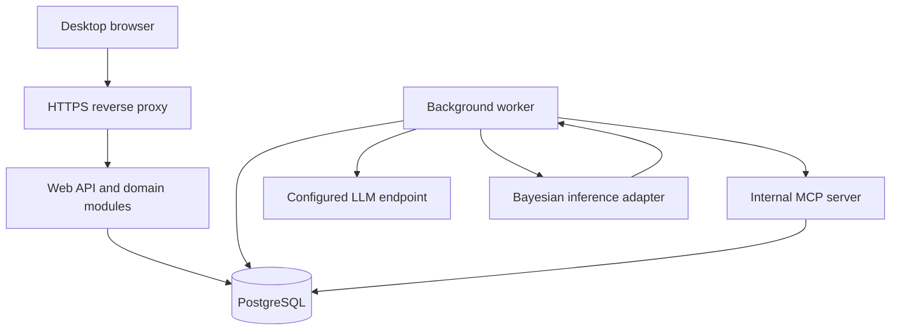
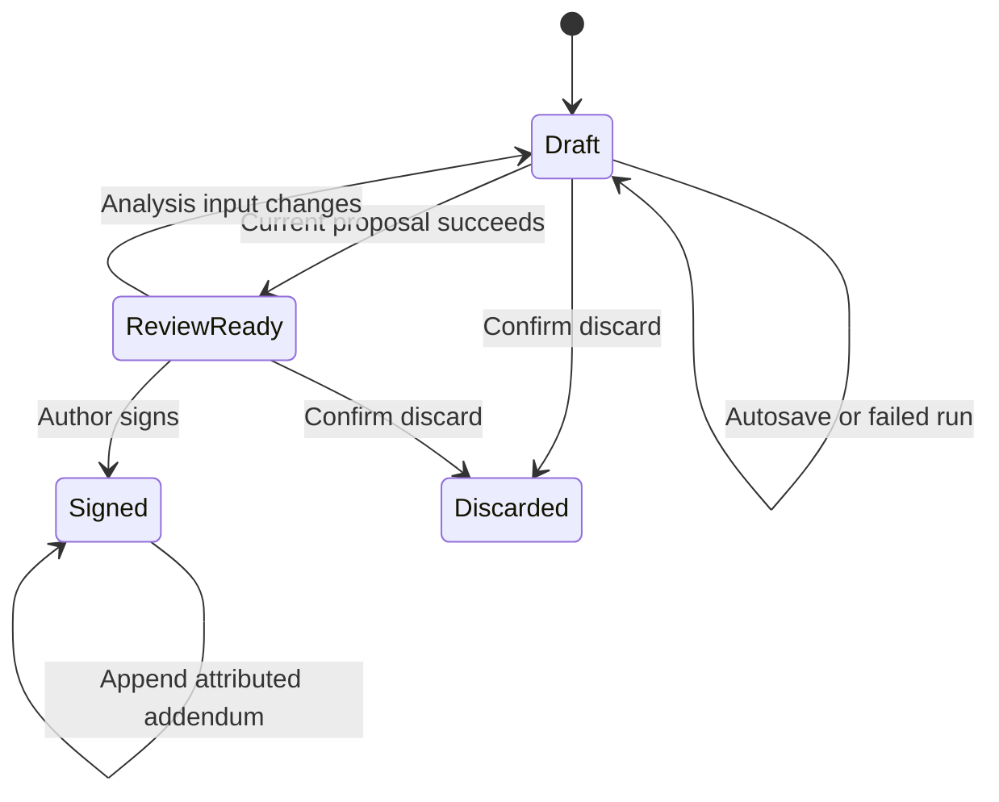

# X-INSIGHT — System Design

## 1. Basis, precedence, and boundaries

[User requirements](../user-requirements.md) are the governing baseline for this revision, dated **2026-09-20**. [System architecture](system-architecture.md) defines logical subsystem ownership; this document defines workflows, contracts, persistence, execution and deployment. Technology choices and numerical operating targets remain proposals. The previously confirmed requirement that signing needs a successful current AI proposal is retained.

X-INSIGHT helps one administrator and fewer than ten physicians maintain a shared patient pool, assess schizophrenia cases, review generated treatment proposals, and sign physician-edited plans. It is a research prototype. After every successful psychiatrist login, display: **“This is a research app and is not intended to be used as the sole basis for treating patients.”** The application does not independently execute treatment decisions.

### 1.1 Changes from the previous design

| Governing requirement | Design consequence |
|---|---|
| FR-01 | Display the research warning after successful physician login |
| FR-11–13 | Use versioned DSM-5-TR diagnostic criteria, PANSS and C-SSRS content; diagnosis bypass needs no reason; skipped severity/suicide assessments are not assessed |
| FR-14 | Medication entries identify drugs without dose, unit, route, frequency or active/stopped fields; retain the bundled demo catalog and local DDI database |
| FR-30 | Seven registration questions and six follow-up questions; remove taper feasibility |
| FR-32–34 | Fix network variables, types and relevance; let the LLM determine patient-specific CPT probabilities through the MCP-mediated workflow; application validates and executes; display inputs and CPT percentages |
| FR-02, NFR-02 | Seed admin/admin, impose no password complexity rules or session timeout; require HTTPS outside localhost; no mandatory password-change gate is specified |
| NFR-01–05 | Remove the previous synthetic-only patient restriction and correct NFR numbering; prototype scope does not establish clinical validation or PHI hardening |

### 1.2 Explicit exclusions

No permanent patient deletion, PDF generator, self-registration, graphical network editor, external EHR integration, multi-tenant organizations, mobile-specific interface, automatic treatment execution, or production clinical compliance claim in v1. Browser printing is supported through HTML. The requirements no longer restrict patient records or questionnaires to synthetic data; only the medication catalog is explicitly a demo catalog. Exact questionnaire editions/forms and approved content must be supplied before implementation of scoring.

## 2. Proposed architecture and deployment

Use a **modular monolith with a separate background worker**, one relational database, and an internal MCP server. Modules share one release and database but have explicit service interfaces and ownership. Long-running inference and LLM work must not block form saving or browsing.

| Layer | Proposed choice | Responsibility / reason |
|---|---|---|
| Browser UI | TypeScript + React | Desktop forms, wizard, review screens, graph display, theme, printable reports |
| Application API | Python + FastAPI | Authorization, validation, domain transactions, REST contracts |
| Worker | Same Python application package, separate process | Durable jobs, LLM orchestration, bounded inference |
| Reasoning engine | pgmpy adapter, pinned release after validation | Deterministic discrete Bayesian inference and XMLBIF import/export |
| Persistence | PostgreSQL | Concurrent records, versioned artifacts, audit events, sessions, durable job queue |
| MCP server | Internal Python process, stdio transport to worker | Narrow read-only access to run-scoped record snapshots |
| LLM adapter | Configured OpenAI-compatible HTTP API | Patient-input preparation, CPT estimation and proposal drafting; server-side credentials |
| Edge | HTTPS reverse proxy | TLS termination, request limits, static assets and API routing |
| Packaging | Container Compose deployment on Linux | Repeatable self-hosted or VPS installation |

These are recommendations, not a stack mandated by the requirements. Team familiarity, budget, and delivery deadline are unknown. Exact dependency versions must be selected, pinned, and tested during implementation.

The browser talks only to the application origin. The database and MCP server have no public ports. The worker obtains persisted jobs from the database. The inference adapter runs within a bounded child process when resource isolation is needed. The MCP server reads immutable snapshots from the same database; it does not create a second patient record store.

### 2.1 Module boundaries

| Module | Owns | Must not do |
|---|---|---|
| Identity | Accounts, credential changes, role checks, sessions, theme preferences | Infer privileges from the role selected on the login form |
| Patient registry | Identifiers, demographics, phone, archive state, revisions | Modify signed encounter snapshots |
| Encounter service | Drafts, assessments, history, medications, notes, final plans, addenda | Allow non-author draft edits or signing |
| Assessment and drug content | Questionnaire versions, scoring rules, demo drug catalog, interaction data | Invent scoring rules or imply complete interaction coverage |
| Model registry | XML, manifests, validation, immutable versions, activation | Change a model already referenced by a run |
| Reasoning orchestration | Run snapshots, evidence, patient-specific CPT artifacts, jobs, inference outputs, proposals | Change registered network structure or sign plans |
| Operations | Exports, backups, restores, audit viewing | Bypass domain authorization or silently overwrite live data |

Only domain service interfaces perform writes. API handlers, workers, and MCP tools reuse the same access policies instead of issuing unrestricted database operations.

## 3. Access, identity, and initialization

Exactly one administrator exists, with immutable username `admin`. A singleton constraint or dedicated administrator identity prevents provisioning a second administrator. Seed password `admin` once and store only a password hash. Administrators can change their password; no complexity rules, mandatory first-login change or deployment password-change gate are required. Password entry is required and credentials are never trimmed silently. Use a standard password-hashing implementation, with parameters selected through deployment testing.

Store opaque session tokens as hashes server-side. Cookies are HttpOnly, SameSite, and Secure under HTTPS. Do not configure application idle or absolute session expiration, in accordance with NFR-02. Sessions nevertheless end on logout, account deactivation, password change/reset, restore, or administrative credential revocation. Browser-cookie persistence is an implementation preference; it must not introduce a server inactivity timeout. Enforce account-active status on every request and before committing queued work.

| Capability | Administrator | Physician |
|---|---|---|
| Change own password and theme | Yes | Yes |
| Create/edit/deactivate physician | Yes | No |
| Change admin username / create another admin | No | No |
| View patient directory and records | Yes | Yes, shared pool |
| Update demographics / create encounters | No by default; not requested for admin | Yes |
| Edit/sign draft | No | Draft author only |
| Read another physician's draft | Proposed yes; visibly marked unfinished | Proposed yes; read-only |
| Add correction to signed encounter | No | Proposed original signer only |
| Archive/unarchive patient | Yes | No |
| CSV lists and patient HTML report | Yes | Proposed patient HTML only |
| API settings, models, audit, backup/restore | Yes | No |

Draft visibility, addendum authorship, and physician report permissions are unresolved product choices; the defaults above are proposals. Audit records retain stable actor IDs and display-name snapshots after usernames change.

The Register button displays “Contact administrator”. After successful physician authentication, show the research warning from Section 1 before proceeding with the role dashboard. Authentication failures return generic errors. Login throttling and CSRF protection protect sessions without adding password-complexity rules or idle logout.

## 4. Patient and encounter workflows

### 4.1 Registration

1. Require first and last names, sex M/F, age 18–99, a ten-digit identifier, and first-time/established clinical status. Keep Next disabled until valid. Propose Unicode letters only for names, rejecting digits, punctuation and spaces pending clarification. Patient ID is a text field constrained to exactly ten ASCII digits; preserve leading zeros in every layer. Check against the entire patient pool, including archived patients, before creation; reject a match. The database constraint below also protects against concurrent registrations.
2. Atomically create a patient and registration draft after valid demographics. Assign internal UUIDs and a server-generated encounter timestamp. A unique database constraint resolves simultaneous attempts to register the same ID; return a duplicate warning and a link to the existing patient. Do not merge automatically.
3. Capture the versioned DSM-5-TR diagnostic criteria. Show the threshold indicator live; recompute server-side using the supplied content rules. Below-threshold cases remain saveable and may continue to generation after a recorded warning acknowledgment. Bypass without a reason is allowed; record its status, author and time without requiring a reason field. An incomplete questionnaire is not a below-threshold result.
4. Capture PANSS severity and C-SSRS suicide assessments. Both start unanswered; skipping either records `not_assessed`. Compute a score/result only when its required items are complete under the supplied instrument rules; never silently assign zero or minimum scores.
5. Capture structured history, separate history free text, and medication records. Generate the local interaction report.
6. On reaching proposal review, automatically queue a run once required inputs and warning acknowledgments are present. Do not run on every keystroke. Display progress, extracted inputs, gaps, network versions, patient-specific CPT percentages, network outputs, DDI report and initial treatment proposal.
7. Let the author edit a separate secondary plan, review changes, and sign explicitly. Signing is an authenticated in-app attestation, not a qualified digital signature or external prescribing action.

### 4.2 Follow-up

Any active physician may start a follow-up for an unarchived patient. Copy prior signed clinical facts into the draft with provenance and require reconciliation of current medications and history. Do not inherit severity or suicide scores as if newly assessed. Show the source encounter and assessment dates. Capture phone changes, severity, suicide assessment, history, medications, and adverse effects before running the follow-up bundle.

Adverse-effect status is `present`, `absent`, or `not_assessed` for tardive dyskinesia, akathisia, parkinsonism, and acute dystonia. When present, record severity under the versioned content schema. An absent/not-assessed effect has no severity score. Retain other-effect text separately. No standardized scale is assumed.

### 4.3 Notes and algorithm-visible history

Every wizard page has an attributed, timestamped note facility. Page notes are a separate data type excluded from every evidence snapshot, MCP response, extraction prompt, and proposal prompt. This exclusion is enforced by an allowlisted serializer, not just a prompt instruction. They appear in the chart and report.

Structured history and the designated history free-text field may influence extraction; label them accordingly. The UI must make the distinction between “History used for analysis” and “Page note” clear. Signed encounter notes are immutable; later corrections are addenda.

### 4.4 State, autosave, and concurrency

Run state is separate from encounter state. Proposed run states are `queued`, `extracting`, `estimating_cpts`, `validating_cpts`, `needs_clarification`, `inferring`, `drafting`, `succeeded`, `failed`, `stale`, and `cancelled`.

Autosave uses a short debounce (proposed one second) and saves on page transitions. Display “Saving”, “Saved”, and “Save failed”; only a server acknowledgment means durable save. Warn on navigation when local edits remain unsaved. A crash may lose unacknowledged keystrokes, but acknowledged drafts survive process restarts. Do not claim offline editing support.

Every mutable record carries a revision/ETag. Updates require the expected revision; conflicting edits return `409` or `412` and require explicit reconciliation. Multiple tabs cannot silently overwrite one another. Shared demographic edits increment the patient revision, while draft ownership remains unchanged. Proposed policy permits multiple physicians to hold separate follow-up drafts, each showing other open encounters and their baseline signed encounter; signing against an outdated clinical baseline requires review and a new run when analysis inputs change.

A run pins an analysis snapshot, network/content versions and the complete effective CPT artifact. Edits to algorithm-visible facts invalidate its suitability for signing. Note-only changes do not require inference reruns, but signing still uses the latest encounter revision. Patient archive, account deactivation, and sign operations are rechecked inside the committing transaction.

Signed encounters are immutable. Corrections append dated, attributed records referencing the original; they never replace the original result. Addenda do not silently update structured clinical facts or generate a revised plan. A new encounter captures changed structured facts.

The shared patient list supports name and Patient ID search and a clinical-status filter (FR-23).

Proposed archive policy: retain visibility through an archive filter, block new encounters and signing, preserve existing drafts read-only, and resume them after unarchive. Patient discard does not delete the patient: it ends the draft and leaves an incomplete-registration record visible for recovery. These archive/discard policies require review.

## 5. Persistence and invariants

Use normalized relational tables for identities, ownership, state, and references. Use schema-validated JSON documents for versioned assessment answers, snapshots, and model output structures that evolve during research. Store UTC timestamps and display the browser's timezone with an explicit label. Record age as reported, including an encounter snapshot; do not infer a birthdate.

| Entity | Principal fields and constraints |
|---|---|
| `User` | UUID, unique normalized username, role, password hash, active flag, credential revision, theme; one admin only |
| `Session` | Token hash, user, credential revision, created/revoked times; no inactivity expiry |
| `Patient` | UUID, unique ten-digit text ID, names, sex, age, clinical status, optional phone, archived flag, revision |
| `PatientRevision` | Patient, revision, changed fields, actor, timestamp; attribution for demographic changes |
| `Encounter` | UUID, patient, registration/follow-up, author, state, visit time, baseline encounter, revision |
| `Assessment` | Encounter, type, content version, unanswered/partial/complete/not-assessed/bypassed state, answers, nullable score/result, bypass attribution; no required bypass reason |
| `History` | Encounter, structured fields, algorithm-visible free text, provenance |
| `MedicationEntry` | Encounter, catalog drug or explicit unknown label, provenance; no dose/unit/route/frequency/active-stopped fields |
| `AdverseEffect` | Encounter, effect type, assessment status, nullable severity, other text |
| `PageNote` | Encounter, page, author ID/name snapshot, timestamp, text; excluded from reasoning |
| `SignedEncounterSnapshot` | Encounter, complete signed record, final plan, initial proposal/run reference, signature actor/time, content hash |
| `Addendum` | Signed encounter, author/time, reason, correction text; append-only |
| `ContentVersion` | Type, schema, immutable payload/hash; questionnaires, scoring, catalog, DDI, prompt and proposal templates |
| `Network` / `NetworkVersion` | Clinical question, immutable XML, manifest, hash, validation report, version, creator/time |
| `ModelBundle` | Immutable mapping from workflow questions to model versions and gating/template versions; active pointer per workflow |
| `ReasoningRun` | Encounter, author, snapshot/hash, pinned bundle/content/config versions, engine version, status and timestamps |
| `EvidenceItem` | Run/node, evidence kind/value, source references, missing/conflict reason, extractor metadata |
| `RunCPTSet` | Run/question, network version, ordered probability tables, source references, estimation metadata, validation report, effective XML/hash; immutable once accepted |
| `NetworkResult` | Run/question, version, applicability, posterior, warnings, outcome or error |
| `Proposal` / `SecondaryPlan` | Immutable generated proposal and citations; separately revisioned physician draft and change history |
| `Job` / `JobAttempt` | Run/step/question, status, lease, attempt counter, next eligible time, bounded error, deduplication key |
| `APIConfigVersion` | Endpoint/model, encrypted key reference, configuration revision, capability-test status |
| `AuditEvent` | Event ID, UTC time, actor, action, target, outcome, correlation ID, bounded metadata |

Foreign keys prevent orphaned records. Signed snapshots, model versions, content versions, proposals and audit events referenced by history cannot be overwritten by ordinary application roles. Both registered and run-effective XML are stored in the database to make the database the authoritative model store; backup packages also export XML files for portability.

Signing is one transaction: lock encounter, verify active author and expected revision, ensure all saves completed, validate required acknowledgments and current successful run, freeze secondary plan plus full encounter snapshot, mark signed, and append sign-off audit event. A repeated idempotent sign request returns the original signed result. Admins cannot sign on behalf of physicians.

Deactivation immediately revokes access. If drafts exist, the admin sees their count and can deactivate while retaining them read-only, or explicitly confirm discard. No draft is discarded implicitly. Retained drafts become editable by their original author upon reactivation; reassignment is outside v1. Discard cancels associated jobs and removes their eligibility for signing while retaining an audit tombstone; physical draft-content retention is an open policy choice.

## 6. Assessment content and local interactions

Use versioned DSM-5-TR diagnostic criteria, PANSS severity items, and the selected C-SSRS form. Definitions include stable item IDs, answer types, allowed values, required/conditional items, completeness rules and scoring or result rules. The content owner supplies exact forms, thresholds, permitted content and worked examples; this design does not reproduce instruments or invent clinical scoring rules. Validate each definition against those supplied examples before release. Unanswered, partial, complete, not-assessed and diagnosis-bypassed states remain distinct.

History uses structured fields. Any separately designated analysis-visible history text must be defined by the content schema; page notes remain excluded. Medication entries identify drugs from the bundled demo catalog or preserve an unknown drug label for unavailable coverage. FR-14 excludes dose, unit, route, frequency and active/stopped fields. The proposed DDI input is the reconciled medication list recorded in the encounter; prior encounter lists remain historical snapshots rather than a current-status flag.

Interaction evaluation uses that list and a pinned local bundled DDI version. Evaluate each unordered drug pair once, canonicalizing catalog IDs. Distinguish `interaction_found`, `covered_no_listed_interaction`, and `coverage_unavailable`; display unknown drugs as “coverage unavailable”. Absence of a database row cannot mean no interaction unless the dataset explicitly defines coverage for that pair. Every report identifies its catalog/data version and coverage limitations. Recompute when the medication list changes and preserve the signed report snapshot. Include the DDI report alongside Bayesian recommendations in the initial proposal; LLM wording cannot remove coverage warnings.

## 7. Bayesian model registry and execution

### 7.1 Question inventory and applicability

The registry must cover every FR-30 question. A question manifest declares designated input nodes, output nodes, state names/order, applicability, required inputs, missing-data policy, designated CPT allowlist, and display mapping. Applicability predicates and thresholds belong to versioned content; the LLM does not invent them.

| Workflow | Stable question key | Applicability proposal |
|---|---|---|
| Registration | `hospitalization` | All registration runs |
| Registration | `pharmacotherapy` | All registration runs |
| Registration | `involuntary_care` | All registration runs |
| Registration | `high_suicide_clozapine` | Versioned high-risk gate true |
| Registration | `lai_indication_choice` | Indication queried; choice shown only when indication rule permits |
| Registration | `aggression_clozapine` | Recorded aggression gate true |
| Registration | `established_case_clozapine` | Established-case status |
| Follow-up | `tardive_dyskinesia` | Effect present |
| Follow-up | `akathisia` | Effect present |
| Follow-up | `parkinsonism` | Effect present |
| Follow-up | `acute_dystonia` | Effect present |
| Follow-up | `no_improvement_clozapine` | Versioned no-improvement rule true |
| Follow-up | `continue_or_adjust` | All follow-up runs |

Propose one LAI network with indication and choice output nodes, consistent with the combined FR-30 entry; confirm whether two networks are intended. Unknown applicability is not false: record `applicability_unknown` and request clarification when required, otherwise display the skipped/unknown reason. A false gate yields `not_applicable`, not a negative posterior. No implicit chaining between networks is assumed; any dependency must be declared in a validated acyclic bundle manifest.

### 7.2 Import, validation, and versioning

1. Accept XML as text/file under configured size limits. Reject external entities, DTD resolution, unexpected remote references, and parser resource abuse.
2. Validate against the app's versioned XSD for structural form only, as required by FR-31. XSD does not establish clinical validity or correct probability semantics.
3. Perform separate semantic checks: unique nodes/states, valid parent references, directed acyclic graph, complete CPT dimensions, finite nonnegative probabilities, normalized distributions within a documented tolerance, and declared state/CPT ordering.
4. Validate the manifest: designated inputs/outputs exist; gates, required fields, state mappings and the designated CPT allowlist are defined; no unexpected executable expressions; inference fixtures pass within resource limits.
5. Persist a new immutable version and validation report. Editing XML always creates a new version. Render a read-only graph from parsed nodes/edges.
6. Activate through an atomic bundle update after compatibility validation. Rollback points a new activation event to previously validated versions. Running jobs retain their pinned bundle.

An incomplete or invalid bundle may be stored for editing but cannot be activated for its workflow. The rest of the application remains usable if no workflow bundle is active; generation clearly reports unavailable configuration.

### 7.3 Evidence contract and uncertainty

Each input has `node_id`, `kind`, typed value, source field paths and source revision, explanation, and extractor version. Allowed kinds:

| Kind | Meaning | Inference behavior |
|---|---|---|
| `hard` | An observed value maps unambiguously to a declared state | Condition on that state |
| `likelihood` | A manifest explicitly permits a likelihood vector with documented semantics | Apply validated virtual/likelihood evidence through the tested adapter |
| `unknown` | Unsupported, missing, not assessed, or uncertain without a supported representation | Leave unobserved and marginalize, unless required |
| `conflict` | Incompatible source facts without an approved precedence rule | Clarify if required; otherwise leave unobserved with warning |

A vector interpreted as the probability that the extractor is correct is not automatically likelihood evidence. Do not feed LLM confidence numbers into a BN as if they were calibrated clinical probabilities. For v1, default to hard/unknown/conflict evidence; enable likelihood evidence only per model after an approved mathematical interpretation and numerical fixtures. A model with an explicit “unknown” state may use it only when the manifest maps that meaning intentionally. Never substitute “absent”, zero, or low severity for missing data.

The evidence extractor can populate only designated inputs. CPT estimation is a separate output contract in Section 7.4. Direct structured facts use deterministic mappings where available and take precedence over an unsupported LLM guess. Source references are checked against the pinned snapshot. A physician correcting an extracted value edits the underlying record or an explicitly recorded evidence correction, producing a new run with attribution; historical evidence remains unchanged.

### 7.4 Patient-specific CPT estimation and deterministic inference

FR-32 separates fixed network definitions from patient-specific probability values. Variables, types, states, parent relationships and relevance/input mappings are pinned by the selected network version. The LLM cannot add/remove variables, change their types or states, alter edges, or redefine relevance. Administrator XML edits create a new registered version; a patient run never edits that shared version.

After input preparation, the LLM uses authorized record context obtained through internal MCP tools to estimate CPT values. Each output identifies its network version, node, ordered parent-state assignment, ordered child states, probabilities and supporting snapshot references. Store probabilities as numbers in `[0,1]`; display `100 × probability` as percentages. **Confirmed scope: only designated CPTs are estimated.** Each network manifest lists the designated node CPTs; every other table is copied unchanged from the pinned network version. The LLM must return each designated table in full and cannot alter a non-designated table. Reject missing designated estimates rather than silently substituting defaults. Persist both the estimated and unchanged tables as the complete effective CPT set, with an origin marker for each table.

The application validates exact node/state/parent ordering, table coverage and dimensions, finite probabilities, bounds, and distributions summing to one within a documented tolerance. Reject structural changes, unexpected or duplicate entries, missing required tables and invalid sums. Do not silently normalize, clip or repair invalid output. Corrective LLM attempts share the bounded step retry budget. Structural/XSD and mathematical checks do not establish clinical validity of the estimates.

Persist an immutable `RunCPTSet` and effective XMLBIF artifact/hash before inference. These artifacts belong to the run, not the active network registry. Record provider/model and API configuration version, estimation prompt version, attempt, source snapshot hash, accepted structured response and per-table origin. The manifest must define how facts used to estimate CPTs also map to observed evidence so the same fact is not unintentionally counted twice. Run exact inference in the tested adapter using the frozen effective CPTs, accepted evidence, fixed ordering and pinned engine configuration. CPTs remain unchanged once accepted for that run. Reject impossible evidence and time/memory limit violations with explicit errors; never silently switch to approximate inference.

**Reproducibility:** replay requires the same network structure/version, accepted CPT artifact, evidence, query, engine/runtime version and numerical tolerance. The same patient record and base network version alone cannot guarantee the same result after a fresh LLM estimation. Store accepted LLM outputs so replay needs no provider call. A new estimation creates a new run/artifact and never overwrites historical probabilities. NFR-04's “same inputs+version” includes the accepted CPT set as an inference input.

The review screen shows extracted inputs with source references, gaps, network version, every effective CPT distribution as percentages, and resulting posteriors. Label CPT percentages separately from posterior result probabilities; preserve full stored precision for replay. Tables must remain inspectable even if the UI initially collapses them.

Proposal drafting receives validated network results, the DDI report and coverage gaps, permitted record context and a pinned predefined template. Each structured proposal item references its supporting result. Research notices and coverage warnings are rendered independently of the LLM. Clinical thresholds and result-to-treatment mappings must be supplied as versioned content rather than invented by the application.

Required missing or conflicting facts follow a declared model policy: request clarification when necessary, otherwise preserve unknown status and use the specified missing-data handling. The LLM must not invent record facts to complete CPT estimation. If a required estimation, network or drafting step fails, retain partial artifacts for inspection but do not report a successful complete proposal.

**Previously confirmed signing decision:** signing requires a successful current AI proposal and physician review. Physicians cannot sign a manual plan after generation failure. Preserve the draft and allow retry; enforce this prerequisite server-side and in the UI.

## 8. MCP and LLM orchestration

The application worker is the MCP host/client. It mediates every model-requested tool invocation, calls the internal server, and sends bounded tool results to the configured LLM. The provider need not connect directly to the server or implement native MCP. This follows MCP's host/client/server separation; stdio keeps this single-host prototype's server private.

| Internal read tool | Arguments / return contract |
|---|---|
| `get_record_snapshot` | Run-bound snapshot reference; permitted demographics, assessments, history and medications with source paths |
| `get_assessment` | Snapshot reference and allowed assessment type; answers, completeness and content version |
| `get_medications` | Snapshot reference; encounter medication list and catalog references |
| `get_prior_signed_summary` | Authorized snapshot lineage; relevant prior signed facts with dates and encounter references |

Run authorization is bound server-side to actor, encounter, snapshot, and tool allowlist; the model cannot select an arbitrary patient by changing an argument. Check tool arguments, output limits and active account status. Tools cannot write records, change networks, export the patient pool, access credentials, or retrieve page notes. Limit tool calls per input-preparation/CPT-estimation attempt (proposed maximum ten), response size and total context. If authorized context exceeds the budget, fail with a clear context-size error or apply an explicit manifest projection; do not silently truncate required facts.

OpenAI-compatible endpoints differ in supported capabilities. Test credentials, model availability, tool calling and structured-output behavior before activation. Use the adapter to normalize supported differences; never report that every compatible endpoint necessarily supports the whole pipeline. Schema-constrained responses are preferred; otherwise parse and validate structured JSON and apply the same bounded retry policy. Unsupported tool capability prevents activation for the proposed input-preparation and CPT-estimation workflow.

Queue input preparation per snapshot, then CPT estimation for each applicable network, application validation and local inference, then a template-based drafting step. Each step persists its artifacts and status. A drafting retry reuses successful inference and CPT artifacts; it does not re-estimate probabilities. An explicit fresh analysis creates a new run. Pin API configuration at run creation. New settings affect new runs; retain old secrets securely while referenced pending jobs require them, or explicitly cancel/restart those jobs when removing a credential. Secrets never enter audit payloads or prompts.

Treat history text and model output as data rather than executable instructions. Use allowlisted tool names, schemas and fields. No shell, arbitrary SQL, URL fetch or filesystem tool is available to the LLM.

## 9. Jobs, failures, caching, and capacity

### 9.1 Durable queue

Use database-backed jobs initially, without a separate broker. Creating a run snapshot and its first job is atomic. Workers claim ready jobs with row locks and a lease; heartbeat renews ownership. A crashed worker's expired lease allows recovery. Fence completion by lease token so an old worker cannot commit after another worker has reclaimed the job.

Use at-least-once execution with idempotent persistence. Unique run/step/question keys prevent duplicate committed outputs. An external provider request may still be billed twice after a timeout; exactly-once external execution is not promised. Results only commit if the run is current and the actor remains authorized. Repeated automatic triggers for the same snapshot reuse the active run; explicit retry records a new attempt, and changed evidence creates a new run.

Proposed defaults: two concurrent provider calls across the deployment; FIFO eligible jobs with per-physician fairness; one active generation per encounter. Queue saturation returns a visible busy state while preserving the draft. New arrivals do not displace saved jobs.

### 9.2 Retry and failure policy

| Failure | Response |
|---|---|
| Connection timeout, transient provider 5xx, rate limit | Two retries after the initial attempt; exponential backoff with jitter and bounded Retry-After |
| Invalid input/CPT/draft schema or CPT probabilities | At most two corrective retries within the same total three-attempt step budget |
| Invalid credential/model/unsupported capability | Fail configuration immediately; do not retry unchanged credentials |
| Required evidence missing | `needs_clarification`; no automatic guesses or blind retries |
| XML/model semantic failure | Block activation or fail affected run; preserve records |
| Inference exceeds resource budget | Fail step with diagnostic; no silent approximation |
| Database unavailable | No false “Saved” acknowledgment; retry reads as appropriate and show unsaved edits |
| Worker crash | Recover persisted jobs after lease expiry; retain attempts and idempotency |
| Changed record / deactivation / archive | Invalidate or cancel current eligibility; never commit a signed result from stale work |

Propose 60 seconds per provider request, capped retry delay of 60 seconds, and a ten-minute run execution deadline excluding queue wait. These are configurable operating assumptions, not confirmed requirements. Poll status every two seconds while active, back off when hidden, and stop polling terminal runs.

### 9.3 Caching

Cache parsed, validated network structures and immutable catalogs by content hash with bounded memory. Keep CPT sets and inference state per run to avoid cross-patient contamination. Never cache a patient-specific CPT set under the base network hash alone. Cache no shared authenticated patient responses at the reverse proxy. Patient charts, exports and reports use private/no-store response policies. Do not cache LLM responses across patients. A run may reuse its own completed steps only when its snapshot and all relevant version hashes match.

### 9.4 Sizing assumptions and proposed targets

Design for one administrator plus up to nine physicians. With separate provider steps, a registration run can require one input-preparation step, up to seven network CPT-estimation steps and one drafting step; follow-up has up to six network estimation steps. Each step may require multiple tool exchanges and bounded retries. Admission tests must measure CPT payload size and provider calls, not just user count. As a conservative test scenario, ten active clients each autosaving once every five seconds produce about two writes/second; add navigation and status polling to test twenty requests/second. These are planning assumptions, not observed demand.

Start evaluation on 2 vCPU / 4 GB RAM / 20 GB persistent disk, then size from model benchmarks and retained audit/run volumes. Exact inference cost depends on network topology and state cardinality, not merely the number of users; model admission tests are mandatory. Do not promise that this host supports arbitrary imported networks.

Proposed local targets: p95 ordinary reads and acknowledged saves under one second at test load; list search under one second for 10,000 test patients; no loss of committed drafts on application restart. Provider latency is reported separately and excluded from interactive-save targets. End-to-end reasoning has no confirmed SLA.

Use disk sizing as `records + run snapshots + model/content versions + logs + backup staging + headroom`, measured from representative fixtures. Pending retention decisions, do not automatically delete signed records, model versions or audit history.

## 10. External API contracts

Expose versioned REST endpoints under `/api/v1`. Use JSON, internal UUIDs, explicit schema versions, cursor pagination, bounded page sizes, ISO-8601 UTC timestamps, and stable machine-readable error codes. Never place API keys or passwords in URLs. Mutation bodies are validated server-side irrespective of UI checks.

| Method and route | Contract / authorization |
|---|---|
| `POST /auth/login`, `POST /auth/logout` | Role/username/password; authenticated session or generic failure; logout revokes session |
| `GET /me`, `PATCH /me/preferences`, `POST /me/password` | Current user and theme; password change revokes prior sessions |
| `GET/POST /physicians` | Admin list/create; creation assigns physician role only |
| `PATCH /physicians/{id}` | Admin credential changes; revision required; no admin role escalation |
| `POST /physicians/{id}/deactivate` | Admin; explicit discard choice and reviewed draft-set revision |
| `POST /physicians/{id}/reactivate` | Admin; preserve attribution and retained drafts |
| `GET/POST /patients` | Directory for both roles; physician creates validated demographics and initial draft atomically |
| `GET/PATCH /patients/{id}` | Both read; physician updates allowed fields with expected revision |
| `POST /patients/{id}/archive`, `/unarchive` | Admin state change with expected revision |
| `POST /patients/{id}/encounters` | Physician starts follow-up or resumes through existing draft workflow |
| `GET/PATCH /encounters/{id}` | Authorized read; author-only draft update with revision |
| `POST /encounters/{id}/notes` | Author-only draft note; idempotency key avoids duplicate notes |
| `POST /encounters/{id}/discard` | Author; explicit confirmation and revision |
| `POST /encounters/{id}/runs` | Author; snapshot revision, idempotency key; returns `202` with run ID |
| `GET /runs/{id}`, `POST /runs/{id}/retry` | Authorized review; author-only retry of eligible failed step |
| `PATCH /encounters/{id}/secondary-plan` | Author; draft plan revision and associated proposal reference |
| `POST /encounters/{id}/sign` | Author; encounter revision, run ID, final plan revision and acknowledgments |
| `POST /encounters/{id}/addenda` | Authorized signer under proposed policy; append-only |
| `GET/POST /networks`, `GET /networks/{id}/versions` | Admin registry and import |
| `POST /networks/{id}/versions`, `POST /network-versions/{id}/validate` | Admin XML edit-as-new-version and validation |
| `GET /network-versions/{id}/graph`, `/xml` | Admin read-only graph and XML export |
| `POST /model-bundles/activate`, `/rollback` | Admin atomic version mapping change with audit |
| `GET/PUT /api-settings`, `POST /api-settings/test` | Admin; masked key in reads; explicit replace/clear semantics |
| `GET /exports/patients.csv`, `/exports/physicians.csv` | Admin bounded export of list fields, excluding credentials |
| `GET /patients/{id}/report` | Printable HTML, authorized actor, explicit draft/signed labels |
| `POST /backups`, `GET /backups/{id}` | Admin asynchronous consistent backup and authorized download |
| `POST /restores/validate`, `POST /restores/commit` | Admin staging validation then explicit destructive restore confirmation |
| `GET /audit-events` | Admin paginated filter by actor/action/time/target |

Return `401` for missing/revoked authentication, `403` for role/ownership denial, `404` for missing or inaccessible resources as appropriate, `409/412` for duplicate/stale/state conflicts, `422` for field/content validation, `429` for admission/rate limits, and `503` for unavailable dependencies. Error bodies contain `code`, safe `message`, field errors where applicable, `request_id`, and `retryable`; no stack traces or secrets.

Idempotency keys apply to create, run, sign, note and addendum commands. Scope keys to actor and operation; a reused key with a different payload is a conflict. Revision requirements also apply to administrative settings and activation pointers.

## 11. Security, audit, exports, and recovery

### 11.1 Prototype security boundary

Require HTTPS for non-localhost use. Encrypt provider credentials using a deployment-held key outside the database. Restrict configurable endpoint schemes and validate destinations against an operator-controlled allowlist, including redirect and resolved-address checks, to prevent server-side request forgery. Allow explicitly configured local model hosts without allowing arbitrary metadata-service or internal-network access. HTTP provider endpoints, if supported for local operation, require explicit deployment configuration; browser non-localhost traffic remains HTTPS.

Validate output encoding for HTML and XML, use parameterized database access, enforce request/file/context size limits, and exclude secrets from logs. NFR-02 specifies prototype-basic security and no PHI hardening. These controls do not establish production clinical compliance or clinical validation; the revised requirements do not impose a synthetic-only patient-data restriction.

### 11.2 Audit

Append audit events for successful/failed logins, password and account actions, record changes, network imports/validation/activation/rollback, each run and its terminal outcome, signing/addenda, exports, and backup/restore. Mutations and their audit events commit together. Log failed operations separately without claiming their mutation succeeded.

Application database roles cannot update/delete audit rows. This is application-level append-only history, not a guarantee against the database owner or someone restoring an older backup. Report that limitation honestly. Preserve pre-restore audit history in the pre-restore archive and record the restore operation in an operator recovery log outside the replaced database, then add a restore event to the restored system before reopening it.

### 11.3 CSV and printable HTML

CSV exports have stable English headers, UTF-8 encoding, proper quoting and spreadsheet-formula injection neutralization for user text. Preserve Patient ID bytes as ten digits; document importing that column as text in spreadsheet software because CSV itself has no column type. Do not add formula-based wrappers to preserve leading zeros.

The patient HTML report includes current demographics, encounter chronology, assessment completeness, history, medications, interaction coverage, initial treatment proposal, physician final plan, signature attribution, notes and addenda. Clearly distinguish draft content from signed content and current demographics from historical snapshots. Use print CSS, readable page breaks and research labeling. Escape all user and model text.

### 11.4 Backup and restore

A full backup includes a consistent database snapshot, all referenced network XML and manifests, accepted patient-specific CPT/effective XML artifacts, content versions, active-bundle mapping, schema/application versions, checksums and a backup timestamp. Because authoritative XML resides in the database, exported XML must be derived from that same snapshot; do not combine a live filesystem copy with an unrelated database dump. Exclude active session tokens from portable recovery and revoke all sessions on restore.

Encrypted API credentials remain in the database backup. The deployment encryption key is a separate recovery dependency; never include it in a plaintext downloadable archive. Document secure key escrow, or require API-key re-entry after migration to a host without the original key. This exception must be clear in the backup manifest.

Restore is a full replacement, not a merge. Flow: upload to staging → validate archive paths/size/checksums/schema compatibility → restore into an isolated database and validate identities/models/foreign keys → show backup date and replacement impact → admin confirms → enter maintenance mode and quiesce writes/workers → take pre-restore backup → switch atomically → revoke sessions, clear caches and cancel/reconcile restored nonterminal jobs → verify login and read health → reopen. In-flight calls from the old deployment generation cannot commit after the switch. Failed validation leaves the live system intact; failed switching rolls back to the pre-restore state.

Manual backups satisfy FR-41. No automatic backup schedule is assumed. Recovery point is the most recent successful retained backup; no numerical RPO is promised. Proposed restore drill target is under thirty minutes on the representative dataset, subject to measurement.

## 12. Deployment, operations, and growth

Run edge, API, worker and database services on one Linux host initially. Bundle the internal MCP subprocess with the worker. Use persistent database volumes, explicit migration jobs, private service networking and restart policies. Production changes use saved configuration and a database backup before schema migration. Rollback requires a compatible previous application and schema; do not assume arbitrary downgrade is safe.

Liveness checks process responsiveness. Readiness checks database/schema/config availability; lack of an LLM endpoint disables generation without disabling chart access. Monitor request latency/error rate, database connections/disk, autosave failure rate, oldest queued job, worker heartbeat, provider errors/retries, inference duration/memory failures, and last successful backup. Logs use request/run correlation IDs without record text or credentials. Proposed alerts: worker heartbeat absent for two minutes, oldest runnable job over five minutes, repeated provider authentication failure, or disk over 80%; tune after use.

The initial host is a single point of failure. Restart policies and backups provide recovery, not high availability. No multi-node failover SLA was requested. If measured demand grows, first tune queries and increase host resources, then add stateless API replicas and worker capacity while retaining global queue/provider limits. Consider a dedicated broker only when database job contention is demonstrated. Consider managed database replication and tested failover when availability requirements justify their cost. Split services only for independently scaling or owned domains; do not adopt microservices solely because the app uses AI.

## 13. Architecture decision records

All ADRs below are **Proposed**, dated **2026-09-20**. **Deciders:** project owner and implementation lead; the research content owner also reviews ADR-03. Team familiarity is unknown for every option.

### ADR-01: Modular monolith with a separate worker

**Context:** Small shared user pool, tightly related records, asynchronous provider calls, and an adaptive research workflow.

**Decision:** One modular application release plus independently running worker and private MCP process.

| Option | Complexity | Cost | Scalability | Team familiarity |
|---|---|---|---|---|
| Modular monolith + worker | Low–medium | Few processes on one host | Suitable initial scale; workers can grow | Unknown |
| Domain microservices | High | More deployment and observability overhead | Independent domain scaling | Unknown |

**Trade-off analysis:** The chosen option preserves transactional signing and simpler operation; module discipline is necessary to avoid tight internal coupling. Microservices would add distributed consistency work before any demonstrated scaling need.

**Consequences:** Easier coherent releases and debugging; API and worker still share domain dependencies. Revisit if teams or workload domains become independently operated.

**Action items:** Define module interfaces; establish worker job contracts; benchmark representative inference separately from API traffic.

### ADR-02: PostgreSQL for records and the initial durable queue

**Context:** Concurrent edits, immutable signed history, and durable work scheduling need a coherent transaction model.

**Decision:** Use PostgreSQL for domain data, immutable XML/content and leased jobs; omit a separate message broker initially.

| Option | Complexity | Cost | Scalability | Team familiarity |
|---|---|---|---|---|
| PostgreSQL + job table | Medium | One stateful service | Appropriate at proposed load | Unknown |
| SQLite + local queue | Low initially | Minimal service overhead | More constraints under multiple writing processes | Unknown |
| PostgreSQL + dedicated broker | Higher | Extra service and recovery model | Better queue isolation at larger scale | Unknown |

**Trade-off analysis:** A single transaction can persist a draft snapshot and queue its job. The application must implement leases, idempotency and fair scheduling carefully. A broker is justified later if queue traffic competes materially with record operations.

**Consequences:** Simpler backup consistency; database outage stops both jobs and writes. Revisit with measured queue contention or multi-host availability requirements.

**Action items:** Specify claim/lease/fencing rules; validate duplicate-job recovery; measure queue and clinical-record contention.

### ADR-03: Fixed network structure with run-specific LLM-estimated CPTs

**Context:** Updated FR-32 requires patient-based LLM estimation of CPT values while variables, types and relevance remain fixed. FR-33 requires visibility of inputs and CPT percentages; NFR-04 requires reproducible application execution.

**Decision:** Preserve immutable registered structures and manifests. Use MCP-mediated record context to estimate only designated CPTs; copy non-designated tables unchanged from the pinned version, then validate and freeze complete effective CPT artifacts before deterministic application inference. This supersedes the previous evidence-only, fixed-CPT decision.

| Option | Complexity | Cost | Scalability | Team familiarity |
|---|---|---|---|---|
| Fixed structure + run-specific CPTs + application inference | Medium–high | LLM estimation plus artifact storage | Bound by CPT size and inference complexity | Unknown |
| Fixed CPTs + LLM evidence only | Medium | Fewer generated values | Smaller provider workload | Unknown |
| LLM changes structure and executes reasoning | High validation burden | Provider-dependent | Provider-dependent | Unknown |

**Trade-off analysis:** The chosen approach satisfies patient-specific estimation while preserving inspectable structure and reproducible replay of accepted artifacts. Fixed CPTs alone no longer satisfy FR-32. Allowing structural edits or LLM-owned execution violates its fixed-definition and application-execution boundaries. Larger tables increase context size, latency and validation cost; numerical validity alone does not prove clinical validity.

**Consequences:** More artifacts and validation work; fresh estimation can differ for identical records. Historical results remain replayable because the exact accepted probabilities are retained. Revisit estimation granularity, model admission limits and evaluation methods as model sizes and research evidence grow.

**Action items:** Declare designated CPTs in each manifest; supply fixed definitions and estimation contracts; test structural-change rejection, incomplete/invalid tables, percentage display, note exclusion, cross-patient isolation and replay with stored CPTs.

### ADR-04: Internal read-only MCP with application mediation

**Context:** MCP is required, but the provider is only specified as OpenAI-compatible and the database remains authoritative.

**Decision:** Worker-hosted MCP client talks to a private stdio server exposing run-scoped reads; the adapter bridges tool calls to the provider.

| Option | Complexity | Cost | Scalability | Team familiarity |
|---|---|---|---|---|
| Private MCP + adapter | Medium | Extra local process | Sufficient single-host prototype | Unknown |
| Public provider-facing MCP | High | Remote authorization and network operation | Remote consumers possible | Unknown |
| Direct database access without MCP | Low | Lowest integration cost | Adequate performance | Unknown |

**Trade-off analysis:** Direct database access alone fails FR-33. Public exposure is unnecessary for the requested workflow. The chosen bridge requires provider capability tests but limits data access and avoids assuming native MCP support.

**Consequences:** Private deployment and narrow tools; additional protocol lifecycle testing. Revisit transport if workers and MCP need separate hosts.

**Action items:** Pin tested SDK/protocol compatibility; verify cross-patient denial and note exclusion; test supported provider tool-call behavior.

### ADR-05: Immutable signed snapshots with append-only corrections

**Context:** Shared patients coexist with author-owned drafts and immutable signed encounters.

**Decision:** Maintain revisioned drafts and immutable signed snapshots, with separately attributed addenda and new follow-up encounters.

| Option | Complexity | Cost | Scalability | Team familiarity |
|---|---|---|---|---|
| Draft revisions + signed snapshots | Medium | Additional retained storage | Suitable research scale | Unknown |
| Mutable records plus change log only | Lower initially | Less snapshot storage | Straightforward | Unknown |

**Trade-off analysis:** Snapshots make the exact signed state inspectable even after demographic or content changes. A mutable record plus logs makes reconstruction harder and risks violating FR-22.

**Consequences:** Clear attribution and proposal/final-plan comparison; retention and addendum-authority policy must be defined. Revisit archival storage when historical volume is measured.

**Action items:** Define snapshot schema and sign transaction; decide addendum permissions; test concurrent sign/edit races.

## 14. Requirement traceability and acceptance evidence

The following are implementation acceptance criteria, not a claim that software has been built or tested.

| Requirements | Design coverage | Required evidence |
|---|---|---|
| FR-01–04 | Sections 3, 5, 10 | Post-login research warning; admin/admin initialization; role checks; no self-registration; deactivation retains records and requires discard confirmation |
| FR-10 | Sections 4–5 | Leading-zero ID round trip; concurrent duplicate rejection; age/name/sex validation |
| FR-11–13 | Sections 4, 6 | Versioned DSM-5-TR/PANSS/C-SSRS definitions; below-threshold warning; bypass without reason; both skip states and no fabricated default scores |
| FR-14 | Sections 6–7 | Drug-only entries with excluded fields absent; covered vs uncovered pairs; versioned interaction report |
| FR-15–16 | Sections 4–5 | Original proposal unchanged by final-plan edits; durable autosave; page-note noninterference |
| FR-20–23 | Sections 3–5 | Complete follow-up fields; author-only edits/signing; addenda; shared search; archive-only lifecycle |
| FR-30 | Section 7.1 | Fixture coverage for every listed question and true/false/unknown gates |
| FR-31–32 | Sections 7.2–7.4 | Separate XSD/semantic validation; fixed structure and validated patient-specific CPTs; deterministic replay with stored CPTs; unknown/conflict handling |
| FR-33–35 | Sections 8–9 | Internal MCP access boundaries; displayed inputs and CPT percentages; bounded retries; explicit clarification and failure states; saved data retained |
| FR-36 | Sections 7, 10 | XML import/edit/export, graph read, validation, version activation and rollback |
| FR-40–43 | Sections 8–11 | Safe CSV/print HTML; complete restore drill; append-only audit; masked settings and concurrent queued calls |
| NFR-01 | Sections 2, 9, 12 | Self-hosted/VPS Linux deployment and concurrent-use test |
| NFR-02 | Sections 3, 11 | HTTPS; authentication; no password-complexity or session-timeout gate; prototype security boundary |
| NFR-03 | Sections 3–4, 11 | Chrome/Firefox desktop walkthrough; English UI, theme, validation, confirmations and printing |
| NFR-04 | Sections 4–5, 7, 9 | Committed draft recovery; deterministic replay using stored evidence and CPT artifacts |
| NFR-05 | Sections 5, 7, 11–12 | Network/template version retention; XSD validation; audit and restore verification |

Cross-cutting release gates include server-side rejection of signing after failed proposal generation (including manual-plan submissions), stale-run signing rejection, page-note exclusion from every LLM payload, cross-patient MCP denial, no effect of page-note changes on evidence or CPT-estimation inputs, account-deactivation race handling, failure during autosave/sign/restore, and XML round-trip preservation of CPT/state ordering. Test synthetic fixtures and expected mathematical outputs; do not label these tests clinical validation.

## 15. Confirmed decisions and remaining questions

**Confirmed by the project owner:** Only designated CPTs are estimated per run; non-designated tables retain their versioned defaults. Physicians must not sign a manual plan when AI proposal generation fails. The draft remains saved for retry; a current successful proposal and physician review are prerequisites for signing. These confirmations do not settle the other unresolved design choices.

The architecture is sufficiently specified for review, but the following inputs affect implementation. The proposed defaults make the design concrete without presenting unanswered questions as settled requirements.

| Priority | Question | Proposed default / impact |
|---|---|---|
| Before model integration | Which node CPTs are designated in each supplied network? | Scope is confirmed as designated CPTs only; content owner supplies the explicit per-version allowlist |
| Before content/inference work | Who supplies the exact DSM-5-TR criteria, PANSS/C-SSRS forms and rules, history fields, adverse-effect severity categories, drug/DDI data, network definitions, estimation instructions and templates? | Content owner supplies versioned definitions and reference examples; LLM estimates run-specific CPTs under that contract |
| Before model integration | Is LAI one network with two outputs, or two separate networks? How is uncertain evidence intended to work? | One network; hard/unknown/conflict by default; explicitly approved likelihood evidence only |
| Before access-policy implementation | May all physicians see others' drafts, and may any physician add an addendum? | Read-only shared drafts; addenda restricted to original signer |
| Before workflow finalization | Can one patient have simultaneous follow-up drafts, and what should archiving do to open drafts? | Separate drafts allowed with baseline checks; archive makes drafts read-only |
| Before validation/content work | Do names permit spaces, apostrophes or hyphens; is phone optional; is clinical status mandatory? | Literal letters-only names, optional phone, required clinical status |
| Before deployment | Team expertise, budget, expected dataset/model size, and availability/recovery targets? | Proposed stack and sizing in Sections 2 and 9; no HA SLA |
| Before retention/export finalization | What content survives confirmed draft discard; may physicians export reports? | Audit tombstone required; draft-content retention unresolved; physician patient HTML allowed |

No clinical thresholds or CPT values are implied by this document. Interpret fixed “relevance” in FR-32 as fixed graph relationships and input mappings; the content owner must specify any additional relevance metadata. Content gaps can be developed alongside infrastructure, but must be resolved before an end-to-end reasoning demonstration is considered complete.

## 16. Technical references

The supplied requirements and skills are the authority for product scope. External references support only technical integration choices; they do not validate clinical content.

- [MCP architecture overview](https://modelcontextprotocol.io/docs/2026-07-28/learn/architecture): host/client/server roles and stdio transport inform Section 8. Pin the actually tested SDK/protocol combination during implementation.
- [pgmpy XMLBIF documentation](https://pgmpy.org/readwrite/xmlbif.html): documents reader/writer support, supporting the proposed adapter. Application-specific XSD, semantic validation and round-trip fixtures remain necessary.

MCP reference checked on 2026-09-20; the pgmpy documentation link could not be revalidated during this revision, so reader/writer compatibility remains an implementation check. This document contains no claim of a completed build, benchmark, security certification or clinical validation.
