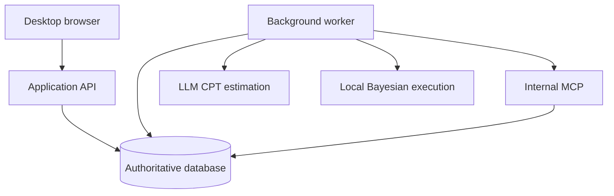

# X-INSIGHT — System Design

Revision: 2026-09-28. This document defines the application in technical detail; it is a design specification, not implementation code or a claim of completed testing.

## 1. Authority, scope, and confirmed decisions

The supplied `user_requirements.md`, including FR-50–FR-59 and NFR-06, is the product baseline. The project owner's clarifications below govern where the requirements leave policy unspecified. Technology and numerical implementation choices are proposed design decisions. Unresolved content and policies are identified in Section 15 rather than silently treated as approved requirements.

X-INSIGHT is an English-only research prototype for one administrator and fewer than ten physicians sharing a patient pool. It supports schizophrenia assessment, an initial system-generated treatment proposal, optional physician adjustment of Bayesian probabilities, and a signed secondary treatment plan. Display the research warning after every successful physician login: “This application is a research prototype and must not be used as the sole basis for treating patients.”

### 1.1 Confirmed product rules

1. Patient-variable values are supplied to the LLM **only to estimate CPTs**. Do not also condition Bayesian execution on those values as hard, soft, likelihood, or virtual evidence. Patient data still drive forms, versioned applicability rules, DDI evaluation, and invalidation where appropriate; the prohibition concerns feeding them into inference as additional evidence.
2. The LLM estimates every CPT, including root-node distributions. The application validates the estimates, executes the fixed network, and renders versioned recommendation templates.
3. Only the draft's author can view its clinical content, edit it, adjust/reset CPTs, retry work, accept results, or sign it. Other physicians cannot view that draft. Shared access to patient demographics and signed records does not confer draft access.
4. Any active physician can append a dated, attributed addendum to a signed encounter, including one signed by another physician. An addendum never alters the original signed content.
5. A patient has at most **one open draft across all physicians and encounter types**, including drafts awaiting generation or probability review. Separate drafts for the same patient are prohibited, including multiple drafts by the same author.
6. A physician cannot bypass failed initial proposal generation by signing a manual plan. Every applicable question must have a successful, current original execution, and its final probabilities and results must be accepted before signing.
7. Every CPT value is reviewable and adjustable, subject to probability constraints. A single-state row remains at 100%. Slider changes affect only the selected encounter and question run; they never create or change shared network versions.

### 1.2 Terminology and exclusions

| Term | Meaning |
|---|---|
| Initial treatment proposal | Immutable system proposal combining original question recommendations and local DDI findings |
| Original baseline | Successful question run's validated LLM-estimated CPTs, output, recommendation, patient-input snapshot and pinned versions |
| CPT revision | Immutable, complete probability set created by a completed slider change or reset within one question run |
| Adjusted result | Application-calculated output and templated recommendation tied to one exact CPT revision |
| Accepted result | The author-approved current revision and matching successful result, or the unchanged original baseline |
| Secondary treatment plan | Separately editable physician plan that becomes immutable on sign-off |

Excluded from v1: permanent patient deletion, PDF generation, self-registration, graphical network editing, external EHR integration, autonomous treatment execution, and production clinical compliance claims. Only the medication catalog is explicitly a demo catalog; do not invent a synthetic-only patient-data restriction. Standard clinical content must be supplied and verified before implementing its rules.

## 2. Proposed technical structure

Use a modular monolith, a separate background worker, an internal MCP process, and one authoritative relational database. This is a physical realization of the four logical subsystems in `system-architecture.md`; it does not turn every module into a separate service.

| Component | Proposed choice | Responsibility |
|---|---|---|
| Desktop UI | TypeScript and React | Forms, draft autosave, CPT review, comparison, accessible controls and HTML printing |
| Application API | Python and FastAPI | Authorization, validation, revisions, domain transactions and REST endpoints |
| Worker | Same application package, separate process | Durable initial-generation jobs and isolated local recalculation jobs |
| Bayesian adapter | Pinned and validated pgmpy adapter | XMLBIF handling and deterministic exact inference |
| Database | PostgreSQL | Records, immutable artifacts, audit, sessions and durable job queues |
| MCP server | Private worker-managed process | Read-only, question-scoped access to saved patient projections |
| Provider adapter | Configured OpenAI-compatible endpoint | CPT estimation only; credentials remain server-side |
| Deployment | Linux containers with reverse proxy | HTTPS, persistent volumes, self-hosted/VPS operation |

These are retained implementation proposals, not requirements for particular frameworks or verified compatibility claims. Pin dependency versions and validate XMLBIF, inference, and provider behavior during implementation. No external documentation was newly validated for this revision.

```mermaid
flowchart TD
    UI[Desktop browser] --> API[Application API]
    API --> DB[(Authoritative database)]
    W[Background worker] --> DB
    W --> MCP[Internal MCP]
    MCP --> DB
    W --> LLM[LLM CPT estimation]
    W --> BN[Local Bayesian execution]
```

Generation and local recalculation use separate job classes and capacity limits. Slider changes need neither provider access nor MCP reads. The worker loads their already-saved CPTs, fixed network and templates from the database. Keep the database and MCP private; expose only the application through HTTPS outside localhost.

| Domain module | Owns |
|---|---|
| Identity and access | Accounts, sessions, active-account checks and permissions |
| Patient registry | Demographics, unique Patient ID, archive state and demographic revisions |
| Encounter workflow | Single-open-draft rule, assessments, history, notes, secondary plan, signing and addenda |
| Knowledge registry | Network definitions, prompts, templates, content versions and activation |
| Initial reasoning | Scoped patient projections, sequential LLM estimation, original runs and proposals |
| Probability review | Revisioned CPT changes, redistribution, reset, comparison and local calculation state |
| Operations | Reporting, backups, restore and append-only audit presentation |

Writes use owning domain services. Background jobs enforce the same authorization and lifecycle rules as API requests.

## 3. Identity, privacy, and access

Create exactly one administrator with immutable username `admin`, initial password `admin`, and a stored password hash. No password-complexity rules or mandatory password-change gate are introduced. The administrator provisions and edits physician credentials. Physicians can change their own password. The Register button displays “Contact administrator”.

Use server-side opaque sessions, hashed tokens and protected cookies. No application idle or absolute timeout applies. Logout, password reset/change, deactivation and restore revoke applicable sessions. Enforce role and account status on every protected request and immediately before queued work commits. The role selected at login does not grant permissions independently of the stored account.

| Operation | Administrator | Active physician |
|---|---|---|
| View patient directory, demographics and signed records | Yes | Yes |
| Create patient, update demographics, start encounter | Not granted by requirements | Yes, subject to single-open-draft rule |
| View draft clinical content and its derived artifacts | No ordinary draft-view route | Author only |
| Edit draft, sliders, reset, retry, accept, sign | No | Author only |
| Add addendum to any signed encounter | No | Yes |
| Archive/unarchive patient | Yes | No |
| Manage models, API settings, physicians, audit and backups | Yes | No |
| Export patient/physician CSV | Yes | No |
| Printable signed patient report | Yes | Proposed yes; see Section 15 |

Draft restrictions apply transitively to assessments, notes, history, medications, runs, CPTs, results, proposal text, download routes and notifications. Do not leak draft content via shared chart responses, search snippets or printable reports. Other physicians attempting a new encounter see only a generic “An encounter draft is already open for this patient” conflict, without the draft contents. The author can resume that draft.

Administrator audit and full-backup capabilities remain explicitly authorized operations and can contain required draft audit data. They do not grant normal clinical draft viewing or editing. The administrator may inspect minimal draft counts/identifiers to confirm deactivation/discard, not a clinical draft screen.

Deactivation revokes access immediately and preserves records. If drafts exist, show a choice to retain them or explicitly confirm discard. Retained drafts remain reserved to their author and continue occupying the patient's open-draft slot; reactivation allows resumption. Reassignment and automatic expiry are outside v1. A confirmed administrative discard releases the slot and cancels pending jobs. No silent takeover is allowed.

## 4. Patient and encounter lifecycle

### 4.1 Registration

Require first/last names containing letters only, sex M/F, age 18–99 and Patient ID as exactly ten ASCII digits. Preserve leading zeros. Check uniqueness across archived and active patients and enforce it with a database unique constraint. Propose Unicode letters for names; spaces/punctuation remain a content-validation question. Record clinical status as first-time or established, and timestamp the encounter automatically. Next remains disabled until required fields are valid.

Create the patient and registration draft atomically. Duplicate registration returns a conflict rather than creating another record. A canceled draft does not delete the registered patient.

| Page | Required behavior |
|---|---|
| Diagnosis | Versioned DSM-5-TR criteria, live threshold indicator; below-threshold generation allowed with warning; bypass allowed without a reason |
| Severity | PANSS items initially unanswered; skip records `not_assessed`; compute only scores whose required items are complete |
| Suicide | C-SSRS items initially unanswered; skip records `not_assessed`; required completeness precedes results |
| History | Structured fields and catalog-selected medications; no dose, unit, route, frequency or active/stopped state |
| Proposal review | Automatic initial processing, DDI report, per-question original baseline and CPT review; optional local adjustment |
| Finalization | Review/accept current probabilities and results, edit secondary plan and sign explicitly |

Every page supports timestamped, physician-attributed notes. Notes are a separate field type excluded from patient projections, prompts, MCP responses, applicability rules and all algorithms. Never turn notes into algorithm-visible history implicitly.

### 4.2 Follow-up

Any active physician may start a follow-up if no open draft exists for that patient. Prior signed history may be copied with provenance and reconciled; do not present prior severity/suicide scores as newly assessed. Allow phone update, severity and suicide reassessment, history/medication updates, adverse-effect recording, initial proposal review, CPT adjustment and signing.

For tardive dyskinesia, akathisia, parkinsonism and acute dystonia, distinguish `present`, `absent` and `not_assessed`. Severity is recorded when present, using supplied categories; it is null for absent/not-assessed. Do not invent a clinical severity scale.

### 4.3 Single-draft enforcement and autosave

Use encounter lifecycle states `draft`, `signed` and `discarded`; generation/review readiness is separate derived state. Enforce a partial unique database constraint on `patient_id` for lifecycle `draft`. Creation locks the patient row and checks the slot in the same transaction. Concurrent requests cannot both succeed. Signing/discard releases the slot atomically; generation failure, inactivity and account deactivation do not.

Autosave normal form edits with a short debounce, and save completed slider interactions as explicit durable revisions. “Saved” means a server acknowledgment. Display saving/failure states and warn before leaving with unsaved local edits. A process crash can lose unacknowledged input; committed drafts and adjustments survive restarts. Offline editing is not promised.

Mutable records use revisions/ETags. Require the expected revision for writes; return a conflict instead of merging changes silently. Multiple tabs of the same author are subject to the same rule. Queue that browser's completed slider commands in order, but use server concurrency checks against other tabs. The server computes redistribution from the exact previous committed revision.

Other physicians can update shared demographics without viewing the draft. Such edits trigger dependency checks on any open draft and notify its author of stale results. Authorize and recheck archive/account/draft state within committing transactions.

### 4.4 Signed records, addenda, archive and discard

Signed encounters, CPT snapshots, accepted results, notes and plan text are immutable. Any active physician can append an attributed, timestamped addendum referencing a signed encounter. The new author does not replace the original signer. Addenda do not overwrite assessment fields, accepted probabilities or prior results; new clinical assessment uses a new encounter.

Archive behavior remains a **proposed policy, not a confirmed owner decision**: block new encounters and signing while archived, preserve existing drafts read-only, and permit the author to resume after unarchive. Such a retained draft still occupies the patient's single slot. This does not change the confirmed single-draft constraint.

Explicit discard requires confirmation and records actor/time/reason if supplied. Proposed retention is to retain committed draft artifacts and adjustment history as discarded, non-editable records for audit, while excluding them from signed clinical reports. This retention policy remains unconfirmed. Discard never deletes the patient or signed records.

## 5. Persistent data model and invariants

Use relational identities, lifecycle/ownership columns and foreign keys, with schema-validated JSON for versioned clinical content, snapshots and complete probability tables. Use UTC timestamps and explicit display timezone. Store reported age rather than inventing birthdate.

| Entity | Essential fields and invariants |
|---|---|
| User / Session | Unique username, role, active state, password hash, credential revision, theme; one admin; revocable non-expiring application sessions |
| Patient / PatientRevision | Unique ten-digit text identifier, demographics, clinical status, optional phone, archive state, revision and change attribution |
| Encounter | Patient, author, encounter type, lifecycle, visit timestamp, revision and prior signed source; at most one draft per patient |
| Assessment / History / MedicationEntry / AdverseEffect | Encounter-owned clinical data, completeness/status, content versions and provenance |
| PageNote | Encounter/page, text, author and timestamp; never included in algorithm inputs |
| NetworkVersion / ContentVersion | Immutable XML, structure hash, manifest, prompt, template, scoring/catalog/DDI definitions and versioned numerical rules |
| ModelBundle | Ordered clinical-question mappings, versions, applicability and missing-data rules; versioned active pointer |
| GenerationBatch | Encounter, source revision, ordered work list, pinned bundle/configuration, progress and retries |
| QuestionRun | Question, immutable patient-variable projection/hash, applicability dependencies, network/prompt/template/configuration versions and original execution status |
| OriginalBaseline | Successful QuestionRun, raw returned percentages, validated complete CPT set, effective XML/hash, output and templated recommendation; immutable |
| CPTRevision | QuestionRun, parent revision, sequence, kind `adjustment` or `reset`, complete CPT artifact/hash, actor/time, direct edit and redistributed before/after row values |
| QuestionReviewState | Current QuestionRun, current CPT revision or baseline, latest successful result reference, current calculation state, input freshness and optimistic revision |
| CalculationAttempt / Result | Exact baseline/revision ID, CPT hash, network/template/engine/configuration versions, status, output, recommendation, error and timestamps |
| ProbabilityAcceptance | Encounter/question, baseline/run, exact current CPT revision and result, actor/time, input hash; invalidated by a later change |
| ProposalSnapshot | Immutable initial proposal assembled from successful original baseline references, DDI snapshot and applicability set |
| SecondaryPlan / PlanRevision | Physician-authored draft text and edits; linked proposal and review-set revision; never overwrites the initial proposal |
| SignedEncounterSnapshot | Full clinical record, plan text, proposal, per-question original and accepted CPTs/results, versions, inputs, acceptor/signer/timestamps and hash |
| Addendum | Signed encounter reference, author/time, correction text; append-only and independently attributed |
| Job / JobAttempt | Class, scope, revision/hash, lease/fencing token, idempotency key, status, retry count and bounded diagnostics |
| APIConfigVersion | Base URL/model and protected credential reference; secrets excluded from clinical artifacts |
| AuditEvent | Actor/time, action/outcome, patient/encounter/question/run/revision IDs and required before/after values; append-only |

Store authoritative network XML and complete effective CPT artifacts in the database. XML files in backups are exports from the same consistent database snapshot. No run depends on mutable files outside its versioned definitions.

Baseline creation is atomic with its successful original result and recommendation. A validated CPT set without successful execution is not an adjustable baseline. An unsuccessful calculation never updates the current successful-result pointer. Full CPT artifacts are retained per revision initially for simple replay; later compression must preserve exact reconstruction.

The signed snapshot records unchanged questions explicitly: their original and final accepted values/results are equal. A question adjusted and then reset has `final_values_differ_from_original=false` and `had_adjustment_history=true`; do not erase that distinction.

## 6. Clinical content and local drug interactions

The content owner supplies exact DSM-5-TR criteria, PANSS/C-SSRS forms, scoring/completeness rules, structured history fields, adverse-effect severity categories, medication catalog and interaction data. Version the definitions and validate worked examples before release. Unanswered, partial, bypassed and not-assessed states must remain different from negative findings or minimum scores.

Medications are selected from the bundled demo catalog. A catalog entry may lack DDI coverage; show “coverage unavailable”. Free-text medication addition is not introduced as an extra feature. Evaluate each unordered drug pair once using the recorded medication set and pinned DDI version. Distinguish interaction found, explicitly covered with no listed interaction, and coverage unavailable. A missing database row alone cannot prove absence of an interaction.

Recompute DDI findings on medication changes and retain prior reports as history. Include the current report and limitations in the initial proposal. A medication edit also invalidates questions whose patient projections or applicability depend on it. If only DDI findings change, refresh the proposal snapshot and invalidate final review without inventing an LLM dependency for unrelated questions.

## 7. Model registry and original reasoning

### 7.1 Inventory and definitions

| Workflow | Ordered clinical questions |
|---|---|
| Registration | Hospitalization; pharmacotherapy; involuntary care; high-suicide Clozapine; LAI indication and choice; aggression Clozapine; established-case Clozapine |
| Follow-up | Tardive dyskinesia; akathisia; parkinsonism; acute dystonia; no-improvement Clozapine; continue-versus-adjust |

Each question maps to one XMLBIF network, one prompt and a recommendation template. Treat LAI indication and choice as one question with its corresponding network. A versioned manifest fixes node identities, states/order, parent relationships, variable types, patient-variable mappings, output queries, applicability, missing-data policy, CPT layout and template result mappings. Clinical gates and treatment thresholds must be supplied; names of questions alone do not define thresholds.

Process applicable questions sequentially in the bundle's declared order. Record false gates as not applicable with a reason; missing information is not automatically false. Unknown required applicability pauses generation for clarification. No question result becomes another question's patient input unless requirements are explicitly revised; slider recalculation always remains independent.

### 7.2 Import and validation

Administrators can inspect a graph, import/edit/export XML, validate, version, activate and roll back. Graph editing is unavailable. XML edits create new immutable versions; activation switches a pointer and does not alter existing runs.

Disable external entity/DTD resolution and constrain file size and parsing resources. XSD validates structure, including CPT syntax. Separate semantic validation checks unique nodes/states, parent references, acyclicity, state and parent-combination ordering, complete CPT dimensions, duplicate/missing entries, numeric finiteness, bounds and normalized rows. Validate manifests and deterministic execution fixtures before activation. Invalid versions may remain drafts but cannot be activated.

Physician adjustments are run artifacts, never model imports, activations or network versions. Imported default CPTs do not fill gaps in incomplete LLM estimates.

### 7.3 Patient inputs and execution contract

Create an immutable question-scoped projection containing only patient variables represented in that network, typed values, source revisions and explicit missing status. Notes are excluded by an allowlisted serializer. The MCP tool exposes precisely that saved projection, not the whole chart. The LLM receives the question prompt and fixed network structure with the projection.

**Execution uses the complete saved CPT set, fixed graph, declared output queries and pinned execution configuration with an empty evidence set.** Do not clamp a node to a patient's observed state or submit soft/virtual evidence. Patient-specific information has already entered through LLM-estimated CPTs. The patient snapshot remains required provenance and determines whether a result is current, even though the execution adapter does not consume it as evidence.

Store engine/runtime version, query order and numerical rules. Use deterministic exact inference; fail clearly on numerical/resource problems rather than silently switching to sampling or approximation. Recommendation rendering consumes network output through the pinned template. The LLM neither executes inference nor writes final recommendation prose.

### 7.4 Percentage representation and original baseline

Proposed deterministic storage policy: percentages have up to six decimal places. Represent 100% as `100,000,000` integer units, with one unit equal to `0.000001` percentage point. Encode API percentage values as decimal strings to avoid binary-floating-point parsing drift. The LLM response contract declares this precision, every row must total exactly 100%, and out-of-contract precision or totals are validation errors. Never silently normalize, clip or complete invalid LLM output. Conversion to the engine's numeric representation occurs at its boundary and is recorded with the execution policy version.

Validate every node, root distribution, child state and complete parent-state combination. Reject extra, missing or duplicate identities and any attempted structure change. Store the raw response, validated percentages and complete run-local effective CPT artifact. Execute and render the template, then atomically persist the original baseline. Continue to the next applicable question only after this succeeds.

After all applicable questions succeed, create an immutable initial proposal with original recommendations and DDI findings. Each completed question can already be inspected and adjusted while later questions are pending, but a partial proposal cannot authorize signing.

### 7.5 Patient changes and regeneration

Maintain per-question dependency fingerprints for represented patient variables and declared applicability inputs. Compare typed values and dependency state rather than invalidating every result for any record timestamp change. A relevant demographic or encounter edit marks the affected QuestionRun and adjustments out of date, clears its acceptance and blocks final signing. Retain its original proposal, baseline and full adjustment history.

Regenerate affected applicable questions in declared order using new patient projections and new QuestionRun identities. New runs establish new original baselines; never copy old physician adjustments into them. Unaffected, still-current question baselines and adjustments remain valid and retain their references. Record transitions into/out of applicability and refresh the proposal snapshot's question set. An obsolete run remains historical rather than being relabeled as current.

A note-only edit does not regenerate questions or invalidate probability acceptance. A plan-text edit requires final plan review but does not cause inference. Changing active model versions does not silently rebase an open encounter; preserve its pinned definitions. Patient-input regeneration uses the encounter's existing pinned bundle so unaffected questions remain coherent with regenerated questions. Newly created encounters select the then-active bundle.

## 8. Interactive CPT review and local calculation

### 8.1 Review panel

For every successfully completed question, show question title, network version, original recommendation and calculation state. Group all CPT entries by node and complete parent-state combination; root distributions have no parent grouping. Show each state's original and current percentages, signed percentage-point difference and row total. Highlight both directly edited and automatically redistributed states. Label original values “LLM-estimated”; distinguish current physician-adjusted values and read-only output probabilities.

All values remain reachable, including in large CPTs. Search, folding, pagination or virtualization may aid navigation but must not omit rows. Support keyboard sliders, clear focus, accessible labels and exact numeric readouts at storage precision. A single-state row visibly remains at 100% with an explanation. Proposed slider step is 0.01 percentage point; stored redistributed/original values retain six-decimal precision. Small screens are not the primary target.

Show original and latest successfully adjusted outputs and recommendations side by side. An identical recommendation after adjustment is valid; still show changed probabilities and provenance. If no successful adjusted result exists, say so rather than presenting the original as an adjusted calculation.

### 8.2 Deterministic redistribution

Treat a pointer-release, keyboard adjustment commit or equivalent completed interaction as one command. Transient drag previews are not audit events. The client may preview redistribution, but the server is authoritative.

For a row with units `u[1..n]`, selected state `k`, selected target `X`, and total `T=100,000,000`:

1. Authorize the author, verify draft/run freshness and expected review revision, and validate `0 <= X <= T`.
2. For `n=1`, the only valid value is `T`; reject any other requested value and explain the constraint.
3. Let `R=T-X` and `S=sum(u[j] for j != k)` from the immediately preceding committed row.
4. If `S>0`, each remaining state's ideal units are `R*u[j]/S`. If `S=0`, they are `R/(n-1)`.
5. Floor ideal units, then allocate remaining single units by descending fractional remainder. Break ties using the pinned network's state order. Keep the selected state exactly `X`.
6. Verify every value is in `[0,T]` and the row total is exactly `T`. Other CPT rows are byte-for-byte unchanged. Persist a complete new CPT revision with before/after values, selected edit, redistribution rule version, actor and timestamp.

This largest-remainder rule is deterministic and preserves proportional allocation to the supported precision. Display the canonical stored percentages, whose sum is 100%; do not round each label independently to a lower precision and show an inconsistent total.

Examples: `[20,30,50]`, changing the first value to 40, becomes `[40,22.5,37.5]`. `[100,0,0]`, changing the first value to 40, becomes `[40,30,30]`. A four-state `[100,0,0,0]` changed to 0 becomes `[0,33.333334,33.333333,33.333333]` in the defined state order. Setting a state to 100 makes the others zero.

### 8.3 Save and recalculate

In one transaction, insert the revision, update the current revision pointer, clear prior acceptance, mark recalculating, enqueue its local job and append the adjustment/redistribution audit event. Acknowledging the command means the new values are durable even if the calculation later fails.

The worker validates the complete saved CPT set and runs only that question's pinned network, with empty evidence and the original query/configuration. Use the same patient-input snapshot for provenance and the original template version. Render the adjusted recommendation and save its exact revision association. This path never invokes the provider, MCP, the initial generation pipeline, DDI processing or unrelated networks.

| UI calculation state | Meaning and permitted next action |
|---|---|
| Unchanged | Baseline/current values match original and a valid corresponding result is available; review and accept |
| Recalculating | Current saved revision is queued/running; keep sliders responsive, block acceptance/signing |
| Successfully recalculated | Current revision has a successful matching output and recommendation; review and accept |
| Failed | Current revision is preserved but unsolved; show error, allow local retry or reset, block acceptance/signing |

Track `out_of_date` separately from calculation state. Historical success cannot override changed patient inputs. Identify previous successful results with their revision and a visible “earlier revision” label whenever the current revision is unresolved.

### 8.4 Concurrency, failure and reset

Every job/result carries QuestionRun ID, CPT revision, complete CPT hash, versions and attempt identity. Saving a later adjustment moves the current pointer immediately. An older response may be stored as historical, but a conditional update must prevent it from replacing the latest result/state. Ignore out-of-order browser responses using the same identifiers. Pending superseded local jobs may be canceled; committed revision history is retained.

A failed calculation preserves current values and the prior successful result separately. Local retry targets exactly the current saved revision and does not re-estimate CPTs. Process recovery can resume a saved job; a completed numerical failure requires an explicit local retry or reset. Recheck active author, draft lifecycle and current-input eligibility before publishing a result.

“Reset to original values” creates an audited reset revision referencing this QuestionRun's immutable baseline, restores every CPT row for this question, clears acceptance and refreshes the result. Since the values and execution/template configuration are identical, bind the reset revision explicitly to the retained original result as an exact baseline reuse; record this reuse rather than claiming a fresh execution. Alternatively, deterministic local execution is possible, but the default design reuses the verified original artifact. Fence any older in-flight responses. Other question panels are unchanged and no history is deleted.

A reset cannot make a stale patient snapshot current. If relevant patient inputs changed, regeneration remains mandatory. Returning manually to original values also requires a matching successful calculation or explicit verified baseline reuse; equality of a few displayed values is insufficient.

### 8.5 Acceptance and atomic sign-off

Provide author-only acceptance per question and a final review summary of all applicable questions. A grouped “Accept all current results” action may create explicit per-question acceptance records atomically. Acceptance references exact original baseline, current CPT revision, successful result, patient-input hash and actor/time. Unchanged baselines require acceptance too. Any later probability edit/reset, relevant patient edit or regeneration invalidates the affected acceptance.

Sign-off is one transaction that locks the patient and encounter, validates expected encounter/plan/review revisions, and verifies:

- The actor is the active draft author, every save is acknowledged, and the encounter remains the patient's single draft.
- A complete current initial proposal exists, with successful originals for all applicable questions and current DDI findings.
- Each current accepted revision has a matching successful result and recommendation. No calculation is pending, failed or stale.
- Patient projection and applicability fingerprints still match the current data; versions and results are internally consistent.
- The physician has reviewed the final secondary-plan revision and accepted the exact probability/result set used for it.

Freeze the full signed snapshot, original proposal, all original/final CPTs and outputs, adjusted recommendations, physician plan edits, versions/configuration, patient inputs and attribution. Mark signed, release the open-draft slot and append audit events in the same transaction. Repeated identical idempotent sign requests return the original signed result. A concurrent demographic edit must serialize with signing or fail its freshness check.

## 9. MCP, queues, failures and capacity

The worker hosts a private MCP client/server relationship and mediates any provider tool calls. Expose a read-only `get_question_patient_inputs` tool bound by the server to actor, encounter, QuestionRun and projection. It accepts no arbitrary patient selector. Responses contain only represented patient variables already saved for that question; no notes, credentials, unrestricted chart reads or write/inference tools are exposed.

Queue initial LLM calls across encounters with bounded concurrency, proposed initially two provider calls at once. Within one generation batch, only the current question can execute; completion and enqueueing its successor are atomic. Use two retries after the initial LLM attempt, shared across transport and invalid-CPT failures: three attempts total, within FR-36's allowed range. Exhaustion stops the affected question, leaves later work pending and preserves completed originals and adjustments. A manual retry resumes the failed step. If CPT validation succeeded but execution failed, retry local execution from those saved CPTs before requesting new estimates.

Use separate local calculation jobs so queued provider calls cannot monopolize worker slots. Proposed local concurrency starts at one bounded inference process and is benchmarked for available memory. Long-running local execution never blocks form/API threads. Fair scheduling across users and coalescing superseded pending revisions avoid slider starvation without deleting adjustment history.

Database-backed jobs use leases, heartbeats, fencing tokens and at-least-once execution with idempotent result persistence. An expired worker cannot commit using an old lease. External provider requests can still be duplicated after uncertain transport outcomes; do not promise exactly-once billing. Proposed provider timeout is 60 seconds per request with bounded backoff. Exact inference resource limits depend on admitted network size.

| Failure | Required behavior |
|---|---|
| Provider unavailable/invalid CPT response | Bounded original-generation retries, then visible failed step; no manual signing bypass |
| Invalid credentials/capability | Configuration error; no blind retries with unchanged settings |
| Required patient variable/applicability missing | Explicit missing state or clarification according to manifest; no fabricated negative finding |
| Local recalculation fails | Retain values and previous result with revision labels; local retry/reset; no LLM/MCP call |
| Worker or application restarts | Recover persisted jobs/drafts and revision associations; no false successful calculation |
| Database save fails | No “Saved” acknowledgment; show unsaved local state |
| Stale revision or wrong draft author | Reject request; never silently overwrite or disclose draft content |
| Relevant data changes | Mark affected question stale and require a new original baseline |

Cache only immutable parsed models/content by hash; patient-specific results must also include run/revision/CPT/configuration identity. Never share CPT sets by network version alone. Use private/no-store policies for authenticated records and reports. Separate provider latency from local UI responsiveness.

Sizing remains a proposal: start evaluation at 2 vCPU, 4 GB RAM and persistent storage sized from records, CPT revisions, model artifacts, audit and backups. Admission benchmarks must constrain graph topology and CPT cardinality. Target ordinary read/save p95 under one second at representative load; measure local recalculation separately and show progress rather than promising a universal inference latency. There is no confirmed high-availability or end-to-end SLA.

## 10. Application API contracts

Use `/api/v1`, internal UUIDs, schema-versioned JSON, decimal percentage strings, UTC timestamps and bounded pagination. All mutation validation and ownership checks are server-side. Use idempotency keys for create, slider, reset, retry, accept, sign and addendum operations; reused keys with different payloads are conflicts.

| Route | Contract |
|---|---|
| `POST /auth/login`, `/auth/logout`; `GET /me` | Role/credentials, session lifecycle and authenticated identity |
| `POST /me/password`; `PATCH /me/preferences` | Own password/theme; credential changes revoke prior sessions |
| `GET/POST /physicians`; `PATCH /physicians/{id}` | Administrator account management |
| `POST /physicians/{id}/deactivate`, `/reactivate` | Admin; explicit confirmed discard choice if applicable |
| `GET/POST /patients`; `GET/PATCH /patients/{id}` | Shared directory/read; physician create/update; revision and duplicate checks |
| `POST /patients/{id}/archive`, `/unarchive` | Admin; preserve records and apply declared archive policy |
| `POST /patients/{id}/encounters` | Atomic single-draft creation; `409 OPEN_DRAFT_EXISTS` without another author's clinical content |
| `GET/PATCH /encounters/{id}` | Draft author only for drafts; shared authorized read after signing |
| `POST /encounters/{id}/notes`, `/discard` | Author-only note creation/confirmed discard |
| `POST /encounters/{id}/generation-batches` | Automatic author-context generation trigger; expected source revision; returns `202` and batch ID |
| `GET /generation-batches/{id}`; `POST /question-runs/{id}/retry-original` | Author-only progress/resume; retain completed questions |
| `GET /question-runs/{id}/review` | Original/current CPTs, results, revision IDs, input freshness, history and permissions |
| `POST /question-runs/{id}/cpt-adjustments` | Expected review revision, node, full parent assignment, state and target percentage; server redistributes and returns saved revision/job/state |
| `POST /question-runs/{id}/reset` | Expected review revision; save reset revision and explicit baseline-result reuse |
| `POST /question-runs/{id}/retry-calculation` | Exact current CPT revision; local-only retry |
| `POST /question-runs/{id}/acceptance` | Exact current baseline/revision/result/input hash; author-only; reject unresolved/stale combinations |
| `PATCH /encounters/{id}/secondary-plan` | Author's plan text, expected plan revision and proposal reference |
| `POST /encounters/{id}/sign` | Encounter/plan/review revisions, proposal ID and acceptance references; atomic checks in Section 8.5 |
| `POST /encounters/{id}/addenda` | Any active physician; signed target only; attributed append-only content |
| `GET/POST /networks`; `POST /networks/{id}/versions` | Admin import/edit-as-new-version |
| `POST /network-versions/{id}/validate`; `GET /network-versions/{id}/graph`, `/xml` | Admin validation and read-only graph/XML export |
| `POST /model-bundles/activate`, `/rollback` | Admin atomic activation with version checks and audit |
| `GET/PUT /api-settings`; `POST /api-settings/test` | Admin; masked keys and explicit replacement semantics |
| `GET /exports/patients.csv`, `/exports/physicians.csv` | Admin lists without credentials or private draft content |
| `GET /patients/{id}/report` | Authorized printable signed history, including complete original/accepted CPT comparisons |
| `POST /backups`; `GET /backups/{id}` | Admin full consistent backup/download |
| `POST /restores/validate`, `/commit`; `GET /audit-events` | Admin staged recovery and append-only audit viewing |

Use `401` for unauthenticated access, `403`/non-disclosing `404` for unauthorized draft access, `409/412` for stale/duplicate/lifecycle conflicts, `422` for invalid input, `429` for admission limits and `503` for dependency failure. Errors expose safe code/message, retryability and request ID; no stack traces, secrets or another author's draft fields.

Review responses explicitly distinguish `current_cpt_revision_id`, `displayed_result_revision_id`, `current_result_matches`, `calculation_state` and `input_freshness`. Never infer validity from the existence of any successful result.

## 11. Security, audit, reports and recovery

Require HTTPS outside localhost; protect cookies against script access, use CSRF protection, parameterized database access, bounded requests and safe HTML/XML handling. Encrypt provider credentials with a deployment-held key outside the database. Validate configurable provider endpoints and redirects against operator-approved destinations. These controls support prototype security; they do not claim PHI hardening or clinical certification.

Audit successful/failed logins, administrator actions, original runs, completed slider edits and redistribution, resets, calculation outcomes, probability acceptance, signing and addenda. Required context is actor/time, patient, encounter, question, run/revision and outcome. Preserve before/after CPT values for adjustment events, including automatic changes. A result calculated after its revision is superseded is identified as historical. Successful mutations and audit events commit atomically; failed attempts must not appear as successful changes.

Application roles cannot modify/delete audit rows. Database owners or restoring an old backup can affect history, so this is application-level append-only protection. Keep pre-restore history in a pre-restore archive and record recovery outside the replaced database as well as in the restored system.

CSV exports use UTF-8, stable headers, quoting and formula-injection neutralization. Preserve Patient ID as ten digit characters; spreadsheet import must treat it as text. Do not use formula wrappers.

Printable HTML includes signed encounter chronology, assessments, DDI coverage, original proposal, final plan, signatures and attributed addenda. For **every clinical question**, include original CPT values and output/recommendation, final accepted CPT values and output/recommendation, network/template versions, adjustment indicators, accepting physician and timestamps. Include complete root and conditional tables, with repeated print headings/page breaks for long CPTs. If adjusted then reset, report both final equality and the existence of adjustment history. Distinguish final physician text from adjusted templated recommendations. Do not include another author's private drafts; any optional author-only draft preview must be explicitly labeled and use the same access policy.

A full backup contains a consistent database snapshot, network XML, versioned prompts/templates/manifests, numerical policies, engine/configuration metadata, raw/validated original CPTs, all revisions/calculations/acceptances, signed snapshots, audit, schema versions and checksums. Include dependency/runtime lock information sufficient to restore the recorded execution configuration. Reproduction uses saved CPTs, never new LLM estimates.

Restore into staging, validate checksums/schema/foreign keys/artifact references, preview the replacement impact and require administrator confirmation. Quiesce writes and workers, take a pre-restore backup, switch atomically, revoke sessions and fence old jobs before reopening. Reconcile restored pending jobs against their exact revision and lifecycle. Failed staging validation leaves live data intact. Protect the credential encryption key separately or require API-key re-entry after migration. Backup/restore is full recovery, not a merge. Manual backups satisfy v1; no automated schedule or numerical recovery guarantee is assumed.

## 12. Deployment and operations

Deploy API, worker, private database and HTTPS edge on one Linux host initially. Bundle the MCP subprocess with the worker. Use persistent database storage, explicit migrations, restart policies and readiness/liveness checks. A missing provider disables new estimation but does not prevent saved-draft access or local recalculation of existing valid baselines.

Monitor save failures, authorization failures, both queue classes, worker leases, provider retry rates, local calculation duration/memory, stale-result rejection, disk growth and backup success. Logs use correlation IDs without credentials or clinical text. Restore tests must include an adjusted-then-signed encounter, a failed pending revision and a retained private draft.

Scale measured worker or database bottlenecks before adding services. Single-host deployment has a single point of failure; backups provide recovery, not high availability. Network complexity and revision retention may dominate capacity before physician count does.

## 13. Architecture decision records

Product rules in Section 1 are confirmed; infrastructure choices below remain proposed. Updated 2026-09-28.

| Decision | Rationale and consequence |
|---|---|
| Modular monolith with separate worker | Coherent transactions and small deployment; API remains responsive during long work |
| PostgreSQL plus durable job tables | Atomic saves, revision events and job creation; shared database is also a common failure point |
| LLM estimates all CPTs; app executes with empty evidence | Implements the confirmed role of patient inputs; requires complete stored CPTs and fixed inference definitions |
| Original baseline plus append-only CPT revisions | Preserves provenance and reset; adds storage but prevents overwriting original estimates |
| Integer percentage units and deterministic redistribution | Exact row totals and stable rounding; selected six-decimal precision becomes versioned policy |
| Local recalculation isolated from initial generation | Slider use consumes no provider/MCP calls and cannot restart unrelated questions |
| Revision-bound results and acceptance | Prevents older responses and stale results from authorizing signing; requires atomic pointer/freshness checks |
| One private open draft per patient | Enforces confirmed collaboration policy; abandoned/deactivated-author drafts can block new work until resumed or explicitly discarded |
| Any physician may append signed-record addenda | Supports shared follow-up while preserving original signer, plan and probability artifacts |

## 14. Requirement traceability and verification plan

These are acceptance criteria for future implementation, not executed software tests.

| Requirements | Sections | Required evidence |
|---|---|---|
| FR-01–04 | 3 | Warning, admin initialization, role checks, password/theme behavior, deactivation without silent discard |
| FR-10 | 4–5 | Leading-zero round trip, archived-ID uniqueness and concurrent registration rejection |
| FR-11–13 | 4, 6 | Standard versioned instruments, allowed bypass/warning, no default scores for missing items |
| FR-14 | 6 | Catalog-only medications, excluded fields absent, explicit unavailable DDI coverage |
| FR-15–16 | 4–5, 8 | Separate proposal/adjustments/plan; saved draft/revision recovery; notes never affect algorithms |
| FR-20–23 | 3–5 | Follow-up fields, immutable signing, any-physician addenda, shared directory with private drafts |
| FR-30–35 | 7, 9 | Complete inventory, XSD plus semantic validation, sequential questions, scoped MCP, original baseline provenance |
| FR-36–37 | 7, 9 | Bounded original retries, completed work retained, no adjustable failed baseline, versioned admin XML management |
| FR-40–43 | 9–11 | Complete printable probability history, full restore, audit and queued provider settings; local calculation uses no external calls |
| FR-50, FR-51 | 8.1 | Every CPT/root/parent row reachable; labels, exact values, row totals and read-only outputs |
| FR-52 | 7.4, 8.2 | Proportional, zero-remainder, all-zero-other-states, single-state, 0/100 endpoint and rounding/tie cases |
| FR-53, FR-54 | 8.1–8.4 | Only affected network executes, original comparison persists, same template/input snapshot, unchanged recommendation allowed |
| FR-55, FR-56 | 5, 8.3–8.4 | Reset restores baseline without deleting history; durable edits and actor/revision association |
| FR-57 | 8.5 | Exact acceptance and atomic immutable signing; pending/failed/stale revisions rejected |
| FR-58 | 8.3–8.4, 9 | Out-of-order responses cannot overwrite latest state; retry preserves current values and labels previous result |
| FR-59 | 7.5 | Relevant changes require new baseline; unaffected questions retained; no silent adjustment carry-forward; note-only changes excluded |
| NFR-01–02 | 2–3, 11–12 | Linux/VPS and concurrent use, HTTPS, no session timeout, API-enforced ownership |
| NFR-03 | 4, 8.1, 11 | English desktop Chrome/Firefox, keyboard sliders, readable large CPTs, theme and print review |
| NFR-04–05 | 5, 7–9, 11 | Replay saved CPTs/configuration/template, durable drafts, immutable baselines and signed artifacts |
| NFR-06 | 2, 8–9 | Responsive edits under queued calculation load; isolated local work and no stale acceptance |
| Owner clarifications | 1, 3–5, 7.3 | Empty inference evidence; other-physician draft denial; any-physician addenda; atomic single-draft constraint |

Critical race fixtures include two simultaneous draft creates, two browser tabs adjusting the same row, adjustment during calculation, reset before an old result returns, sign versus demographic update, sign versus adjustment, deactivation during queued work, and restore with pending jobs. Test the inference adapter with an observed patient variable and verify that no evidence argument is passed. Test signed reports for complete original/final probability rows and absence of unauthorized drafts. These are software correctness checks, not clinical validation.

## 15. Remaining content and policy inputs

The owner has resolved evidence semantics, draft privacy, addendum authorship and simultaneous drafts. Do not reopen those decisions as implementation options.

| Remaining input | Status or proposed handling |
|---|---|
| Clinical instruments, history schema, severity categories, prompts, networks, gates and templates | Content owner must supply versioned definitions and expected examples; no thresholds invented here |
| Archive handling of open drafts | Proposed read-only while archived and resumable after unarchive; not confirmed |
| Discarded draft-content retention | Proposed retain committed artifacts for audit; physical retention policy not confirmed |
| Physician printable-report permission | Proposed signed patient HTML access; administrator exports are explicitly required |
| Name punctuation/spacing and phone validation | Literal letters-only names; phone optional unless a later requirement specifies otherwise |
| Provider/model capabilities and numerical/runtime validation | Verify during implementation; six-decimal storage and 0.01 slider step are explicit proposed technical choices |
| Dataset size, exact resource budgets and recovery targets | Benchmark representative networks and retained revision volumes; no unapproved SLA |

The supplied requirements remain unchanged. This design incorporates the owner's clarifications without adding observed-evidence inference, shared drafts, parallel drafts for one patient, or manual signing after failed generation.