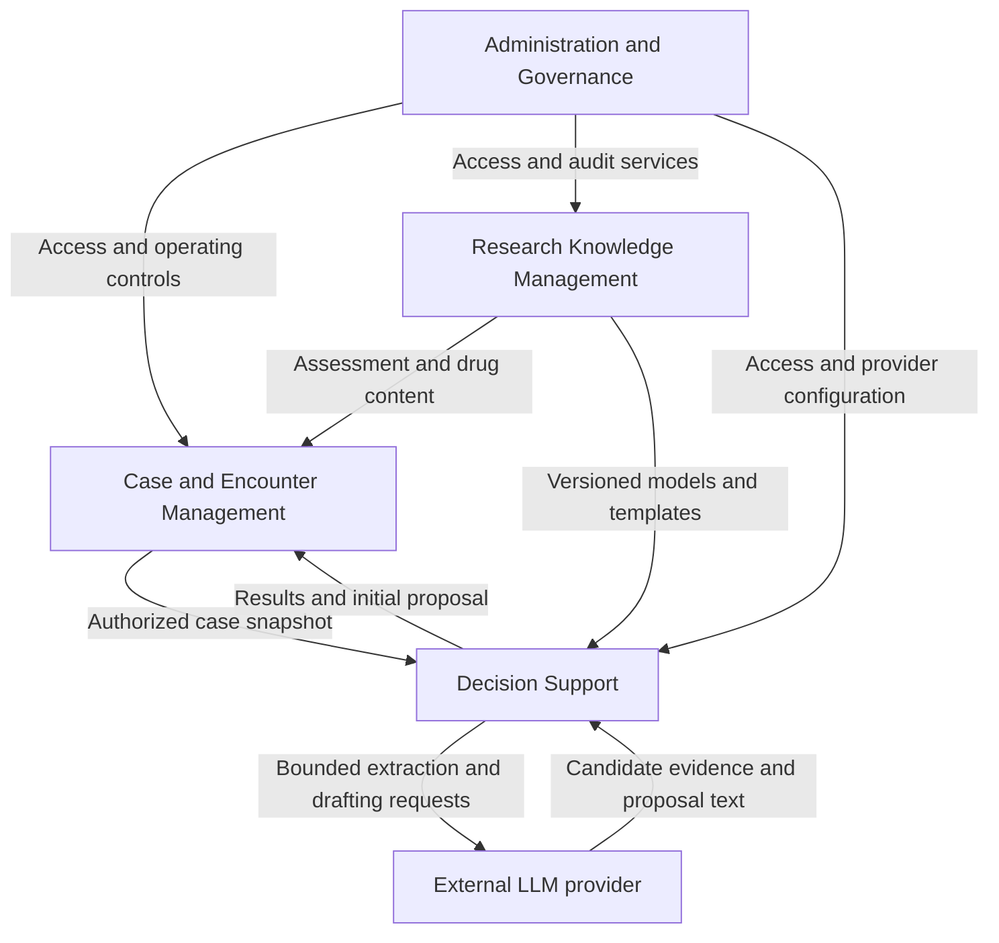

# X-INSIGHT — System Architecture

## 1. Purpose and architectural vocabulary

X-INSIGHT is a research prototype, not an independent treatment system.

The following definitions govern this architecture:

| Level | Meaning | Application to X-INSIGHT |
|---|---|---|
| System | The complete software serving its overall purpose | X-INSIGHT |
| Subsystem | An independent system that holds independent value | A coherent capability with its own useful outcome, owned information and boundary |
| Module | A component of a subsystem that cannot function as a standalone system | A contributing capability that depends on its parent subsystem's context and rules |

Independence means a subsystem can deliver its own defined value without completing the entire X-INSIGHT workflow. It may consume information or services through explicit relationships. It does not mean every subsystem must have its own application, server, database or deployment.

For example, maintaining a synthetic case record is useful even when proposal generation is unavailable. Conversely, the assessment-entry module is meaningful only within a case and encounter workflow; it is not a separate system.

## 2. System boundary

X-INSIGHT serves one administrator and fewer than ten physicians sharing a patient pool. Its user-facing language is English. All patient records, assessment content, drug information and reasoning models are synthetic demonstration material in v1.

| Participant | Relationship to X-INSIGHT |
|---|---|
| Physician | Creates and updates records, conducts encounters, reviews generated proposals, edits and signs final plans |
| Administrator | Manages access, network versions and activation, provider configuration, patient archiving, exports, audit inspection and recovery |
| Configured LLM provider | External dependency used for evidence extraction and proposal wording; it has no authority to finalize records |
| Hosting environment | Provides execution and durable storage for the application; it is outside the functional decomposition |

The internal patient record is authoritative. The external LLM provider does not own the record, execute the authoritative Bayesian inference, modify model probability tables, or sign plans.

Excluded from this architecture's v1 scope are real clinical use, autonomous treatment, external health-record integration, self-registration, permanent patient deletion, PDF generation and graphical editing of Bayesian networks.

## 3. Subsystem decomposition

X-INSIGHT consists of four proposed subsystems.

| ID | Subsystem | Independent value | Primary owned information |
|---|---|---|---|
| S1 | Case and Encounter Management | Maintains and presents a useful longitudinal synthetic case record, even without a generated proposal | Patients, encounters, assessments, history, medications, notes, physician final plans and addenda |
| S2 | Research Knowledge Management | Maintains a reusable, inspectable collection of versioned synthetic models and supporting content, without requiring a patient encounter or reasoning run | Bayesian network definitions, content versions, validation status and active model selections |
| S3 | Decision Support | Produces an inspectable reasoning result and synthetic proposal from a defined case snapshot and selected knowledge versions, without finalizing an encounter | Accepted evidence, reasoning runs, network results, generated initial proposals and their provenance |
| S4 | Administration and Governance | Maintains an accountable, recoverable operating environment independently of whether an encounter is being conducted | Accounts, access state, provider settings, audit history and recovery operations |

These are logical systems within one product. Their boundaries organize responsibilities; they do not introduce a requirement for four separately installed products.

### 3.1 High-level relationships

Arrows describe information or services supplied to another subsystem.

All subsystems contribute events to Administration and Governance's audit capability. Those audit relationships are omitted from the diagram for readability. Research Knowledge Management supplies definitions; Decision Support executes reasoning; Case and Encounter Management controls the physician's final record.

## 4. Subsystems and their modules

### 4.1 S1 — Case and Encounter Management

**Purpose:** Maintain the shared case record and coordinate the physician's registration, follow-up and finalization work.

**Independent outcome:** A persisted, searchable and reportable synthetic case history. Recording and reading remain useful when decision support is unavailable, although signing a new plan is blocked until a valid proposal succeeds.

| Module | Responsibility | Why it is a module |
|---|---|---|
| Patient Registry | Identification, demographics, contact details, search and archive state | Depends on the case identity and record lifecycle |
| Encounter Workflow | Registration and follow-up progression, draft ownership, autosave, resumption and confirmed discard | Coordinates the other case modules around an encounter |
| Assessment and History | Diagnostic demonstration, severity, suicide assessment, adverse effects and structured/free-text history | Requires an encounter and content definitions |
| Medication Review | Medication reconciliation and local synthetic interaction reporting, including unavailable coverage | Requires the encounter's medication set and supplied drug knowledge |
| Notes | Timestamped, attributed page notes | Requires a record context and must remain separate from algorithm-visible history |
| Plan Review and Sign-off | Displays initial proposals, captures physician changes, enforces signing prerequisites and records addenda | Requires an encounter, its author and a successful current proposal |
| Record Presentation and Reporting | Patient chart, chronology, patient-list export and printable patient report | Presents authoritative case information under access rules |

**Boundary:** S1 owns the physician's secondary/final plan. It references the generated initial proposal owned by S3 without rewriting it. S1 does not author Bayesian models or determine their inference results.

### 4.2 S2 — Research Knowledge Management

**Purpose:** Preserve the synthetic knowledge and model versions on which assessments and reasoning depend.

**Independent outcome:** An inspectable and exportable set of research models and supporting content. Models can be maintained without creating cases or calling an LLM.

| Module | Responsibility | Why it is a module |
|---|---|---|
| Bayesian Model Library | Import, XML editing, read-only graph inspection and export | Depends on model identity, validation and version history |
| Model Validation | Distinguishes structural validity from model consistency and suitability for execution | Produces a judgment about an artifact managed by the library |
| Version and Activation Control | Preserves versions, selects active models and supports rollback | Depends on the managed knowledge collection and validation results |
| Synthetic Content Catalog | Owns demonstration questionnaires, scoring definitions, drug catalog and interaction coverage | Supplies definitions consumed by case and reasoning workflows |
| Reasoning Definitions | Owns input/output meanings, applicability rules, uncertainty policies and proposal templates | Gives executable models and generated results their intended interpretation |

**Boundary:** S2 owns model definitions and fixed probability tables. Editing creates a new version rather than changing a historical run. Content ownership does not imply a new graphical content-authoring feature: bundled content is sufficient where no management UI is required.

### 4.3 S3 — Decision Support

**Purpose:** Transform an authorized case snapshot into reproducible Bayesian results and an explicitly synthetic initial proposal.

**Independent outcome:** A reviewable analysis artifact containing evidence, results, gaps and provenance. Producing it does not require a physician to sign a plan; S3 cannot sign one itself.

| Module | Responsibility | Why it is a module |
|---|---|---|
| Analysis Coordination | Controls run progression, automatic execution, retries, clarification and failure state | Organizes the reasoning modules around one analysis request |
| Authorized Record Access | Obtains permitted case information through internal MCP tools | Requires the run's authorized case context; it is not another record system |
| Evidence Preparation | Maps facts into designated model inputs and makes missing/conflicting information explicit | Depends on a snapshot and model input definitions |
| Bayesian Inference | Executes selected fixed models deterministically | Requires validated model versions and accepted evidence |
| Proposal Generation | Uses templates and LLM assistance to express results as a synthetic proposal | Requires validated reasoning outputs and their limitations |
| Result Provenance | Retains evidence sources, model/content versions and result history for inspection | Gives the analysis artifact its traceability and replay context |

**Boundary:** S3 owns system-generated proposals, not physician decisions. LLM failure cannot remove saved case data. The LLM supplies candidate evidence and wording; application-controlled inference produces the authoritative model results.

The registration and follow-up clinical questions are configurations of this subsystem, not separate subsystems. Hospitalization, medication selection, LAI, Clozapine-related questions, adverse-effect management, continuation/adjustment and taper feasibility remain distinct model questions within the same reasoning capability.

### 4.4 S4 — Administration and Governance

**Purpose:** Control access, preserve accountability and support continued operation of X-INSIGHT.

**Independent outcome:** An administered set of users and configuration, inspectable activity history, and recoverable system state. These tasks can be performed without an active clinical encounter or successful LLM call.

| Module | Responsibility | Why it is a module |
|---|---|---|
| Identity and Access | Login, roles, password changes, physician account management and deactivation | Depends on X-INSIGHT's actors and access policies |
| Operating Configuration | Provider key/base URL/model settings and user preferences | Configures other application capabilities rather than producing clinical outputs |
| Audit | Captures and presents append-only activity history | Requires meaningful events supplied by the application |
| Backup and Restore | Preserves and restores coherent system state | Depends on the information and consistency rules of all subsystems |
| Administrative Reporting | Physician-list export and administrative views | Presents governed operational information |

**Boundary:** Administrative authority does not confer the right to sign a physician's encounter. An admin dashboard is an entry point to capabilities across subsystems, not a fifth subsystem. Patient archiving belongs to S1; model editing belongs to S2; S4 supplies the authorization for the administrator to perform those actions.

## 5. Collaboration and ownership rules

| Exchange | Owner supplying the information | Consumer | Architectural rule |
|---|---|---|---|
| Case snapshot | S1 | S3 | Authorized, consistent view; page notes excluded |
| Assessment and drug definitions | S2 | S1 | Content version and coverage remain identifiable |
| Models and reasoning definitions | S2 | S3 | A run uses fixed, identifiable versions |
| Evidence, results and initial proposal | S3 | S1 | Generated content retains its identity and provenance |
| Final physician plan | S1 | Chart/report consumers | Original proposal remains distinguishable from physician edits |
| Identity and permissions | S4 | All subsystems | Each action respects role, ownership and active account state |
| Activity events | All subsystems | S4 | Audit records describe actions without replacing domain records |
| Recovery state | All subsystems | S4 | Recovery preserves relationships between records, results and knowledge versions |

Each category of information has one logical owner, even when a common database holds it. A consuming subsystem requests information or an operation through the owner's boundary rather than changing another subsystem's state independently. Historical snapshots preserve the state used for a result or signature; they do not become competing editable master records.

## 6. End-to-end responsibility

The physician begins in S1, which records and preserves the encounter using synthetic definitions supplied by S2. When the encounter reaches proposal review, S1 supplies an authorized snapshot to S3. S3 prepares evidence, executes the relevant versioned models, and produces a synthetic proposal with its limitations.

S1 presents the proposal and extracted inputs for review. The physician edits the secondary plan and explicitly signs it. S1 preserves the signed encounter, while S4 records the relevant actions. Follow-up creates a new encounter rather than changing an earlier signed record.

**Confirmed signing rule:** A physician cannot sign a manual plan when AI proposal generation fails. The draft remains saved for retry. A current successful proposal and physician review are prerequisites for signing; there is no manual bypass.

| Situation | Capabilities that remain available | Boundary on completion |
|---|---|---|
| LLM unavailable or generation fails | Record viewing, draft editing/saving, model maintenance and administration | New plan signing remains blocked |
| Required model/content unavailable or invalid | Record work and corrective knowledge maintenance | Affected reasoning cannot complete |
| Required evidence missing or conflicting | Saved draft and clarification workflow | Affected analysis waits for resolution |
| Analysis inputs change after generation | Continued draft editing and a new analysis | Old proposal cannot justify signing the changed analysis state |

These are capability boundaries, not promises of independent process-level availability. An outage of shared hosting or storage may affect all subsystems.

## 7. System-wide constraints

1. Synthetic research use and explicit synthetic labeling apply throughout the product.
2. Shared patient access does not override author-only draft editing and signing.
3. Signed encounters are immutable; corrections are dated, attributed addenda, and subsequent assessments are new encounters.
4. Page notes never influence algorithms. Designated history fields may do so.
5. Bayesian probability tables remain fixed during execution. The application executes the networks; the LLM does not.
6. Missing, conflicting and not-assessed information must remain distinguishable from negative findings.
7. Saved drafts survive reasoning failures. Leaving a page does not implicitly discard them.
8. Model/content changes preserve the interpretability of historical results.
9. Account deactivation and patient archiving preserve records and attribution.
10. The internal record remains the single source of truth; MCP is an access mechanism.

Access protection, HTTPS for non-localhost use, the initial administrator password-change requirement, the chosen no-session-timeout policy, auditability and recovery apply across subsystem boundaries as specified in the requirements and detailed design.

## 8. Architectural rationale

Separate the product by independently useful responsibilities: keeping records, maintaining knowledge, producing analysis, and governing operation. Combining all four would obscure ownership, particularly the distinction between generated proposals and signed plans. Dividing by screens, individual networks, or technical layers would classify supporting components as independent systems even though they do not deliver independent domain value.

The proposed modular application in `system-design.md` can realize these boundaries within a coordinated deployment. This document neither requires microservices nor changes the detailed design's proposed technology stack. Any later physical separation should preserve the same ownership and signing rules.

The cost of these boundaries is explicit coordination: snapshots must agree with analysis results, content versions must remain available, and recovery must preserve their relationships. The benefit is that record maintenance, knowledge evolution and reasoning can change within clear responsibilities.

## 9. Relationship to requirements and detailed design

| Requirement area | Accountable subsystem | Supporting subsystem |
|---|---|---|
| Access and physician administration — FR-01–04 | S4 | S1 for affected drafts |
| Registration, assessments, medication recording and notes — FR-10–16 | S1 | S2 for definitions; S3 for proposals |
| Follow-up, signed records and patient directory — FR-20–23 | S1 | S3 for new proposals; S4 for access |
| Model questions and inference — FR-30–35 | S3 | S2 for models; S1 for records; S4 for provider settings |
| Network management — FR-36 | S2 | S4 for administrator authorization |
| Exports — FR-40 | S1 for patients; S4 for physicians | Access rules apply throughout |
| Backup/restore and audit — FR-41–42 | S4 | All subsystem information owners |
| Provider configuration and queued calls — FR-43 | S4 for configuration; S3 for execution | — |
| Quality constraints — NFR-01–06 | System-wide | Refined in the detailed design |

This architecture groups the existing design's Identity and Operations capabilities into S4, Patient Registry and Encounter capabilities into S1, Demo Content and Model Registry into S2, and Reasoning Orchestration into S3. Export responsibilities follow their information owner. This refines the high-level vocabulary without asserting that new functionality has been approved.

Remaining questions in `system-design.md`—including content supply, draft visibility, addendum authority and archive behavior—remain open. They affect policies or lower-level design and do not prevent defining these subsystem boundaries. The prohibition on signing after generation failure is confirmed and is not an open question.